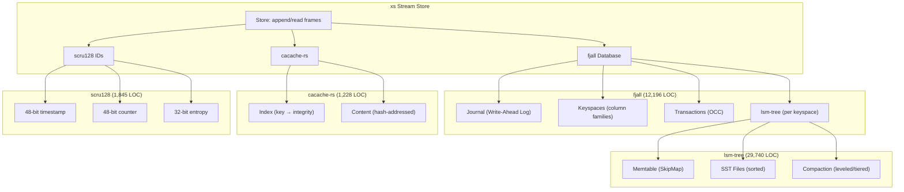

# LSM Usage — fjall, cacache-rs, scru128, and xs

**This project documents the full storage stack behind xs's stream store: lsm-tree (the core LSM implementation), fjall (the database that wraps it), cacache-rs (content-addressable storage), and scru128 (sortable IDs). It covers how each library works internally, how xs integrates them, and how the same stack could be extended for S3 sync or used in different patterns.**

## The Full Stack



## Why This Stack?

```mermaid
flowchart LR
    A[Write path: O(1)] --> B[Memtable (SkipList)]
    B --> C[Flush to SST (sequential)]
    C --> D[Compaction (background)]
    E[Read path: O(log n)] --> F[Check memtable first]
    F --> G[Search SST files newest-first]
    F --> H[Bloom filter skip]
```

**Aha:** Each library in the stack solves one specific problem exceptionally well: lsm-tree handles O(1) writes, fjall adds durability (WAL) and transactions, cacache-rs provides deduplication (content-addressing), and scru128 gives sortable IDs without coordination. Together they form a complete storage engine without the complexity of a monolithic database.

| Library | Location | Lines | Role |
|---------|----------|-------|------|
| **lsm-tree** | `lsm-tree/src/` | 29,740 | Core LSM-tree: memtable, SST files, compaction |
| **fjall** | `fjall/src/` | 12,196 | Full database: journal, keyspaces, transactions |
| **cacache-rs** | `cacache-rs/src/` | 1,228 | Content-addressable cache with integrity |
| **xs** | `xs/src/` | 13,083 | Stream store tying everything together |
| **scru128** | `src.scru128/rust/src/` | 1,845 | Sortable, unpredictable unique IDs |

## Why This Stack?

**Aha:** Each library in the stack solves one specific problem exceptionally well: lsm-tree handles O(1) writes, fjall adds durability (WAL) and transactions, cacache-rs provides deduplication (content-addressing), and scru128 gives sortable IDs without coordination. Together they form a complete storage engine without the complexity of a monolithic database.

| Requirement | Solution | Why |
|-------------|----------|-----|
| Fast appends | LSM tree (memtable + sequential writes) | O(1) writes |
| Durability | fjall journal (WAL) | Crash recovery |
| Content dedup | cacache-rs (hash-addressed) | Same content stored once |
| Integrity | SRI hashes on all content | Corrupt data detected on read |
| Ordering | scru128 IDs | Sortable by time, unique without coordination |
| Queries | fjall keyspaces with tuned indexes | Point reads + prefix scans |

## What's Next

- [01 — LSM Tree Internals](01-lsm-tree-internals.md) — Memtable, SST files, blocks, compaction
- [02 — fjall Database](02-fjall-database.md) — Journal, keyspaces, transactions, recovery
- [03 — cacache-rs](03-cacache-rs.md) — Content-addressable storage architecture
- [04 — scru128](04-scru128.md) — Sortable IDs, comparison with Twitter Snowflake
- [05 — xs Stream Store](05-xs-stream-store.md) — How xs ties it all together
- [06 — fjall Patterns](06-fjall-patterns.md) — Alternative usage patterns
- [07 — S3 Sync](07-s3-sync.md) — Syncing to object storage
