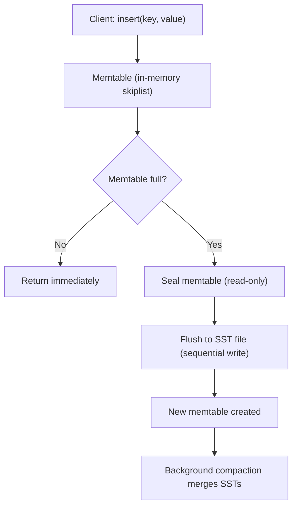

# LSM Tree Internals — Memtable, SST Files, Compaction

**The lsm-tree crate (29,740 lines) is a pure Rust implementation of log-structured merge trees. This document covers the full internals: how the memtable works, how SST files are structured on disk, how blocks are compressed and checksummed, and how compaction strategies choose what to merge.**

## The Core Idea: Writes Are Sequential, Not In-Place

```mermaid
flowchart LR
    A[B-tree: random I/O] --> B["Read page → Modify → Write back"]
    C[LSM: sequential I/O] --> D["Append to memtable → Flush SST"]
    B --> E[O(log n) writes]
    D --> F[O(1) writes]
```

**Aha:** Because writes are always sequential appends to the memtable, LSM trees have O(1) write complexity regardless of data size. The cost is shifted to reads (which may need to search multiple SST files) and compaction (which merges files in the background). This is the fundamental trade-off: write speed for read complexity.

B-trees update data in-place — modifying a leaf node requires reading the page, modifying it, and writing it back. This causes random disk I/O.

LSM trees turn all writes into sequential appends:



**Aha:** Because writes are always sequential appends to the memtable, LSM trees have O(1) write complexity regardless of data size. The cost is shifted to reads (which may need to search multiple SST files) and compaction (which merges files in the background).

## The Memtable: Lock-Free Skiplist

Source: `lsm-tree/src/memtable/mod.rs`

```rust
pub struct Memtable {
    pub id: MemtableId,
    pub items: SkipMap<InternalKey, UserValue>,  // crossbeam_skiplist::SkipMap
    pub(crate) approximate_size: AtomicU64,
    pub(crate) highest_seqno: AtomicU64,
    pub(crate) requested_rotation: AtomicBool,
}
```

### Internal Key Format

Keys in the memtable are not simple user keys — they include metadata for versioning:

```
InternalKey = (user_key, seqno, value_type)
```

| Field | Size | Purpose |
|-------|------|---------|
| `user_key` | variable | The actual key the user inserted |
| `seqno` | 8 bytes (u64) | Monotonically increasing sequence number |
| `value_type` | 1 byte | `Value` (0) or `Tombstone` (1, for deletes) |

**The seqno trick:** The sequence number is stored in **reverse order** so that the skiplist naturally returns the most recent version of a key first. When searching for key "abc", the lowest entry ≥ ("abc", max_seqno) is the most recent version of "abc".

```
Example: Looking up "abc" with seqno=None (want latest)

key     seqno
------  -----
a       7
abc     5  ← Most recent "abc" (returned first)
abc     4
abc     3
abcdef  6
abcdef  5
```

Source: `lsm-tree/src/memtable/mod.rs:93-119` — the `get()` method:

```rust
pub fn get(&self, key: &[u8], seqno: SeqNo) -> Option<InternalValue> {
    if seqno == 0 {
        return None;
    }

    // Search for the lowest entry ≥ (key, seqno-1, ValueType::Value)
    let lower_bound = InternalKey::new(key, seqno - 1, ValueType::Value);

    let mut iter = self.items
        .range(lower_bound..)
        .take_while(|entry| &*entry.key().user_key == key);

    // Return the first matching entry (highest seqno)
    iter.next().map(|entry| InternalValue { ... })
}
```

### Size Tracking and Rotation

The memtable tracks its approximate size atomically:

```rust
// When a key is inserted
self.approximate_size.fetch_add(estimated_size, Ordering::Relaxed);

// When size exceeds threshold
if self.approximate_size.load(Ordering::Relaxed) >= max_memtable_size {
    self.requested_rotation.store(true, Ordering::Relaxed);
}
```

Rotation is triggered when:
1. The memtable exceeds `max_memtable_size` (e.g. 8 MiB)
2. A flush is explicitly requested

## SST Files: Sorted String Tables

Source: `lsm-tree/src/table/mod.rs`

When a memtable is flushed, it becomes an SST (Sorted String Table) file on disk:

```
SST File Layout:
  ┌────────────────────────────────────────────────────┐
  │ DATA BLOCK 0 (compressed key-value pairs)          │
  ├────────────────────────────────────────────────────┤
  │ DATA BLOCK 1                                       │
  ├────────────────────────────────────────────────────┤
  │ ...                                                │
  ├────────────────────────────────────────────────────┤
  │ DATA BLOCK N                                       │
  ├────────────────────────────────────────────────────┤
  │ BLOOM FILTER (skip non-existent keys)              │
  ├────────────────────────────────────────────────────┤
  │ BLOCK INDEX (binary or hash index)                 │
  ├────────────────────────────────────────────────────┤
  │ META BLOCK (compression, format, blob references)  │
  ├────────────────────────────────────────────────────┤
  │ FOOTER (checksums, magic, offsets)                 │
  └────────────────────────────────────────────────────┘
```

### Block Structure

Source: `lsm-tree/src/table/block/mod.rs`

Each data block has a header, compressed data, and a trailer:

```rust
pub struct Block {
    pub header: Header,
    pub data: Slice,
}

pub struct Header {
    pub block_type: BlockType,       // 1 byte: data, index, filter, or meta
    pub checksum: Checksum,           // 16 bytes: 128-bit hash
    pub data_length: u32,             // 4 bytes: compressed size
    pub uncompressed_length: u32,     // 4 bytes: original size
}
```

### Block Writing

Source: `lsm-tree/src/table/block/mod.rs:45-84`

```rust
pub fn write_into<W: std::io::Write>(
    writer: &mut W,
    data: &[u8],
    block_type: BlockType,
    compression: CompressionType,
) -> Result<Header> {
    let mut header = Header {
        block_type,
        checksum: Checksum::from_raw(0),
        data_length: 0,
        uncompressed_length: data.len() as u32,
    };

    // Compress if enabled
    let data = match compression {
        CompressionType::None => data,
        CompressionType::Lz4 => &lz4_flex::compress(data),
    };

    header.data_length = data.len() as u32;
    header.checksum = Checksum::from_raw(crate::hash::hash128(data));

    header.encode_into(&mut writer)?;
    writer.write_all(data)?;
    Ok(header)
}
```

**Aha:** lsm-tree uses **xxHash128** for block checksums, not CRC32 or SHA-256. xxHash is a non-cryptographic hash that's extremely fast (can hash GB/s) while providing excellent collision resistance. For a storage engine checksumming millions of blocks, this matters — decompression is typically faster than memory bandwidth, so reading compressed data can be faster than reading uncompressed data.

### Prefix Compression Within Blocks

Since keys are sorted, consecutive keys share prefixes. lsm-tree uses prefix compression:

```
Keys in a block:
  "user:1"         → "Alice"    (full key)
  "user:2"         → "Bob"      (shared "user:" prefix)
  "user:3"         → "Charlie"  (shared "user:" prefix)
  "user:profile:1" → "Profile"  (full key - restart point)
```

**Restart intervals**: Every N keys (default 16), a full key is stored. This allows binary search within the block without decompressing all keys.

### Block Index Types

Source: `lsm-tree/src/table/block_index/`

| Type | Purpose | Trade-off |
|------|---------|-----------|
| `FullBlockIndex` | Binary index for all keys | Full range scan support, larger |
| `TwoLevelBlockIndex` | Two-level binary index | Scalable for large files |
| `HashBlockIndex` | Hash table mapping keys to blocks | Fast point reads, no range scans |
| `VolatileBlockIndex` | In-memory only, not persisted | Used during construction |

## Bloom Filters

Source: `lsm-tree/src/table/filter/`

Bloom filters let the LSM tree quickly determine if a key **definitely does not exist** in an SST file:

```rust
pub struct BloomFilterBuilder {
    bits_per_key: f64,  // default: 10.0 (1% false positive rate)
}
```

**How it works:**
1. For each key in the SST, add it to the Bloom filter (set bits in a bit array)
2. On lookup, check the Bloom filter:
   - If bits are NOT all set → key definitely doesn't exist → skip this file
   - If bits ARE all set → key might exist → read the data block

With 10 bits per key, the false positive rate is ~1%. This means 99% of lookups for non-existent keys skip the file entirely.

## Compaction Strategies

Source: `lsm-tree/src/compaction/mod.rs`

As SST files accumulate, reads become slower (more files to search) and disk space is wasted (deleted keys still exist in old files). Compaction merges files to solve both.

### Leveled Compaction (LCS)

Source: `lsm-tree/src/compaction/leveled/mod.rs`

Files are organized into levels:
- **L0**: Recently flushed memtables (may have overlapping key ranges)
- **L1**: Size = `base_size` (e.g. 64MB), no overlapping key ranges
- **L2**: Size = `base_size × ratio` (e.g. 640MB)
- **L3**: Size = `base_size × ratio²` (e.g. 6.4GB)

```rust
fn pick_minimal_compaction(
    curr_run: &Run<Table>,      // Tables in current level
    next_run: Option<&Run>,     // Tables in next level
    hidden_set: &HiddenSet,     // Tables being compacted elsewhere
    table_base_size: u64,
) -> Option<(HashSet<TableId>, bool)> {
    // 1. Try trivial move (no overlap with next level)
    // 2. Try merge with minimal write amplification
}
```

### Tiered Compaction (STCS)

Source: `lsm-tree/src/compaction/tiered.rs`

Instead of levels, files are grouped into "tiers" of similar size. When a tier has enough files, they merge into the next tier.

| Metric | Leveled | Tiered |
|--------|---------|--------|
| Write amplification | High (~10x) | Low (~2x) |
| Read amplification | Low (~2x) | High (~10x) |
| Space amplification | Low (~1.1x) | Higher (~2x) |
| Best for | Read-heavy workloads | Write-heavy workloads |

### Compaction Filter

Source: `lsm-tree/src/compaction/filter.rs`

During compaction, a filter can delete expired or tombstoned entries:

```rust
pub trait CompactionFilter {
    fn filter(&self, key: &[u8], value: Option<&[u8]>) -> Verdict;
}

pub enum Verdict {
    Keep,       // Keep this entry
    Remove,     // Delete this entry
    RemoveAndStop,  // Delete and stop scanning (for range deletes)
}
```

## Recovery

Source: `lsm-tree/src/version/recovery.rs`

On startup, the LSM tree:
1. Reads the manifest (which SST files exist in which levels)
2. Validates each SST file's checksum
3. Replays any unflushed journal entries
4. Reconstructs the version (the current state of all levels)

## What's Next

- [02 — fjall Database](02-fjall-database.md) — Journal, keyspaces, transactions
- [00 — Overview](00-overview.md) — Return to overview
- [05 — xs Stream Store](05-xs-stream-store.md) — How xs uses these internals
