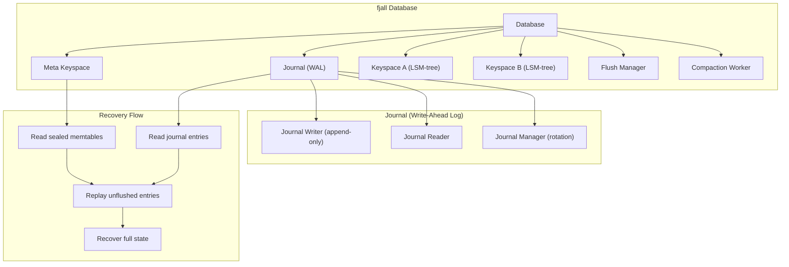
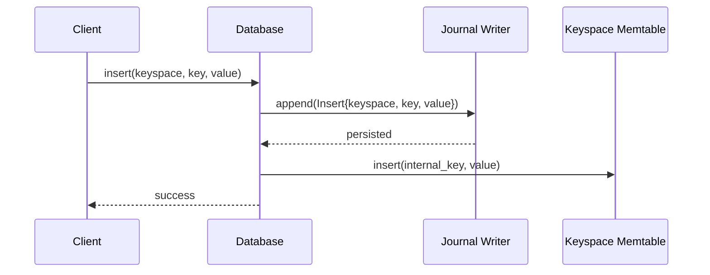
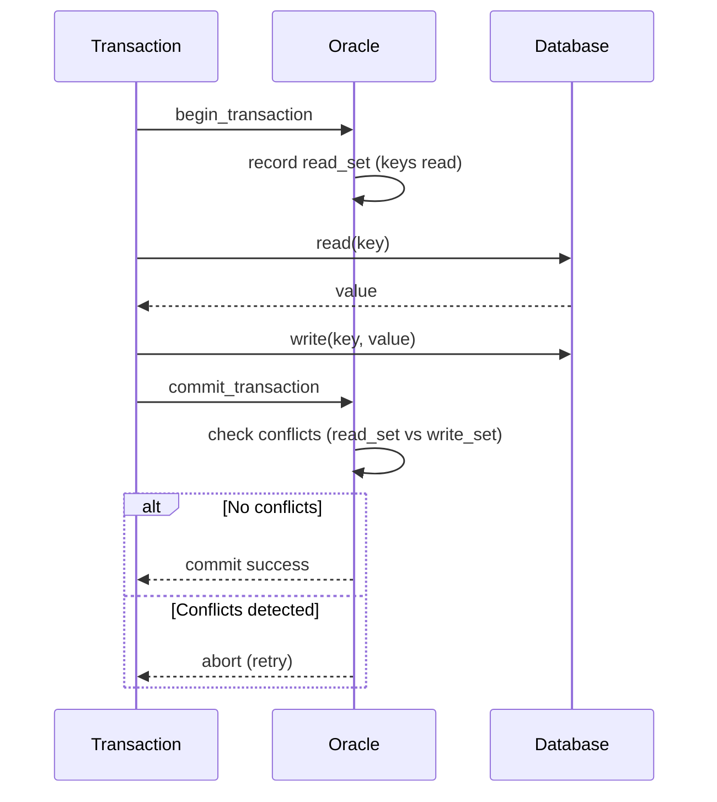

# fjall Database — Journal, Keyspaces, Transactions

**fjall (12,196 lines) wraps lsm-tree into a full database with a write-ahead log (journal), multiple keyspaces (column families), atomic cross-keyspace batches, and optimistic concurrency control. This document covers how each piece works.**

## Why fjall Exists

The `lsm-tree` crate is a primitive LSM implementation — it has **no WAL**, so writes aren't durable until manually flushed. `fjall` adds:

| Feature | lsm-tree | fjall |
|---------|----------|-------|
| WAL / Journal | No | Yes (append-only journal) |
| Multiple keyspaces | No (single tree) | Yes (column families) |
| Atomic batches | No | Yes (cross-keyspace) |
| Transactions | No | Yes (OCC + single-writer) |
| Recovery | Manual | Automatic (journal replay) |

## Database Architecture



## The Journal (Write-Ahead Log)

Source: `fjall/src/journal/`

Every write goes through the journal first — this is what makes fjall durable.

### Journal Entry Format

```rust
pub enum JournalEntry {
    Insert { keyspace: KeyspaceKey, key: Vec<u8>, value: Vec<u8> },
    Remove { keyspace: KeyspaceKey, key: Vec<u8> },
}
```

The journal is an append-only file. Each entry is serialized and appended:

```
Journal File:
  ┌─────────────────────────────────────┐
  │ Entry 0: Insert{keyspace=0, ...}    │
  ├─────────────────────────────────────┤
  │ Entry 1: Insert{keyspace=1, ...}    │
  ├─────────────────────────────────────┤
  │ Entry 2: Remove{keyspace=0, ...}    │
  ├─────────────────────────────────────┤
  │ ...                                 │
  └─────────────────────────────────────┘
```

### Write Path



**Aha:** The journal is persisted **before** the memtable is updated. This means if the process crashes after the journal write but before the memtable update, recovery will replay the journal entry and restore the write. This is the classic WAL protocol.

### Journal Rotation

Source: `fjall/src/journal/manager.rs`

The journal grows unbounded. To prevent it from consuming all disk space, it is rotated when all its entries have been flushed to SST files:

```rust
// After memtable flush completes
fn on_flush_complete(&self, sealed_memtable: &SealedMemtable) {
    // The sealed memtable's journal entries are now in SST files
    // The journal can be truncated up to the sealed memtable's max seqno
    self.journal_manager.advance_safe_seqno(sealed_memtable.max_seqno);
}
```

## Keyspaces (Column Families)

Source: `fjall/src/keyspace/`

A single fjall database can have multiple keyspaces, each with its own LSM-tree:

```rust
let db = Database::builder("./my-db").open()?;
let items = db.keyspace("my_items", KeyspaceCreateOptions::default)?;
let config = db.keyspace("config", KeyspaceCreateOptions::default)?;
```

Each keyspace:
- Has its own memtable and SST files
- Can have different block sizes, compression, filter settings
- Shares the same journal (atomic writes across keyspaces)

### Keyspace Configuration

```rust
KeyspaceCreateOptions {
    max_memtable_size: 64 * 1024 * 1024,          // 64 MiB
    data_block_size_policy: BlockSizePolicy::all(4096),  // 4 KiB blocks
    data_block_hash_ratio_policy: HashRatioPolicy::all(1.0),  // Hash index
    compression: CompressionType::Lz4,
    filter: FilterType::Bloom { bits_per_key: 10.0 },
    compaction: CompactionStrategy::Leveled { ... },
}
```

**Aha:** Each keyspace is independently tunable. For xs's stream store, the `stream` keyspace uses a hash index (fast point reads by scru128 ID), while the `idx_topic` keyspace uses a binary index (fast prefix scans for hierarchical topic queries).

## Atomic Cross-Keyspace Batches

Source: `fjall/src/batch/`

```rust
let mut batch = db.batch();
batch.insert(&items, "key1", "value1");
batch.insert(&config, "setting", "true");
batch.commit()?;  // Atomic: all or nothing
```

The batch writes to the journal atomically — all entries are appended to the journal in a single operation. If any operation fails, none are applied.

**How it works:**
1. Collect all operations in the batch
2. Write all entries to the journal atomically
3. Apply all operations to their respective memtables
4. Return success

If step 2 succeeds but step 3 fails, recovery will replay the journal and complete the operations.

## Transactions: Optimistic Concurrency Control

Source: `fjall/src/tx/optimistic/`

fjall supports optimistic concurrency control (OCC) for multi-writer scenarios:



### The Oracle

```rust
pub struct Oracle {
    read_maps: Mutex<Vec<HashMap<KeyspaceKey, SeqNo>>>,
    write_map: Mutex<HashMap<KeyspaceKey, SeqNo>>,
}
```

The oracle tracks the latest sequence number for each key. At commit time, it checks if any key the transaction read has been modified by another transaction (i.e., its sequence number has increased). If so, the transaction aborts.

**Aha:** OCC is optimistic — it assumes conflicts are rare and validates at commit time. This works well for read-heavy workloads. For write-heavy workloads, fjall also offers a `SingleWriterDatabase` mode with no conflict detection (single thread, no overhead).

## Flush Manager

Source: `fjall/src/flush/`

The flush manager coordinates memtable rotation:

1. Memtable reaches size threshold → flag for rotation
2. Flush manager creates a new memtable
3. Old memtable is sealed and flushed to SST in background
4. SST file is added to the LSM-tree's version
5. Journal is advanced (entries up to sealed memtable's max seqno can be truncated)

## Compaction Worker

Source: `fjall/src/compaction/worker.rs`

Background thread that runs compaction:

1. Check if any level needs compaction
2. Pick the minimal compaction set (via the compaction strategy)
3. Merge files into the next level
4. Update the LSM-tree's version (atomic swap)

**Aha:** Compaction runs in the background and doesn't block writes. Writes always go to the active memtable, regardless of compaction state. This is why LSM trees have O(1) write complexity — compaction is always async.

## Recovery

Source: `fjall/src/recovery.rs`

On startup, fjall:

1. **Load the meta keyspace**: Contains the manifest (which SST files exist)
2. **Load sealed memtables**: SST files already on disk
3. **Read the journal**: All entries not yet flushed to SST
4. **Replay journal entries**: Reconstruct the active memtable state
5. **Database is ready**: Full state recovered

```rust
pub fn recover_keyspaces(...) -> Result<RecoveryResult> {
    // 1. Load manifest from meta keyspace
    let manifest = Manifest::load(&meta_keyspace)?;

    // 2. Load existing SST files
    let segments = manifest.load_segments()?;

    // 3. Read journal
    let journal_entries = journal::read_all(&journal_path)?;

    // 4. Replay unflushed entries
    let memtable = replay_journal(journal_entries, segments)?;

    Ok(RecoveryResult { memtable, segments })
}
```

## Persist Modes

```rust
pub enum PersistMode {
    /// Don't persist — data is in memory only
    None,
    /// Buffer writes (journal in memory, flushed periodically)
    Buffer,
    /// Sync journal to disk after every write
    SyncJournal,
    /// Sync journal and SST files to disk
    SyncAll,
}
```

xs uses `PersistMode::SyncAll` for its stream store — every frame append is synced to disk immediately.

## What's Next

- [03 — cacache-rs](03-cacache-rs.md) — Content-addressable storage
- [01 — LSM Tree Internals](01-lsm-tree-internals.md) — Return to LSM internals
- [05 — xs Stream Store](05-xs-stream-store.md) — How xs uses fjall
