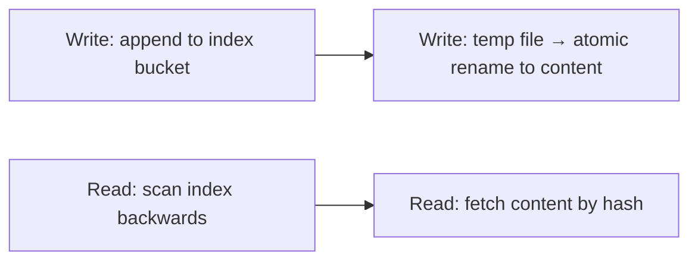
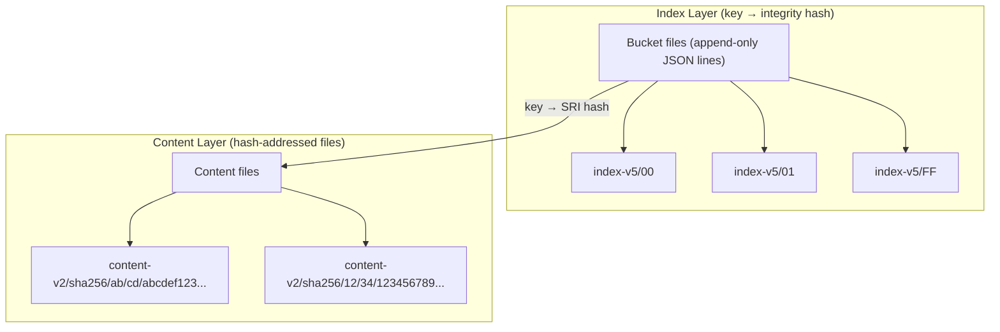

# cacache-rs — Content-Addressable Storage

**cacache-rs (1,228 lines) is a Rust port of npm's cacache — a content-addressable cache where data is stored by its hash, not by a key. This means the same data is never stored twice, and data integrity is guaranteed (the hash is verified on read).**

## Two-Layer Architecture

**Aha:** The index is append-only — there are no updates or deletes. When a key is "updated," a new entry is appended. The lookup reads backwards to find the newest entry. This makes writes fast (just append) and keeps the index simple.





**Aha:** The index is **append-only** — there are no updates or deletes. When a key is "updated," a new entry is appended. The lookup reads backwards to find the newest entry. This makes writes fast (just append) and keeps the index simple.

## Index Layer

Source: `cacache-rs/src/index.rs`

### Index Entry Format

```rust
struct SerializableMetadata {
    key: String,           // User-provided key
    integrity: String,     // "sha256-abcdef..." (SRI hash)
    time: u128,            // Unix milliseconds
    size: usize,           // Data size
    metadata: Value,       // Arbitrary JSON
}
```

Index entries are stored as JSON lines in bucket files:

```
{hash}\t{json}\n
```

### Bucket Distribution

The index is split into 256 buckets based on the hash of the key:

```rust
fn bucket_path(cache: &Path, key: &str) -> PathBuf {
    let hash = hash_entry(key);
    cache.join("index-v5").join(&hash[0..2])
}
```

This means keys are distributed across 256 files, preventing any single file from growing too large.

### Insert (Append-Only)

Source: `cacache-rs/src/index.rs:71-104`

```rust
pub fn insert(cache: &Path, key: &str, opts: WriteOpts) -> Result<Integrity> {
    let bucket = bucket_path(cache, key);
    fs::create_dir_all(bucket.parent().unwrap())?;

    let stringified = serde_json::to_string(&SerializableMetadata { ... })?;

    let mut buck = OpenOptions::new()
        .create(true)
        .append(true)  // Append mode!
        .open(&bucket)?;

    let out = format!("\n{}\t{}", hash_entry(&stringified), stringified);
    buck.write_all(out.as_bytes())?;
    buck.flush()?;

    Ok(opts.sri.unwrap())
}
```

### Lookup (Read Backwards)

To look up a key:
1. Compute the bucket path: `index-v5/{hash(key) % 256}`
2. Read the bucket file backwards (newest entries first)
3. Find the first entry matching the key
4. Return the integrity hash

## Content Layer

Source: `cacache-rs/src/content/`

Content files are stored at paths derived from their integrity hash:

```
content-v2/
  sha256/
    ab/
      cd/
        abcdef1234567890...  ← The actual data (named by full hash)
    12/
      34/
        1234567890abcdef...
```

**Aha:** The path structure (first 2 chars / next 2 chars / full hash) prevents any single directory from having too many files. With SHA-256, there are 256 × 256 = 65,536 possible subdirectories.

### Write Flow

Source: `cacache-rs/src/content/write.rs`

```rust
pub struct Writer {
    cache: PathBuf,
    builder: IntegrityOpts,  // Hashes data as it's written
    mmap: Option<MmapMut>,   // Memory-mapped temp file (for large writes)
    tmpfile: NamedTempFile,  // Temp file for atomic write
}

impl Writer {
    pub fn close(self) -> Result<Integrity> {
        let sri = self.builder.result();  // Compute integrity hash
        let cpath = path::content_path(&self.cache, &sri);  // hash-addressed path
        DirBuilder::new().recursive(true).create(cpath.parent().unwrap())?;

        // Atomic rename: temp file → content file
        let res = self.tmpfile.persist(&cpath);
        match res {
            Ok(_) => {}
            Err(e) => {
                // Handle conflicts: if destination already exists, that's OK
                // (another writer already wrote the same content)
                if !cpath.exists() {
                    return Err(e.error)?;
                }
            }
        }
        Ok(sri)
    }
}
```

**The write process:**
1. Create a temp file in `{cache}/tmp/`
2. Write data, hashing it as you go (SHA-256 or SHA-1)
3. On close, atomically rename the temp file to `{cache}/content-v2/{hash[0..2]}/{hash[2..4]}/{full_hash}`
4. Return the integrity hash

**Aha:** The content file is named by its hash. This means:
- The same content (same hash) is stored only once — automatic deduplication
- If two writers write the same content simultaneously, only one file is created (the other's temp file is discarded, but the content file already exists)

### Integrity Verification

Source: `cacache-rs/src/content/read.rs`

When reading content, the hash is verified:

```rust
pub fn read_hash(cache: &Path, sri: &Integrity) -> Result<Vec<u8>> {
    let cpath = path::content_path(cache, sri);
    let data = fs::read(&cpath)?;

    // Verify the data matches the expected hash
    let actual = IntegrityOpts::new()
        .algorithm(sri.algorithm())
        .chain(&data)
        .result();

    if actual != *sri {
        return Err(Error::IntegrityMismatch);
    }

    Ok(data)
}
```

**This guarantees:** You can never read corrupted data. If the file on disk doesn't match the expected hash, you get an error, not corrupted data.

## API Layout

Source: `cacache-rs/src/lib.rs`

The API is organized like `std::fs`:

| Operation | Async (default) | Sync |
|-----------|----------------|------|
| Write by key | `cacache::write(cache, key, data)` | `write_sync` |
| Read by key | `cacache::read(cache, key)` | `read_sync` |
| Write by hash | `cacache::write_hash(cache, data)` | `write_hash_sync` |
| Read by hash | `cacache::read_hash(cache, hash)` | `read_hash_sync` |
| Stream write | `cacache::Writer::create(cache, key)` | `SyncWriter::create` |

### Hash Reads Are Faster

Reading by hash is faster than reading by key because:
- **Hash read**: Direct file read at `{cache}/content-v2/{hash[0..2]}/{hash[2..4]}/{hash}`
- **Key read**: Read index bucket → find entry → get hash → read content file

## Memory-Mapped Writes

Source: `cacache-rs/src/content/write.rs:24-26`

For large writes (>1MB), cacache uses memory-mapped files:

```rust
#[cfg(feature = "mmap")]
pub const MAX_MMAP_SIZE: usize = 1024 * 1024;  // 1MB threshold
```

Memory-mapped writes are faster for large files because:
- The OS handles page-level I/O
- No user-space buffer copies
- Write-back caching by the OS

## What's Next

- [04 — scru128](04-scru128.md) — Sortable IDs, comparison with Snowflake
- [03 — cacache-rs](03-cacache-rs.md) — Return to cacache
- [05 — xs Stream Store](05-xs-stream-store.md) — How xs uses cacache
