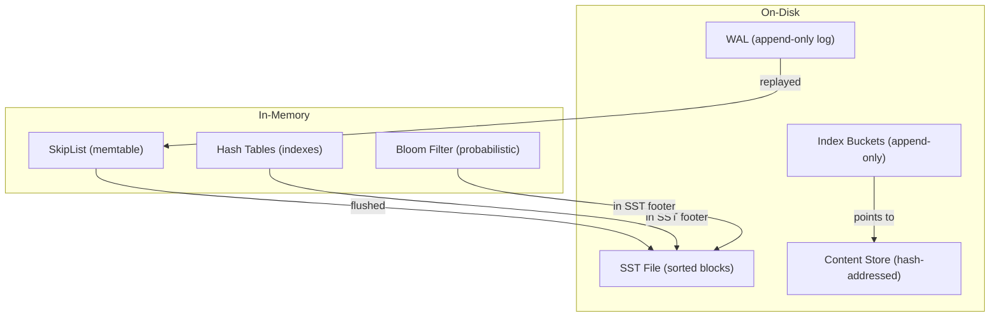

# Data Structures Master Guide — SkipLists, SSTs, Bloom Filters, and More

**This is a comprehensive guide to every data structure used in the LSM storage stack. For each structure, you'll learn what it is, how it works internally, how to implement it from scratch in Rust, edge cases to watch for, how to store it on disk efficiently, and how to guarantee correctness. After reading this, you'll understand the foundations of production storage engines.**

## The Full Stack of Data Structures

**Aha:** Each data structure in the stack serves a specific purpose: SkipLists for concurrent in-memory writes, SSTs for durable sorted storage on disk, Bloom filters for fast non-existence checks, and hash tables for index lookups. Together they form the foundation of any production LSM-based storage engine.



---

## 1. The SkipList

**Used in:** Memtable (lsm-tree's in-memory write buffer)

### What It Is

A SkipList is a probabilistic alternative to balanced trees (B-trees, AVL trees). It's a sorted linked list where each node has multiple "levels" of forward pointers, allowing O(log n) search, insert, and delete with high probability.

```
Level 3:  [head] ──────────────► [25] ──────► [50] ──► nil
Level 2:  [head] ───► [10] ───► [25] ──► [35] ──► [50] ──► nil
Level 1:  [head] ─► [5] ─► [10] ─► [15] ─► [25] ─► [30] ─► [35] ─► [50] ──► nil
```

**Aha:** Unlike a B-tree which needs locks for concurrent access, a lock-free SkipList allows many readers and writers simultaneously. This is why lsm-tree uses it for the memtable — writes to the memtable never block reads.

### How It Works

Each node has a random height (number of levels). The probability of a node having level k is p^k (typically p = 0.5). Search starts at the highest level and "drops down" when the next node is greater than the search key.

### Implementing from Scratch in Rust

```rust
use std::cmp::Ordering;
use std::ptr::NonNull;
use std::sync::atomic::{AtomicUsize, Ordering as AtomicOrdering};
use std::sync::Arc;

const MAX_LEVEL: usize = 18;  // 2^18 > 256K entries
const P: f64 = 0.5;

struct Node<K, V> {
    key: K,
    value: V,
    /// forward[i] points to the next node at level i
    forward: [Option<NonNull<Node<K, V>>>; MAX_LEVEL],
}

pub struct SkipList<K, V> {
    head: NonNull<Node<K, V>>,
    height: AtomicUsize,
    len: AtomicUsize,
}

unsafe impl<K: Send, V: Send> Send for SkipList<K, V> {}
unsafe impl<K: Send, V: Send> Sync for SkipList<K, V> {}

impl<K: Ord, V> SkipList<K, V> {
    pub fn new() -> Self {
        // Create sentinel head node with MAX_LEVEL forward pointers
        let head = Box::new(Node {
            key: unsafe { std::mem::zeroed() },  // Sentinel
            value: unsafe { std::mem::zeroed() },
            forward: [None; MAX_LEVEL],
        });
        let head = Box::into_raw(head);

        Self {
            head: unsafe { NonNull::new_unchecked(head) },
            height: AtomicUsize::new(1),
            len: AtomicUsize::new(0),
        }
    }

    /// Generate a random level for a new node
    fn random_level(&self) -> usize {
        let mut level = 1;
        while rand::random::<f64>() < P && level < MAX_LEVEL {
            level += 1;
        }
        level
    }

    pub fn get(&self, key: &K) -> Option<&V> {
        unsafe {
            let mut current = self.head;
            // Start from the highest level
            for i in (0..self.height.load(AtomicOrdering::Acquire)).rev() {
                while let Some(next) = (*current).forward[i] {
                    match (*next).key.cmp(key) {
                        Ordering::Less => current = next,
                        Ordering::Equal => return Some(&(*next).value),
                        Ordering::Greater => break,
                    }
                }
            }
            None
        }
    }

    pub fn insert(&self, key: K, value: V) -> Option<V> {
        // Find update positions at each level
        let mut update: [Option<NonNull<Node<K, V>>>; MAX_LEVEL] = [None; MAX_LEVEL];
        let mut current = self.head;

        unsafe {
            let height = self.height.load(AtomicOrdering::Acquire);
            for i in (0..height).rev() {
                while let Some(next) = (*current).forward[i] {
                    match (*next).key.cmp(&key) {
                        Ordering::Less => current = next,
                        Ordering::Equal => {
                            // Key exists, update value at level 0
                            let old = std::mem::replace(&mut (*next).value, value);
                            return Some(old);
                        },
                        Ordering::Greater => break,
                    }
                }
                update[i] = Some(current);
            }

            let level = self.random_level();

            // Update height if necessary
            if level > height {
                for i in height..level {
                    update[i] = Some(self.head);
                }
                self.height.store(level, AtomicOrdering::Release);
            }

            // Create new node
            let new_node = Box::new(Node {
                key,
                value,
                forward: [None; MAX_LEVEL],
            });
            let new_ptr = Box::into_raw(new_node);
            let new_node = &mut *new_ptr;

            // Insert at each level
            for i in 0..level {
                if let Some(update_node) = update[i] {
                    new_node.forward[i] = (*update_node).forward[i];
                    (*update_node).forward[i] = Some(NonNull::new(new_ptr).unwrap());
                }
            }
        }

        self.len.fetch_add(1, AtomicOrdering::Relaxed);
        None
    }
}

impl<K, V> Drop for SkipList<K, V> {
    fn drop(&mut self) {
        unsafe {
            let mut current = (*self.head).forward[0];
            drop(Box::from_raw(self.head));
            while let Some(node) = current {
                let next = (*node).forward[0];
                drop(Box::from_raw(node));
                current = next;
            }
        }
    }
}
```

### Edge Cases and Gotchas

1. **Sentinel node**: The head is a sentinel with an uninitialized key/value. Never dereference the key of the head node.
2. **Memory ordering**: The height must be updated with Release ordering, and read with Acquire ordering, to ensure other threads see a consistent view.
3. **Lock-free vs concurrent**: The simple implementation above is NOT thread-safe for concurrent writes. For production use, you need `crossbeam_skiplist` which uses epoch-based reclamation.
4. **Memory leaks**: Every node allocated with `Box::into_raw` must be freed in `Drop`. Missing a node is a memory leak.

### Disk Storage

SkipLists are **never stored on disk directly**. They're flushed as sorted runs (SST files). The flush process:


**Aha:** The SkipList-to-SST flush is why LSM trees have O(1) writes — all the expensive sorting and indexing happens during the background flush, not during the write.

### Disk Storage

SkipLists are **never stored on disk directly**. They're flushed as sorted runs (SST files). The flush process:
1. Iterate the SkipList in order (follow level-0 pointers)
2. Write key-value pairs sequentially to a file
3. Build block indexes and bloom filters as you write
4. Atomically rename the file into place

---

## 2. SST Files (Sorted String Tables)

**Used in:** lsm-tree's on-disk storage

### What It Is

An SST file is an immutable, sorted list of key-value pairs. It's the fundamental on-disk structure of any LSM tree.

```
SST File Layout:
  ┌─────────────────────────────────────┐
  │ Block 0: [k1:v1][k2:v2]...[kn:vn]   │
  ├─────────────────────────────────────┤
  │ Block 1: [kn+1:vn+1]...             │
  ├─────────────────────────────────────┤
  │ ...                                 │
  ├─────────────────────────────────────┤
  │ Bloom Filter (skip non-existent)    │
  ├─────────────────────────────────────┤
  │ Block Index (key → block offset)    │
  ├─────────────────────────────────────┤
  │ Footer (checksums, magic, offsets)  │
  └─────────────────────────────────────┘
```

### How It Works

Each block contains:
1. **Header**: block type, checksum, data length, uncompressed length
2. **Data**: key-value pairs with prefix compression
3. **Trailer**: restart points (full keys every N entries for binary search)

### Implementing an SST Writer from Scratch

```rust
use std::fs::File;
use std::io::{BufWriter, Write, Seek, SeekFrom};

const BLOCK_SIZE: usize = 4096;
const RESTART_INTERVAL: usize = 16;
const MAGIC: u64 = 0xFB32109876543210;

pub struct SstWriter {
    file: BufWriter<File>,
    block_data: Vec<u8>,
    restart_points: Vec<(u32, Vec<u8>)>,  // (offset, key)
    block_offsets: Vec<BlockHandle>,      // offset, size
    key_count: u64,
}

#[derive(Debug)]
struct BlockHandle {
    offset: u64,
    size: u64,
}

struct Footer {
    meta_index_handle: BlockHandle,
    index_handle: BlockHandle,
    magic: u64,
}

impl SstWriter {
    pub fn create(path: &str) -> std::io::Result<Self> {
        let file = File::create(path)?;
        Ok(Self {
            file: BufWriter::new(file),
            block_data: Vec::with_capacity(BLOCK_SIZE),
            restart_points: Vec::new(),
            block_offsets: Vec::new(),
            key_count: 0,
        })
    }

    /// Add a key-value pair. Keys MUST be added in sorted order.
    pub fn add(&mut self, key: &[u8], value: &[u8]) -> std::io::Result<()> {
        // Prefix compress the key
        let shared = if self.key_count % RESTART_INTERVAL == 0 {
            // Restart point: store full key
            self.restart_points.push((
                self.block_data.len() as u32,
                key.to_vec(),
            ));
            0
        } else {
            // Prefix compression: count shared bytes with previous key
            let prev_key = &self.restart_points.last().unwrap().1;
            key.iter()
                .zip(prev_key.iter())
                .take_while(|(a, b)| a == b)
                .count()
        };

        // Write: shared_prefix_len | non_shared_len | value_len | non_shared_key | value
        let non_shared = key.len() - shared;
        self.block_data.push(shared as u8);
        self.block_data.push(non_shared as u8);
        self.write_varint(value.len() as u64);
        self.block_data.extend_from_slice(&key[shared..]);
        self.block_data.extend_from_slice(value);

        self.key_count += 1;

        // Flush block if full
        if self.block_data.len() >= BLOCK_SIZE {
            self.flush_block()?;
        }

        Ok(())
    }

    fn flush_block(&mut self) -> std::io::Result<()> {
        let offset = self.file.stream_position()?;
        self.file.write_all(&self.block_data)?;

        self.block_offsets.push(BlockHandle {
            offset,
            size: self.block_data.len() as u64,
        });

        self.block_data.clear();
        self.restart_points.clear();
        Ok(())
    }

    pub fn finish(mut self) -> std::io::Result<()> {
        // Flush final block
        if !self.block_data.is_empty() {
            self.flush_block()?;
        }

        // Write block index
        let index_offset = self.file.stream_position()?;
        for handle in &self.block_offsets {
            self.write_block_handle(handle)?;
        }

        // Write footer
        let footer = Footer {
            meta_index_handle: BlockHandle { offset: 0, size: 0 },  // Simplified
            index_handle: BlockHandle {
                offset: index_offset,
                size: self.file.stream_position()? - index_offset,
            },
            magic: MAGIC,
        };
        self.write_footer(&footer)?;

        self.file.flush()?;
        Ok(())
    }

    fn write_varint(&mut self, mut val: u64) {
        while val > 0x7f {
            self.block_data.push((val as u8) | 0x80);
            val >>= 7;
        }
        self.block_data.push(val as u8);
    }

    fn write_block_handle(&mut self, handle: &BlockHandle) -> std::io::Result<()> {
        self.write_varint(handle.offset);
        self.write_varint(handle.size);
        Ok(())
    }

    fn write_footer(&mut self, footer: &Footer) -> std::io::Result<()> {
        self.write_block_handle(&footer.meta_index_handle)?;
        self.write_block_handle(&footer.index_handle)?;
        self.file.write_all(&footer.magic.to_le_bytes())?;
        Ok(())
    }
}
```

### Edge Cases and Gotchas

1. **Sorted order**: Keys MUST be added in sorted order. Adding out of order corrupts the file.
2. **Prefix compression**: Only compresses within a block. Restart points store full keys so you can binary search within the block.
3. **Varint encoding**: Numbers are encoded as variable-length integers. The MSB indicates continuation.
4. **Atomic file creation**: Always write to a temp file, then atomically rename. A partial SST file is worse than no SST file.
5. **Checksums**: Every block should have a checksum. Without it, disk corruption goes undetected.

### Disk Storage Best Practices

1. **Block size**: 4KB matches the OS page size. Larger blocks (64KB) reduce overhead but increase I/O for point lookups.
2. **Compression**: LZ4 is fast enough that reading compressed data can be faster than reading uncompressed data (decompression speed > disk bandwidth).
3. **Bloom filters**: Add a Bloom filter for each SST. With 10 bits per key, you get ~1% false positive rate, which means 99% of non-existent key lookups skip the file entirely.

---

## 3. Bloom Filters

**Used in:** SST files (skip non-existent keys)

### What It Is

A Bloom filter is a probabilistic data structure that answers: "Is this element definitely NOT in the set, or might it be in the set?"

- **"Definitely not"**: 100% accurate — if it says "no", the element is NOT in the set
- **"Maybe"**: Can have false positives — if it says "yes", the element MIGHT be in the set

### How It Works

A Bloom filter is a bit array of size m, with k independent hash functions. To insert:
1. Hash the key with each of k hash functions → k bit positions
2. Set those k bits to 1

To query:
1. Hash the key with each of k hash functions
2. If ALL k bits are 1 → "maybe" (the key might exist)
3. If ANY bit is 0 → "definitely not" (the key doesn't exist)

### Implementing from Scratch

```rust
use std::collections::hash_map::DefaultHasher;
use std::hash::{Hash, Hasher};

pub struct BloomFilter {
    bits: Vec<bool>,
    k: usize,  // number of hash functions
}

impl BloomFilter {
    /// Create a Bloom filter for n items with false positive rate p
    pub fn with_capacity(n: usize, p: f64) -> Self {
        let m = optimal_m(n, p);
        let k = optimal_k(n, m);
        Self {
            bits: vec![false; m],
            k,
        }
    }

    pub fn insert(&mut self, item: &[u8]) {
        for i in 0..self.k {
            let idx = hash_with_seed(item, i) % self.bits.len();
            self.bits[idx] = true;
        }
    }

    pub fn might_contain(&self, item: &[u8]) -> bool {
        for i in 0..self.k {
            let idx = hash_with_seed(item, i) % self.bits.len();
            if !self.bits[idx] {
                return false;  // Definitely not
            }
        }
        true  // Maybe
    }
}

fn optimal_m(n: usize, p: f64) -> usize {
    // m = -n * ln(p) / (ln(2))^2
    (-(n as f64) * p.ln() / (2.0_f64.ln().powi(2))).ceil() as usize
}

fn optimal_k(n: usize, m: usize) -> usize {
    // k = (m/n) * ln(2)
    ((m as f64 / n as f64) * 2.0_f64.ln()).round() as usize
}

fn hash_with_seed(item: &[u8], seed: usize) -> usize {
    let mut hasher = DefaultHasher::new();
    seed.hash(&mut hasher);
    item.hash(&mut hasher);
    hasher.finish() as usize
}
```

### Production Implementation: Double Hashing

For production, you don't need k independent hash functions. You can use **double hashing** (Kirsch-Mitzenmacher):

```rust
// Two hash functions: h1(x), h2(x)
// k "hashes": h_i(x) = h1(x) + i * h2(x)
fn bloom_indices(item: &[u8], k: usize, m: usize) -> Vec<usize> {
    let h1 = hash1(item) % m;
    let h2 = hash2(item) % m;
    (0..k).map(|i| (h1 + i * h2) % m).collect()
}
```

### Edge Cases and Gotchas

1. **No deletions**: You can't remove items from a Bloom filter (setting a bit to 0 might remove other items). Use a Counting Bloom Filter if you need deletions.
2. **False positive rate grows**: As you add more items than planned, the false positive rate increases. Design for the worst case.
3. **Serialization**: Serialize as a bit vector. Don't serialize the `Vec<bool>` — pack bits into bytes.
4. **Hash function quality**: Poor hash functions cluster bits and increase false positives. Use a good hash like xxHash or MurmurHash.

### Disk Storage

A Bloom filter is stored as:
1. **Bit vector**: Packed bits (8 bits per byte)
2. **Header**: number of bits (m), number of hash functions (k)

For a 1M-item filter with 1% false positive rate: m ≈ 9.6M bits ≈ 1.2 MB.

---

## 4. Block Indexes

**Used in:** SST files (locate blocks by key)

### What It Is

A block index maps keys to block handles (offset + size in the file). There are two main types:

1. **Binary Index**: Sorted list of (key, block_handle) pairs
2. **Hash Index**: Hash table mapping keys to block handles

### Binary Index

```
Index entries:
  [key_16] → BlockHandle(offset=0, size=4096)
  [key_32] → BlockHandle(offset=4096, size=4096)
  [key_48] → BlockHandle(offset=8192, size=4096)
```

To find a key: binary search the index → find the block → read the block → search within the block.

### Hash Index

```
Hash table:
  hash(key) → BlockHandle(offset, size)
```

To find a key: hash the key → get the block handle → read the block.

### Implementing a Two-Level Index from Scratch

For large files, a single-level index can be too big. A two-level index solves this:

```rust
/// Two-level block index:
/// Level 1: sparse index (one entry per block of blocks)
/// Level 2: block index (full index within each block)
pub struct TwoLevelIndex {
    level1: Vec<Level1Entry>,  // (last_key_in_block, offset_of_block_index)
}

struct Level1Entry {
    separator_key: Vec<u8>,  // Last key covered by this block's index
    block_index_offset: u64,  // Where to read the block index from
}
```

To find a key:
1. Binary search level1 → find which block index to load
2. Read the block index from disk
3. Binary search the block index → find the data block
4. Read the data block from disk

### Edge Cases

1. **Empty file**: An SST with no keys still needs a valid footer (empty index, empty bloom filter).
2. **Single key**: An SST with one key has one block with one entry. The index has one entry.
3. **Large keys**: If keys are larger than a block, the block contains only one key. Handle this case in your reader.

---

## 5. Write-Ahead Log (Journal)

**Used in:** fjall (crash recovery)

### What It Is

A WAL is an append-only log of all modifications. Before any change is applied to the in-memory data structure, it's first written to the WAL. On crash, the WAL is replayed to reconstruct the state.

```
WAL File:
  ┌─────────────────────────────────────┐
  │ Entry 0: Insert{keyspace=0, k="a", v="1"} │
  ├─────────────────────────────────────┤
  │ Entry 1: Insert{keyspace=0, k="b", v="2"} │
  ├─────────────────────────────────────┤
  │ Entry 2: Delete{keyspace=0, k="a"}      │
  ├─────────────────────────────────────┤
  │ ...                                 │
  └─────────────────────────────────────┘
```

### Implementing a WAL from Scratch

```rust
use std::fs::{File, OpenOptions};
use std::io::{Write, Read, Seek, SeekFrom};

#[derive(Debug, Clone)]
pub enum WalEntry {
    Insert { keyspace: u32, key: Vec<u8>, value: Vec<u8> },
    Delete { keyspace: u32, key: Vec<u8> },
}

pub struct WalWriter {
    file: File,
}

impl WalWriter {
    pub fn open(path: &str) -> std::io::Result<Self> {
        let file = OpenOptions::new()
            .create(true)
            .append(true)
            .open(path)?;
        Ok(Self { file })
    }

    pub fn write(&mut self, entry: &WalEntry) -> std::io::Result<()> {
        // Serialize: [type: 1 byte] [keyspace: 4 bytes] [key_len: 4 bytes] [key] [value_len: 4 bytes] [value]
        let mut buf = Vec::new();
        match entry {
            WalEntry::Insert { keyspace, key, value } => {
                buf.push(0);  // type
                buf.extend_from_slice(&keyspace.to_be_bytes());
                buf.extend_from_slice(&(key.len() as u32).to_be_bytes());
                buf.extend_from_slice(key);
                buf.extend_from_slice(&(value.len() as u32).to_be_bytes());
                buf.extend_from_slice(value);
            }
            WalEntry::Delete { keyspace, key } => {
                buf.push(1);
                buf.extend_from_slice(&keyspace.to_be_bytes());
                buf.extend_from_slice(&(key.len() as u32).to_be_bytes());
                buf.extend_from_slice(key);
            }
        }
        self.file.write_all(&buf)?;
        self.file.sync_all()?;  // Force to disk
        Ok(())
    }
}

pub struct WalReader {
    file: File,
}

impl WalReader {
    pub fn open(path: &str) -> std::io::Result<Self> {
        let file = File::open(path)?;
        Ok(Self { file })
    }

    pub fn read_all(&mut self) -> std::io::Result<Vec<WalEntry>> {
        let mut entries = Vec::new();
        let mut buf = Vec::new();
        self.file.read_to_end(&mut buf)?;

        let mut pos = 0;
        while pos < buf.len() {
            let entry_type = buf[pos];
            pos += 1;

            let keyspace = u32::from_be_bytes([buf[pos], buf[pos+1], buf[pos+2], buf[pos+3]]);
            pos += 4;

            let key_len = u32::from_be_bytes([buf[pos], buf[pos+1], buf[pos+2], buf[pos+3]]) as usize;
            pos += 4;
            let key = buf[pos..pos + key_len].to_vec();
            pos += key_len;

            match entry_type {
                0 => {
                    let value_len = u32::from_be_bytes([buf[pos], buf[pos+1], buf[pos+2], buf[pos+3]]) as usize;
                    pos += 4;
                    let value = buf[pos..pos + value_len].to_vec();
                    pos += value_len;
                    entries.push(WalEntry::Insert { keyspace, key, value });
                }
                1 => {
                    entries.push(WalEntry::Delete { keyspace, key });
                }
                _ => return Err(std::io::Error::new(std::io::ErrorKind::InvalidData, "unknown entry type")),
            }
        }

        Ok(entries)
    }
}
```

### Edge Cases and Gotchas

1. **fsync is mandatory**: Without `sync_all()`, data may be in the OS page cache but not on disk. A crash loses the WAL entries.
2. **Partial writes**: If the process crashes mid-write, the WAL may have a partial entry at the end. Your reader must detect and discard partial entries.
3. **WAL rotation**: The WAL grows unbounded. After a checkpoint (memtable flushed to SST), entries up to the checkpoint can be discarded.
4. **Atomic checkpoint**: The checkpoint marker must be written atomically. If the checkpoint marker is written but the SST isn't flushed, recovery will lose data.

### Disk Storage Best Practices

1. **Append-only**: Never modify existing WAL entries. Always append.
2. **Batch syncs**: For performance, batch multiple writes before syncing. Trade-off: more data at risk on crash.
3. **Truncate carefully**: After a checkpoint, truncate the WAL. But truncate AFTER the checkpoint is complete.

---

## 6. Content-Addressable Storage

**Used in:** cacache-rs (content deduplication)

### What It Is

Content-addressable storage stores data by its hash, not by a name. The same content is stored only once, regardless of how many names point to it.

```
Content Store:
  content-v2/
    sha256/
      ab/
        cd/
          abcdef1234567890...  ← Named by its hash
```

### Implementing from Scratch

```rust
use sha2::{Sha256, Digest};
use std::fs;
use std::io::Write;
use std::path::PathBuf;

pub struct ContentStore {
    root: PathBuf,
}

impl ContentStore {
    pub fn new(root: &str) -> Self {
        fs::create_dir_all(root).unwrap();
        Self { root: PathBuf::from(root) }
    }

    /// Compute the hash of content
    pub fn hash(content: &[u8]) -> String {
        let mut hasher = Sha256::new();
        hasher.update(content);
        format!("{:x}", hasher.finalize())
    }

    /// Get the path for a given hash
    fn content_path(&self, hash: &str) -> PathBuf {
        // content-v2/sha256/ab/cd/abcdef...
        self.root
            .join("sha256")
            .join(&hash[0..2])
            .join(&hash[2..4])
            .join(hash)
    }

    /// Store content, return its hash
    pub fn put(&self, content: &[u8]) -> std::io::Result<String> {
        let hash = Self::hash(content);
        let path = self.content_path(&hash);

        // If already exists, skip (deduplication!)
        if path.exists() {
            return Ok(hash);
        }

        // Atomic write: temp file → rename
        let tmp_path = path.with_extension(".tmp");
        fs::create_dir_all(path.parent().unwrap())?;
        let mut file = fs::File::create(&tmp_path)?;
        file.write_all(content)?;
        file.sync_all()?;
        fs::rename(&tmp_path, &path)?;

        Ok(hash)
    }

    /// Retrieve content by hash
    pub fn get(&self, hash: &str) -> std::io::Result<Vec<u8>> {
        let path = self.content_path(hash);
        fs::read(&path)
    }

    /// Retrieve and verify content by hash
    pub fn get_verified(&self, hash: &str) -> std::io::Result<Vec<u8>> {
        let content = self.get(hash)?;
        let actual_hash = Self::hash(&content);
        if actual_hash != hash {
            return Err(std::io::Error::new(
                std::io::ErrorKind::InvalidData,
                format!("hash mismatch: expected {}, got {}", hash, actual_hash),
            ));
        }
        Ok(content)
    }
}
```

### Edge Cases

1. **Race condition on put**: Two writers might try to write the same hash simultaneously. Use a temp file + atomic rename to avoid corruption.
2. **Garbage collection**: Content is never deleted automatically. You need a GC process that finds unreachable content (not referenced by any index entry).
3. **Directory explosion**: With 256 × 256 = 65,536 subdirectories, some filesystems may have issues. Use a shallower hierarchy if needed.

---

## 7. scru128 IDs

**Used in:** xs (sortable, unique IDs)

### What It Is

scru128 is a 128-bit sortable unique ID:

```
  ┌──────────────┬───────────────────┬───────────────────┬──────────────────┐
  │ 48-bit       │ 24-bit            │ 24-bit            │ 32-bit           │
  │ timestamp    │ counter_hi        │ counter_lo        │ entropy          │
  └──────────────┴───────────────────┴───────────────────┴──────────────────┘
```

### Bit Layout

| Field | Bits | Purpose |
|-------|------|---------|
| `timestamp` | 48 | Milliseconds since Unix epoch (usable until year 10889) |
| `counter_hi` | 24 | Random, refreshed every second |
| `counter_lo` | 24 | Counter within the same millisecond |
| `entropy` | 32 | Fully random — prevents prediction |

### Implementing from Scratch

```rust
use std::time::{SystemTime, UNIX_EPOCH};

const MAX_TIMESTAMP: u64 = 0xffff_ffff_ffff;
const MAX_COUNTER_HI: u32 = 0xff_ffff;
const MAX_COUNTER_LO: u32 = 0xff_ffff;

pub struct Scru128Generator {
    timestamp: u64,
    counter_hi: u32,
    counter_lo: u32,
    ts_counter_hi: u64,
    rollback_allowance: u64,  // 10 seconds default
}

impl Scru128Generator {
    pub fn new() -> Self {
        Self {
            timestamp: 0,
            counter_hi: 0,
            counter_lo: 0,
            ts_counter_hi: 0,
            rollback_allowance: 10_000,
        }
    }

    pub fn generate(&mut self) -> u128 {
        let timestamp = SystemTime::now()
            .duration_since(UNIX_EPOCH)
            .unwrap()
            .as_millis() as u64;

        self.generate_with_ts(timestamp)
    }

    pub fn generate_with_ts(&mut self, timestamp: u64) -> u128 {
        if timestamp > self.timestamp {
            self.timestamp = timestamp;
            self.counter_lo = rand::random::<u32>() & MAX_COUNTER_LO;
        } else if timestamp + self.rollback_allowance >= self.timestamp {
            self.counter_lo += 1;
            if self.counter_lo > MAX_COUNTER_LO {
                self.counter_lo = 0;
                self.counter_hi += 1;
                if self.counter_hi > MAX_COUNTER_HI {
                    self.counter_hi = 0;
                    self.timestamp += 1;
                    self.counter_lo = rand::random::<u32>() & MAX_COUNTER_LO;
                }
            }
        } else {
            // Clock rollback too significant — reset
            self.timestamp = 0;
            self.counter_hi = 0;
            self.counter_lo = 0;
            return self.generate_with_ts(timestamp);
        }

        if self.timestamp - self.ts_counter_hi >= 1_000 || self.ts_counter_hi == 0 {
            self.ts_counter_hi = self.timestamp;
            self.counter_hi = rand::random::<u32>() & MAX_COUNTER_HI;
        }

        let entropy = rand::random::<u32>();
        ((self.timestamp as u128) << 80)
            | ((self.counter_hi as u128) << 56)
            | ((self.counter_lo as u128) << 32)
            | (entropy as u128)
    }
}
```

### scru128 vs Twitter Snowflake

| Aspect | Snowflake | scru128 |
|--------|-----------|---------|
| Total bits | 64 | 128 |
| Machine ID | 10 bits (required) | None |
| Max IDs/ms | 4,096 | ~281 trillion |
| Unpredictable | No | Yes (32-bit entropy) |
| Clock rollback | Blocks | Resets or aborts |

**Aha:** scru128 doesn't need a machine ID because the 32-bit entropy field ensures uniqueness across nodes. This means you don't need coordination (like ZooKeeper) to assign machine IDs.

### Edge Cases

1. **Clock rollback**: If the system clock goes back more than 10 seconds, the generator resets. This prevents ID collisions.
2. **Counter overflow**: At ~281 trillion IDs per millisecond, the counter won't overflow in practice. But if it does, the timestamp is incremented.
3. **Sortable**: IDs are sortable as integers AND as strings (Base36). The timestamp is the most significant field, so later IDs sort after earlier ones.

---

## What's Next

- [05 — xs Stream Store](05-xs-stream-store.md) — How xs uses all these structures together
- [06 — fjall Patterns](06-fjall-patterns.md) — Alternative usage patterns
- [07 — S3 Sync](07-s3-sync.md) — Syncing to object storage
