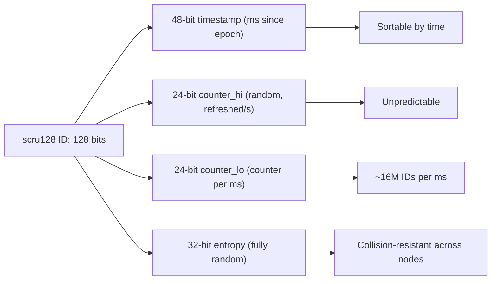
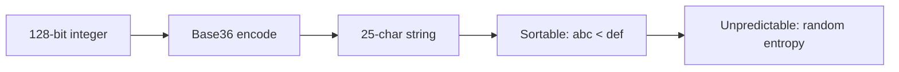

# scru128 — Sortable, Unpredictable Unique IDs

**scru128 (1,845 lines) generates 128-bit IDs that are sortable by time, globally unique without coordination, and unpredictable. This document covers how it works, how it compares to Twitter Snowflake, and how to implement similar ID generators.**

## The 128-Bit Layout



**Aha:** Unlike Snowflake which uses a machine ID (requiring coordination), scru128 uses 32 bits of entropy to ensure uniqueness across nodes without any coordination. This means you can generate IDs on any machine, at any time, without a central authority.

```
  ┌──────────────┬───────────────────┬───────────────────┬──────────────────┐
  │ 48-bit       │ 24-bit            │ 24-bit            │ 32-bit           │
  │ timestamp    │ counter_hi        │ counter_lo        │ entropy          │
  └──────────────┴───────────────────┴───────────────────┴──────────────────┘
   bits:  127                                    ...                    0
```

| Field | Bits | Purpose |
|-------|------|---------|
| `timestamp` | 48 | Milliseconds since Unix epoch (usable until year 10889) |
| `counter_hi` | 24 | Random, refreshed every second — prevents prediction |
| `counter_lo` | 24 | Counter within the same millisecond (~16M IDs per ms) |
| `entropy` | 32 | Fully random — prevents prediction even with known timestamp |

**Aha:** Unlike Snowflake which uses a machine ID (requiring coordination), scru128 uses 32 bits of entropy to ensure uniqueness across nodes without any coordination. This means you can generate IDs on any machine, at any time, without a central authority.

## Generation Logic

Source: `src.scru128/rust/src/generator.rs`

```rust
impl Generator {
    pub fn generate_or_abort_with_ts(&mut self, timestamp: u64) -> Option<Id> {
        if timestamp > self.timestamp {
            // New millisecond: reset counter_lo to random
            self.timestamp = timestamp;
            self.counter_lo = rand() & MAX_COUNTER_LO;
        } else if timestamp + self.rollback_allowance >= self.timestamp {
            // Clock went back slightly: continue with previous timestamp
            self.counter_lo += 1;
            if self.counter_lo > MAX_COUNTER_LO {
                self.counter_lo = 0;
                self.counter_hi += 1;
                if self.counter_hi > MAX_COUNTER_HI {
                    self.counter_hi = 0;
                    self.timestamp += 1;
                    self.counter_lo = rand() & MAX_COUNTER_LO;
                }
            }
        } else {
            return None;  // Clock rollback too significant
        }

        // Refresh counter_hi every second
        if self.timestamp - self.ts_counter_hi >= 1_000 {
            self.ts_counter_hi = self.timestamp;
            self.counter_hi = rand() & MAX_COUNTER_HI;
        }

        Some(Id::from_fields(
            self.timestamp,
            self.counter_hi,
            self.counter_lo,
            rand(),  // entropy
        ))
    }
}
```

## scru128 vs Twitter Snowflake

| Aspect | Twitter Snowflake | scru128 |
|--------|------------------|---------|
| Total bits | 64 | 128 |
| Timestamp | 41 bits (ms, ~69 years) | 48 bits (ms, ~10,889 years) |
| Machine ID | 10 bits (requires coordination) | None |
| Sequence | 12 bits (4,096 IDs/ms) | 48 bits (281 trillion IDs/ms) |
| Unpredictable | No | Yes (56 bits of randomness) |
| Clock rollback | Blocks until clock catches up | Resets or aborts |
| String format | Base64 or number | 25-char Base36 |

**Key differences:**

1. **No machine ID**: Snowflake requires a unique machine ID per node (managed by ZooKeeper or similar). scru128 doesn't — the 32-bit entropy field ensures uniqueness across nodes without coordination.

2. **Unpredictable**: Snowflake IDs are predictable (next ID = timestamp + sequence). scru128 IDs are unpredictable due to the random entropy field.

3. **Higher throughput**: ~281 trillion IDs per ms vs 4,096.

4. **Clock rollback handling**: scru128 has a configurable rollback allowance (default 10 seconds). If the clock goes back more than 10 seconds, the generator resets. Snowflake blocks until the clock catches up.

## String Representation



scru128 IDs are encoded as 25-character Base36 strings:

```
"036z951mhjikzik2gsl81gr7l"  ← 25 chars, sortable
```

Base36 uses digits 0-9 and letters a-z. The string is sortable: `"abc" < "def"` means the first ID was generated before the second.

## Edge Cases

1. **Clock rollback**: If the clock goes back more than 10 seconds, the generator resets (or aborts). This prevents ID collisions.
2. **Counter overflow**: At 281 trillion IDs per ms, overflow is practically impossible. But if it happens, the timestamp is incremented.
3. **Entropy collision**: With 32 bits of entropy, the probability of collision between two nodes in the same millisecond is ~1 in 4 billion. For most applications, this is negligible.

## What's Next

- [05 — xs Stream Store](05-xs-stream-store.md) — How xs uses scru128
- [04 — Data Structures Master](04-data-structures-master.md) — Return to data structures
- [00 — Overview](00-overview.md) — Return to overview
