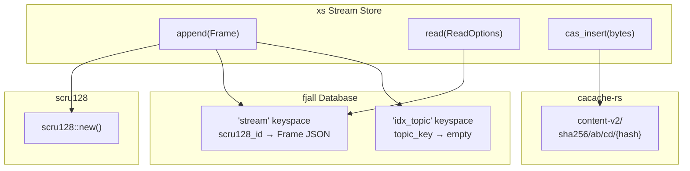
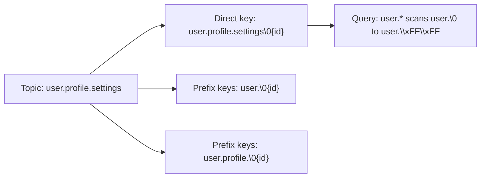

# xs Stream Store — How fjall, cacache-rs, and scru128 Work Together

**xs (13,083 lines) is a stream store that ties fjall (LSM database), cacache-rs (content-addressable storage), and scru128 (sortable IDs) together. This document covers how xs integrates all these components into an append-only stream store with TTL, GC, and hierarchical topic queries.**

## Architecture Overview

**Aha:** The append lock ensures scru128 IDs are inserted in order. Without it, concurrent appends could generate IDs in the same millisecond with different counter values, breaking the chronological ordering that range scans depend on.



## The Store Structure

Source: `xs/src/store/mod.rs`

```rust
pub struct Store {
    path: PathBuf,
    db: Database,              // fjall database
    stream: Keyspace,          // scru128_id → Frame JSON
    idx_topic: Keyspace,       // topic_key → empty (for prefix scans)
    broadcast_tx: broadcast::Sender<Frame>,  // Live subscriptions
    gc_tx: UnboundedSender<GCTask>,         // Garbage collection channel
    append_lock: Arc<Mutex<()>>,            // Serialize appends for ID ordering
}
```

## Append Flow

```rust
pub fn append(&self, mut frame: Frame) -> Result<Frame, Error> {
    let _guard = self.append_lock.lock().unwrap();  // Serialize appends

    frame.id = scru128::new();  // Generate sortable ID

    if frame.ttl != Some(TTL::Ephemeral) {
        self.insert_frame(&frame)?;
        if let Some(TTL::Last(n)) = frame.ttl {
            let _ = self.gc_tx.send(GCTask::CheckLastTTL { topic, keep: n });
        }
    }

    let _ = self.broadcast_tx.send(frame.clone());
    Ok(frame)
}
```

**Aha:** The append lock ensures scru128 IDs are inserted in order. Without it, concurrent appends could generate IDs in the same millisecond with different counter values, breaking the chronological ordering that range scans depend on.

## fjall Keyspace Configuration

```rust
// stream keyspace: point reads by scru128 ID
let stream_opts = KeyspaceCreateOptions::default()
    .max_memtable_size(8 * 1024 * 1024)      // 8 MiB
    .data_block_size_policy(BlockSizePolicy::all(16 * 1024))  // 16 KiB blocks
    .data_block_hash_ratio_policy(HashRatioPolicy::all(8.0))  // Hash index
    .expect_point_read_hits(true);

// idx_topic keyspace: prefix scans only
let idx_opts = KeyspaceCreateOptions::default()
    .max_memtable_size(8 * 1024 * 1024)
    .data_block_size_policy(BlockSizePolicy::all(16 * 1024))
    .data_block_hash_ratio_policy(HashRatioPolicy::all(0.0))  // No hash index
    .expect_point_read_hits(true);
```

**Why different hash ratios?**

| Keyspace | Access Pattern | Hash Ratio | Why |
|----------|---------------|------------|-----|
| `stream` | Point reads by scru128 ID | 8.0 | Hash index is faster for point lookups |
| `idx_topic` | Prefix scans (e.g., "user.*") | 0.0 | Binary index supports range scans |

## Topic Index: Hierarchical Queries

The `idx_topic` keyspace enables hierarchical topic queries:



```rust
// Direct topic key: topic + scru128_id
fn idx_topic_key_from_frame(frame: &Frame) -> Vec<u8> {
    let mut key = frame.topic.as_bytes().to_vec();
    key.push(0);  // Null byte separator
    key.extend(frame.id.as_bytes());
    key
}

// Prefix index keys for "user.*" wildcard queries
fn idx_topic_prefix_keys(topic: &str, id: &Scru128Id) -> Vec<Vec<u8>> {
    let mut keys = Vec::new();
    for (i, _) in topic.match_indices('.') {
        let prefix = &topic[..i + 1];
        let mut key = prefix.as_bytes().to_vec();
        key.push(0);
        key.extend(id.as_bytes());
        keys.push(key);
    }
    keys
}
```

For a topic like `"user.profile.settings"`, this creates prefix keys:
- `"user.\0{id}"`
- `"user.profile.\0{id}"`
- `"user.profile.settings\0{id}"`

A query for `"user.*"` scans from `"user.\0"` to `"user.\u{FF}\u{FF}"`, finding all topics starting with `"user."`.

## Content-Addressable Storage

```rust
pub async fn cas_insert_bytes(&self, bytes: &[u8]) -> cacache::Result<ssri::Integrity> {
    cacache::write_hash(&self.path.join("cacache"), bytes).await
}

pub async fn cas_read(&self, hash: &ssri::Integrity) -> cacache::Result<Vec<u8>> {
    cacache::read_hash(&self.path.join("cacache"), hash).await
}
```

The Frame stores a `hash: Option<ssri::Integrity>` that points to content in cacache. The frame (metadata) is in fjall; the content bytes are in cacache.

**Aha:** This separation is classic: fjall handles the structured, queryable metadata (topics, IDs, TTLs), while cacache handles the unstructured content (bytes) with content-addressable deduplication. The same content is stored once, regardless of how many frames reference it.

## Garbage Collection

```rust
enum GCTask {
    Remove(Scru128Id),
    CheckLastTTL { topic: String, keep: u32 },
    Drain(oneshot::Sender<()>),
}
```

| TTL Type | Behavior |
|----------|----------|
| `TTL::Time(ttl)` | Frame expires at a specific time |
| `TTL::Last(n)` | Keep only the last N frames for this topic |
| `TTL::Ephemeral` | Don't store the frame (only broadcast) |

## What's Next

- [06 — fjall Patterns](06-fjall-patterns.md) — Alternative usage patterns
- [00 — Overview](00-overview.md) — Return to overview
- [04 — scru128](04-scru128.md) — Return to scru128
