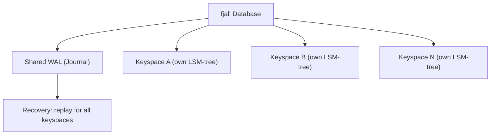

# fjall Patterns — Alternative Usage Patterns

**fjall is a versatile LSM database that can be used in many ways beyond what xs does. This document covers alternative usage patterns, when to choose each, and the trade-offs involved.**

## The Keyspace Model

**Aha:** Each keyspace in fjall is its own independent LSM-tree with separate memtables and SST files, but they share a single WAL. This means cross-keyspace writes are atomic (via the shared journal) but reads from different keyspaces are independent.



## 1. Simple Key-Value Store

The simplest use case: a single keyspace for key-value storage.

```rust
let db = Database::builder("./my-db").open()?;
let items = db.keyspace("items", KeyspaceCreateOptions::default)?;

items.insert("key", "value")?;
let value = items.get("key")?;
items.remove("key")?;
```

**When to use:** Simple data storage, configuration, caching.

**Trade-offs:**
- ✅ Simple API
- ✅ Automatic compaction
- ✅ Crash recovery via WAL
- ❌ No transactions (single keyspace, single operations are atomic anyway)

## 2. Multi-Tenant Database

Each tenant gets their own keyspace:

```rust
let db = Database::builder("./multi-tenant").open()?;

let tenant_a = db.keyspace("tenant:a", opts)?;
let tenant_b = db.keyspace("tenant:b", opts)?;

// Cross-tenant atomic operations via batch
let mut batch = db.batch();
batch.insert(&tenant_a, "config", "value_a");
batch.insert(&tenant_b, "config", "value_b");
batch.commit()?;  // Atomic: all or nothing
```

**When to use:** SaaS applications, multi-user systems, namespace isolation.

**Trade-offs:**
- ✅ Strong isolation between tenants
- ✅ Cross-tenant atomic batches
- ✅ Independent tuning per tenant
- ❌ Each keyspace has its own LSM-tree (memory overhead)

## 3. Event Log (Like xs)

Append-only event store with time-ordered IDs:

```rust
let db = Database::builder("./events").open()?;
let events = db.keyspace("events", opts)?;

fn append(db: &Database, events: &Keyspace, event: &Event) -> Result<()> {
    let id = scru128::new();  // Sortable ID
    let encoded = serde_json::to_vec(event)?;
    events.insert(id.to_bytes(), encoded)?;
    db.persist(PersistMode::SyncAll)?;
    Ok(())
}

// Range queries give events in order:
for kv in events.range(..) {
    let event: Event = serde_json::from_slice(&kv.value)?;
}
```

**When to use:** Event sourcing, audit logs, stream processing.

## 4. Session Store

```rust
let db = Database::builder("./sessions").open()?;
let sessions = db.keyspace("sessions", opts)?;

// Store session
sessions.insert(session_id, session_data)?;

// Background cleanup thread:
loop {
    for kv in sessions.iter() {
        let session: Session = serde_json::from_slice(&kv.value)?;
        if session.expired() {
            sessions.remove(kv.key)?;
        }
    }
    std::thread::sleep(Duration::from_secs(60));
}
```

**When to use:** Web session storage, temporary data.

## 5. Configuration Store

```rust
let db = Database::builder("./config").open()?;
let config = db.keyspace("config", opts)?;

// Hierarchical config with prefix queries:
config.insert("app:db:host", "localhost")?;
config.insert("app:db:port", "5432")?;
config.insert("app:cache:ttl", "3600")?;

// Read all app config:
for kv in config.prefix("app:") {
    // ...
}
```

**When to use:** Application configuration, feature flags.

## 6. Time-Series Database

**Aha:** By combining the timestamp with the metric name in the key, you get automatic chronological ordering. Range scans give you time-series queries without any special indexing — the LSM tree's sorted nature does the work for you.

```rust
let db = Database::builder("./metrics").open()?;
let metrics = db.keyspace("metrics", opts)?;

fn record(db: &Database, metrics: &Keyspace, name: &str, value: f64) -> Result<()> {
    let ts = SystemTime::now().duration_since(UNIX_EPOCH)?.as_nanos() as u64;
    // Key: metric_name + timestamp (for chronological ordering)
    let key = format!("{name}:{:020}", ts);
    metrics.insert(key, value.to_le_bytes())?;
    Ok(())
}

// Range query for time range:
let start = format!("cpu:{:020}", start_ts);
let end = format!("cpu:{:020}", end_ts);
for kv in metrics.range(start..=end) {
    let value = f64::from_le_bytes(kv.value[..].try_into().unwrap());
}
```

**When to use:** Metrics, monitoring, IoT data.

## Choosing Compaction Strategy

```mermaid
flowchart TD
    A["Workload analysis"] --> B{Read-heavy?}
    B -->|Yes| C[Leveled: low read amplification]
    B -->|No| D{Write-heavy?}
    D -->|Yes| E[Tiered: low write amplification]
    D -->|No| F{Delete-heavy?}
    F -->|Yes| G[FIFO: automatic cleanup]
    F -->|No| H[Leveled (default): balanced]
```

| Workload | Strategy | Why |
|----------|----------|-----|
| Read-heavy | Leveled | Low read amplification |
| Write-heavy | Tiered (when available) | Low write amplification |
| Delete-heavy | FIFO | Automatic cleanup of old data |
| General purpose | Leveled (default) | Good balance |

## What's Next

- [07 — S3 Sync](07-s3-sync.md) — Syncing to object storage
- [05 — xs Stream Store](05-xs-stream-store.md) — Return to xs
- [00 — Overview](00-overview.md) — Return to overview
