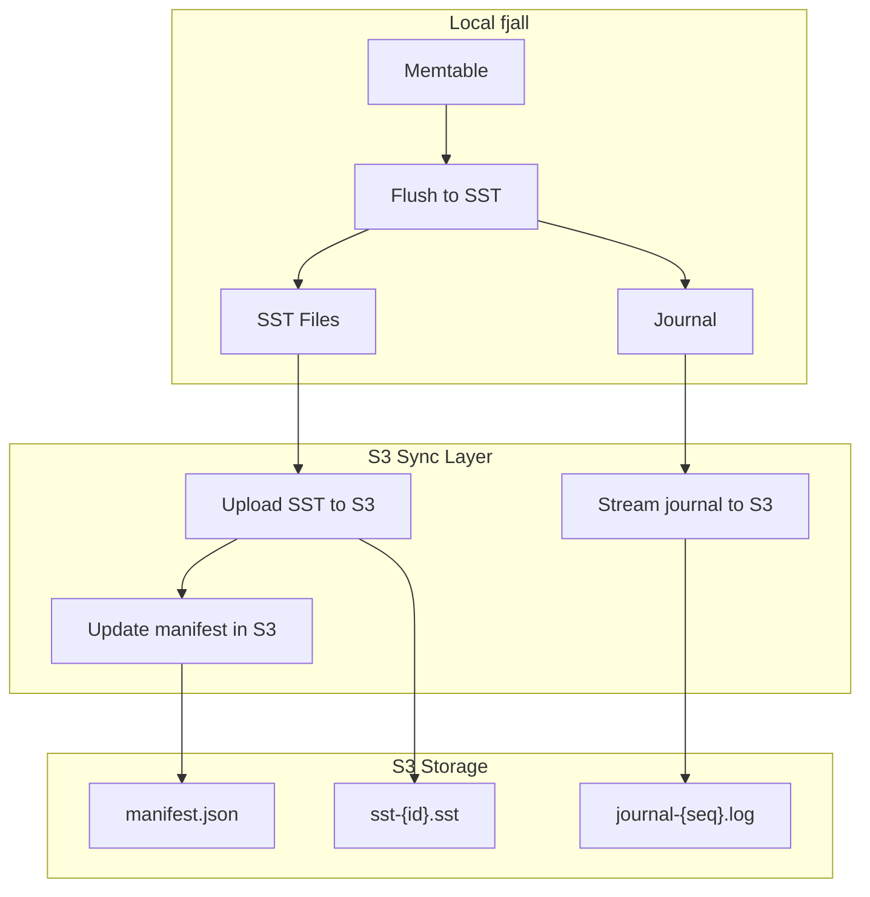

# S3 Sync — Syncing fjall and cacache to Object Storage

**Can you sync fjall (LSM database) and cacache-rs (content-addressable storage) to S3 or other object storage? This document covers what's possible, what's practical, and the architecture for doing it.**

## Is It Possible?

**Yes, but with caveats.** fjall is designed for local disk storage. To sync to S3, you need to understand which components can be synced and how.

## Component Sync Feasibility

| Component | Can Sync to S3? | How |
|-----------|----------------|-----|
| **SST Files** | ✅ Yes | Immutable, content-addressed, upload after flush |
| **Journal (WAL)** | ⚠️ Partial | Append-only, can stream incrementally |
| **Memtable** | ❌ No | In-memory, must flush to SST first |
| **cacache Content** | ✅ Yes | Immutable, hash-addressed, upload on write |
| **cacache Index** | ⚠️ Partial | Append-only, can sync periodically |

## Architecture for fjall S3 Sync



### SST File Sync

SST files are **immutable once written**. They can be uploaded to S3 as soon as they're flushed:

```rust
// After SST flush completes
fn on_sst_created(sst: &SstFile) {
    let key = format!("sst/{}/{}", sst.id(), sst.checksum());
    s3_client.put_object("my-bucket", &key, sst.data()).await?;
    
    // Update manifest
    manifest.add_sst(sst);
    s3_client.put_object("my-bucket", "manifest.json", &manifest).await?;
}
```

### Journal Sync

The journal is **append-only**. It can be streamed incrementally:

```rust
// Background sync thread
fn sync_journal(journal_path: &Path, s3: &S3Client) {
    let mut last_synced_offset = load_last_synced_offset();
    
    loop {
        let new_data = read_new_data(journal_path, last_synced_offset);
        if !new_data.is_empty() {
            s3.put_object("my-bucket", "journal.log", &new_data).await?;
            last_synced_offset += new_data.len();
        }
        std::thread::sleep(Duration::from_secs(1));
    }
}
```

### Recovery from S3

On startup, a remote database would:


1. Download the manifest from S3
2. Download all SST files listed in the manifest
3. Download the journal and replay entries not yet in SSTs
4. Reconstruct the full database state

### Challenges

| Challenge | Solution |
|-----------|----------|
| **Atomic manifest updates** | Use S3 conditional writes (ETag-based) or a separate coordination service |
| **SST deduplication** | SST files are immutable — name by checksum, skip upload if already exists |
| **Latency** | Local reads are fast; remote reads need caching or a read-through layer |
| **Cost** | S3 PUT costs money. Batch SST uploads to reduce costs. |
| **Journal growth** | After a checkpoint (all journal entries in SSTs), the journal can be truncated |

## cacache S3 Sync

cacache is easier to sync because it's already content-addressable:

```rust
// Content upload (on write)
pub fn put_with_s3(&self, content: &[u8]) -> Result<Integrity> {
    let hash = Self::hash(content);
    
    // Local write
    self.local.put(content)?;
    
    // S3 upload (async, deduplicated)
    let s3_client = self.s3.clone();
    let hash_clone = hash.clone();
    tokio::spawn(async move {
        let key = format!("content/{}", hash_clone);
        if !s3_client.exists(&key).await? {
            s3_client.put_object("my-cache", &key, content).await?;
        }
        Ok(())
    });
    
    Ok(hash)
}
```

**Aha:** Because cacache content is addressed by hash, you get automatic deduplication. If two clients write the same content, only one copy is stored in S3. The index can be synced periodically or rebuilt from the content on startup.

## Alternative: S3 as the Primary Backend

**Aha:** Because cacache content is addressed by hash, you get automatic deduplication. If two clients write the same content, only one copy is stored in S3. This makes cacache an ideal candidate for S3 backing — the index can be rebuilt from the content on startup by listing all objects.

Instead of syncing to S3 as a backup, you could use S3 as the primary backend with a local cache:

```
┌─────────────────────────────────────┐
│ Application                         │
├─────────────────────────────────────┤
│ Local Cache (fjall on disk)         │  ← Hot data, fast reads
├─────────────────────────────────────┤
│ S3 Backend                          │  ← Cold data, durable storage
└─────────────────────────────────────┘
```

This is similar to how systems like RocksDB's S3-backed mode works.

## What's Next

- [06 — fjall Patterns](06-fjall-patterns.md) — Return to patterns
- [00 — Overview](00-overview.md) — Return to overview
- [05 — xs Stream Store](05-xs-stream-store.md) — Return to xs
