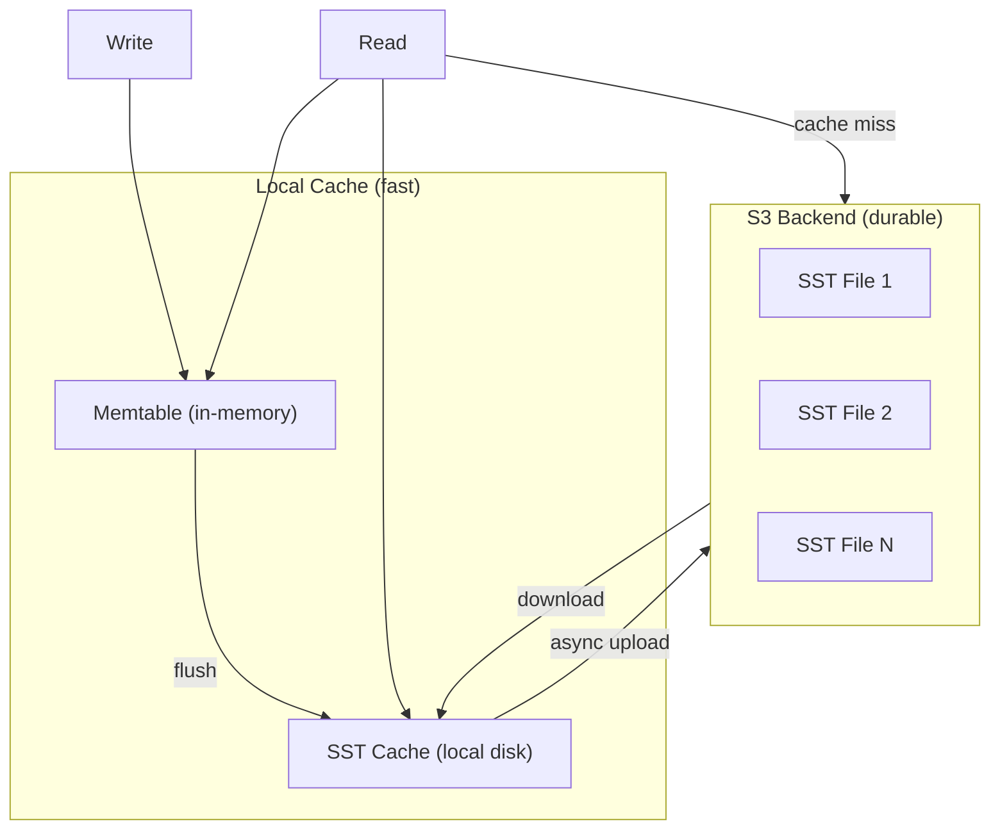

# S3 Support — cacache-rs and fjall Reality Check

**Short answer: neither cacache-rs nor fjall have S3 support built in. Both are purely local disk-based libraries. This document covers the reality, why they're designed this way, and what it would take to add S3 support.**

## The Reality

| Library | S3 Support? | Storage Backend |
|---------|------------|----------------|
| **cacache-rs** | ❌ No | Local filesystem only |
| **fjall** | ❌ No | Local filesystem only |
| **lsm-tree** | ❌ No | Local filesystem only |

### cacache-rs: No Abstraction for Remote Storage

Source: `cacache-rs/src/content/write.rs`

```rust
// All file operations are direct std::fs calls
let tmpfile = NamedTempFile::new_in(tmp_path)?;
let res = self.tmpfile.persist(&cpath);  // Atomic rename on local disk
```

There's no trait, no abstraction, no interface that could be swapped for a remote backend. Every operation is a direct `std::fs` call.

### fjall/lsm-tree: FileAccessor Is Not a Remote Abstraction

Source: `lsm-tree/src/file_accessor.rs`

```rust
pub enum FileAccessor {
    /// Pinned file descriptor
    File(Arc<File>),
    /// Access to file descriptor cache
    DescriptorTable(Arc<DescriptorTable>),
}
```

The `FileAccessor` enum manages **file descriptors**, not storage backends. It's an optimization for keeping frequently-used file descriptors open, not an abstraction for remote storage. It only wraps `Arc<File>` and a `DescriptorTable` — both local file concepts.

## Why They're Local-Only

### cacache-rs

cacache is a port of npm's cacache. Its entire design assumes:
- **Append-only index files** on local disk
- **Atomic renames** (temp file → content file) — which requires a local filesystem
- **Memory-mapped writes** for large files — which requires mmap support

These operations don't translate directly to S3. S3 doesn't have:
- Atomic renames (PUT is atomic, but there's no rename operation)
- mmap support (you can't memory-map an S3 object)
- Append-only files (S3 objects are immutable once written)

### fjall/lsm-tree

fjall's LSM tree design assumes:
- **Sequential writes** to SST files on local disk
- **Random reads** from SST files (block-level seeks)
- **WAL append** with fsync

S3 doesn't support random reads efficiently. Every S3 GET is a full-object or range request with high latency (50-100ms). An LSM tree that reads from S3 would be orders of magnitude slower than one that reads from local disk.

## How to Add S3 Support (If You Wanted To)

### For cacache-rs: Content-Addressable S3

You could build an S3-backed cacache by replacing the content layer:

```rust
// Conceptual S3-backed cacache
pub struct S3Cacache {
    index: LocalCacacheIndex,  // Keep index local for fast lookups
    s3_client: S3Client,
    bucket: String,
}

impl S3Cacache {
    pub async fn put(&self, content: &[u8]) -> Result<Integrity> {
        let hash = Self::hash(content);
        let key = format!("content/{}", hash);
        
        // S3 PUT is idempotent — same hash = same object
        // If it already exists, S3 returns 200 OK (no overwrite needed)
        self.s3_client.put_object(&self.bucket, &key, content).await?;
        
        // Update local index
        self.index.insert(&hash)?;
        
        Ok(hash)
    }

    pub async fn get(&self, hash: &Integrity) -> Result<Vec<u8>> {
        // Check local index first
        if !self.index.exists(hash)? {
            return Err(Error::KeyNotFound);
        }
        
        let key = format!("content/{}", hash);
        let content = self.s3_client.get_object(&self.bucket, &key).await?;
        
        // Verify integrity on read
        let actual = Self::hash(&content);
        if actual != *hash {
            return Err(Error::IntegrityMismatch);
        }
        
        Ok(content)
    }
}
```

**Key insight:** Keep the index local (fast lookups), store content in S3 (deduplicated by hash). S3's idempotent PUT means writing the same content twice is safe — only one copy exists.

### For fjall/lsm-tree: Hybrid S3 + Local Cache

You could build an S3-backed LSM tree with a local cache:



**How it works:**
1. **Writes** go to the local memtable, flush to local SSTs, then async-upload to S3
2. **Reads** check memtable first, then local SST cache, then S3 (with local caching)
3. **SST files** are immutable — once uploaded to S3, they never change
4. **Compaction** runs locally, uploads new SSTs to S3, marks old SSTs as obsolete

**Trade-offs:**
| Aspect | Local-Only | S3-Backed |
|--------|-----------|-----------|
| Write latency | ~1ms (disk) | ~1ms (local) + ~100ms (S3 upload, async) |
| Read latency (hot) | ~1ms (disk) | ~1ms (cache hit) |
| Read latency (cold) | ~1ms (disk) | ~100ms (S3 download) |
| Durability | Single disk | S3 (11 nines durability) |
| Cost | Disk cost | S3 storage + request costs |

## What xs Does Instead

xs (the stream store we documented) takes a different approach: it uses fjall locally for metadata and cacache locally for content. It doesn't sync to S3 — it's designed for local-first storage. The S3 sync document ([07 — S3 Sync](07-s3-sync.md)) covers how you could add S3 sync as a layer on top.

## What's Next

- [07 — S3 Sync](07-s3-sync.md) — Architecture for syncing to S3 (the hybrid approach)
- [00 — Overview](00-overview.md) — Return to overview
