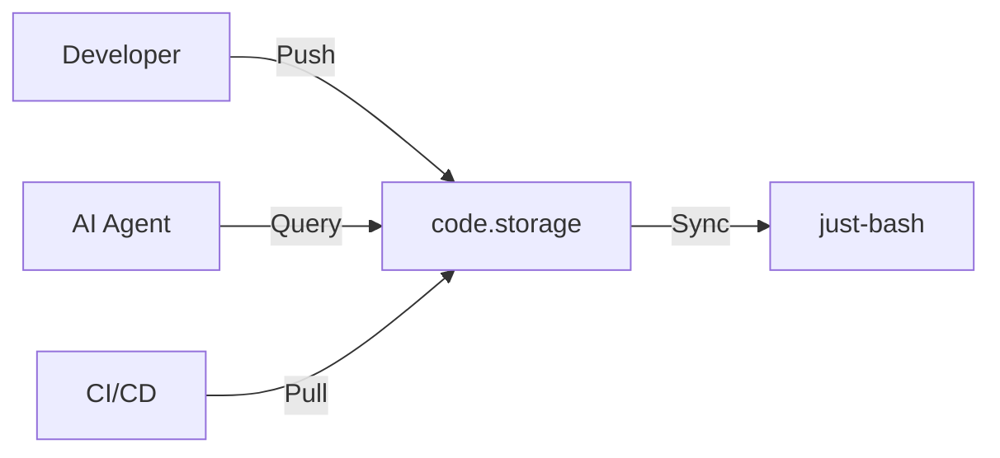
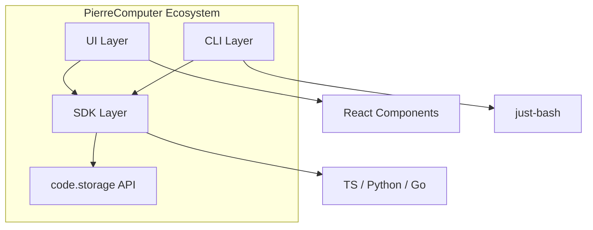

# PierreComputer Overview

PierreComputer is a comprehensive software engineering ecosystem for code storage, version control, and AI-powered development workflows.

## Philosophy

**Code is ephemeral, storage is eternal.**

The PierreComputer ecosystem treats code as transient data that flows through a storage system, enabling:
- Ephemeral branches that live only during development
- AI agents that understand code history
- Collaborative editing without merge conflicts
- Time-travel debugging through complete history

## Projects

### pierre (Core Platform)

**Location:** `src.PierreComputer/pierre/`

UI components for code visualization:
- **diffs/** — Diff rendering with shadow DOM
- **trees/** — File tree navigation
- **path-store/** — File tree engine
- **storage-elements/** — Storage UI components

### SDK (Multi-Language)

**Location:** `src.PierreComputer/sdk/`

Native SDKs for code.storage:
- **TypeScript** — Bun package with async APIs
- **Python** — pip package
- **Go** — go modules

### just-bash (Virtual Bash)

**Location:** `src.PierreComputer/just-bash/`

Virtual bash environment for AI agents:
- Bash command simulation
- WASM support (QuickJS, CPython)
- Git-flavored operations via just-code-storage

### icons (Visual Assets)

**Location:** `src.PierreComputer/icons/`

- 300+ React icon components
- SVG sprite generation
- VS Code extension

## Architecture

The ecosystem follows a layered architecture:

## Technology Stack

| Layer | Technologies |
|-------|--------------|
| UI | React, TypeScript, Shadow DOM, Bun |
| SDK | TypeScript, Python, Go |
| CLI | pnpm, Moon task runner |
| Storage | JWT auth, streaming (4MiB chunks) |

## Next Steps

Continue to [code.storage →](01-code-storage.html) for the core service architecture.
