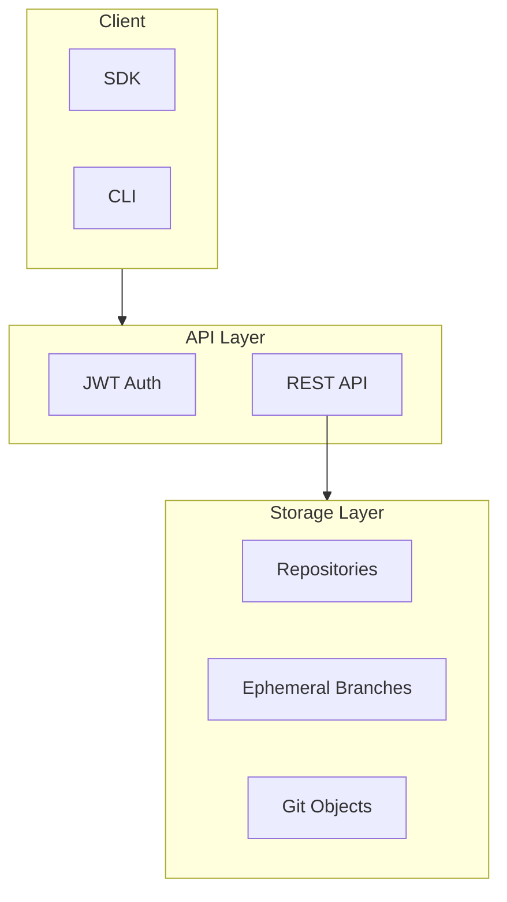
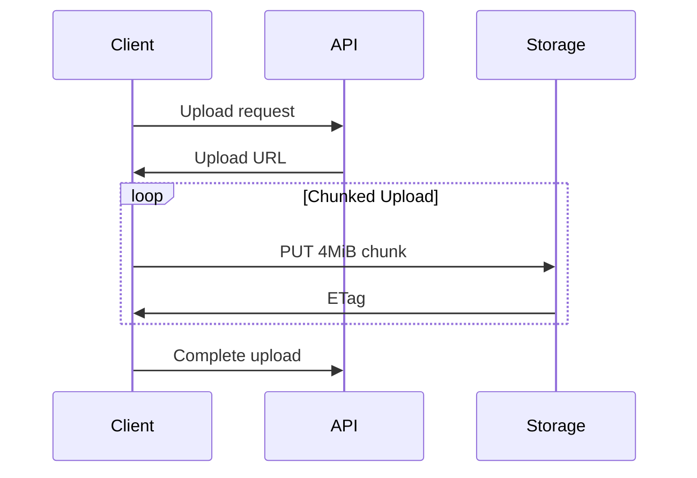

# code.storage

The core storage service providing Git-compatible cloud storage with JWT-based authentication.

## Architecture



## Authentication

JWT-based authentication with service accounts:

```typescript
// sdk/src/auth.ts
export interface AuthContext {
  token: string;
  expiresAt: Date;
  serviceAccount: string;
}

export async function authenticate(
  apiKey: string
): Promise<AuthContext> {
  const response = await fetch('https://api.code.storage/auth', {
    method: 'POST',
    headers: { 'Authorization': `Bearer ${apiKey}` }
  });
  return response.json();
}
```

## Streaming Architecture

Data is streamed in 4MiB chunks:



**Aha:** Chunking enables:
- Resumable uploads
- Parallel transfers
- Memory efficiency for large files

## Ephemeral Branches

Branches that exist only during active work:

```typescript
interface EphemeralBranch {
  name: string;
  parent: string;      // Parent commit
  ttl: number;         // Time-to-live in seconds
  createdAt: Date;
}

// Auto-deleted when TTL expires
// No need to clean up feature branches
```

## Repository Structure

```
repo/
├── refs/
│   ├── heads/          # Branch refs
│   └── tags/           # Tag refs
├── objects/
│   ├── info/
│   └── pack/           # Pack files
└── config              # Repository config
```

## Next Steps

Continue to [SDK →](02-sdk.html) for multi-language client libraries.
