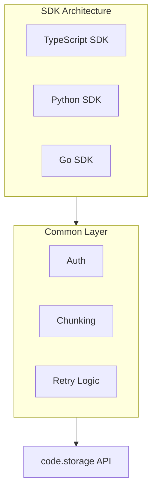

# Multi-Language SDKs

Native SDKs for code.storage in TypeScript, Python, and Go.

## Design Philosophy

**Native APIs, consistent semantics.**

Each SDK provides idiomatic APIs in its language while maintaining consistent behavior:

| SDK | Package Manager | Async Model |
|-----|-----------------|-------------|
| TypeScript | Bun/npm | async/await |
| Python | pip | asyncio |
| Go | go modules | goroutines |

## TypeScript SDK

**Location:** `src.PierreComputer/sdk/src/`

```typescript
// src/index.ts
export class CodeStorageClient {
  private baseUrl: string;
  private auth: AuthContext;

  constructor(options: ClientOptions) {
    this.baseUrl = options.baseUrl;
    this.auth = options.auth;
  }

  async read(
    repo: string,
    ref: string,
    path: string
  ): Promise<Uint8Array> {
    const url = `${this.baseUrl}/repos/${repo}/refs/${ref}/files/${path}`;
    const response = await fetch(url, {
      headers: { 'Authorization': `Bearer ${this.auth.token}` }
    });
    return new Uint8Array(await response.arrayBuffer());
  }

  async write(
    repo: string,
    branch: string,
    path: string,
    content: Uint8Array
  ): Promise<Commit> {
    // Streaming upload in 4MiB chunks
    const chunks = this.chunkData(content, 4 * 1024 * 1024);
    // ... upload logic
  }
}
```

## Python SDK

**Location:** `src.PierreComputer/sdk/python/`

```python
# code_storage/client.py
import asyncio
from typing import BinaryIO

class CodeStorageClient:
    def __init__(self, base_url: str, auth_token: str):
        self.base_url = base_url
        self.auth_token = auth_token

    async def read(
        self,
        repo: str,
        ref: str,
        path: str
    ) -> bytes:
        """Read file contents from repository."""
        url = f"{self.base_url}/repos/{repo}/refs/{ref}/files/{path}"
        async with aiohttp.ClientSession() as session:
            async with session.get(
                url,
                headers={'Authorization': f'Bearer {self.auth_token}'}
            ) as response:
                return await response.read()
```

## Go SDK

**Location:** `src.PierreComputer/sdk/go/`

```go
// client.go
package codestorage

type Client struct {
    baseURL string
    auth    *AuthContext
}

func NewClient(opts Options) *Client {
    return &Client{
        baseURL: opts.BaseURL,
        auth:    opts.Auth,
    }
}

func (c *Client) Read(
    ctx context.Context,
    repo string,
    ref string,
    path string,
) ([]byte, error) {
    url := fmt.Sprintf("%s/repos/%s/refs/%s/files/%s",
        c.baseURL, repo, ref, path)
    req, err := http.NewRequestWithContext(ctx, "GET", url, nil)
    req.Header.Set("Authorization", "Bearer "+c.auth.Token)
    // ... execute request
}
```

## Architecture Comparison



## Next Steps

Continue to [just-bash →](03-just-bash.html) for the virtual bash environment.
