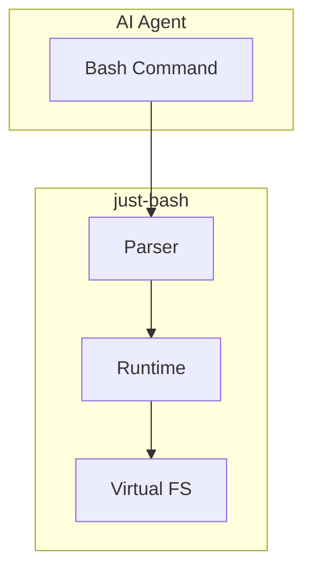

# just-bash

Virtual bash environment for AI agents with WASM support.

## Purpose

just-bash provides a sandboxed bash environment that AI agents can use safely:
- No access to host filesystem
- Deterministic command behavior
- Full bash compatibility (POSIX-compliant)
- WASM support for script execution



## Architecture

### Parser

**Location:** `src.PierreComputer/just-bash/packages/just-bash/src/parser/`

```typescript
// parser/ast.ts
export interface Command {
  type: 'command';
  name: string;
  args: string[];
  redirects: Redirect[];
}

export interface Pipeline {
  type: 'pipeline';
  commands: Command[];
}

export function parse(script: string): AST {
  // Full bash grammar support
  // POSIX-compliant parsing
}
```

### Runtime

**Location:** `src.PierreComputer/just-bash/packages/just-bash/src/runtime/`

```typescript
// runtime/executor.ts
export class BashRuntime {
  private fs: VirtualFilesystem;
  private commands: Map<string, CommandImpl>;

  constructor(fs: VirtualFilesystem) {
    this.fs = fs;
    this.registerBuiltins();
  }

  async execute(ast: AST): Promise<ExitStatus> {
    for (const command of ast.commands) {
      const result = await this.executeCommand(command);
      if (result.exitCode !== 0) {
        return result;
      }
    }
    return { exitCode: 0 };
  }
}
```

### Virtual Filesystem

```typescript
// fs/virtual.ts
export interface VirtualFilesystem {
  read(path: string): Promise<Uint8Array>;
  write(path: string, content: Uint8Array): Promise<void>;
  ls(path: string): Promise<Dirent[]>;
  stat(path: string): Promise<Stats>;
}

// Backed by just-code-storage
export class CodeStorageFS implements VirtualFilesystem {
  private client: CodeStorageClient;

  async read(path: string): Promise<Uint8Array> {
    return this.client.read(this.repo, this.branch, path);
  }
}
```

## WASM Support

**Location:** `src.PierreComputer/just-bash/packages/just-bash/src/wasm/`

```typescript
// wasm/loader.ts
export async function loadWasmModule(
  path: string
): Promise<WebAssembly.Module> {
  const bytes = await fetch(path).then(r => r.arrayBuffer());
  return WebAssembly.compile(bytes);
}

// Supported interpreters
const INTERPRETERS = {
  'quickjs': './wasm/qjs.wasm',
  'cpython': './wasm/python.wasm',
  'node': './wasm/node.wasm',
};
```

**Aha:** WASM enables running QuickJS, CPython, and Node.js in the sandbox without host dependencies.

## just-bash-executor

**Location:** `src.PierreComputer/just-bash/packages/just-bash-executor/`

The executor package provides tool integration for just-bash:

```typescript
// src/executor.ts
export interface Tool {
  name: string;
  description: string;
  parameters: Parameter[];
  execute: (args: Record<string, unknown>) => Promise<unknown>;
}

export class ToolExecutor {
  private tools: Map<string, Tool> = new Map();

  register(tool: Tool): void {
    this.tools.set(tool.name, tool);
  }

  async execute(name: string, args: Record<string, unknown>): Promise<unknown> {
    const tool = this.tools.get(name);
    if (!tool) {
      throw new ToolNotFoundError(name);
    }
    return await tool.execute(args);
  }
}
```

## Built-in Commands

| Command | Implementation |
|---------|---------------|
| cat | `src/commands/cat.ts` |
| ls | `src/commands/ls.ts` |
| grep | `src/commands/grep.ts` |
| echo | `src/commands/echo.ts` |
| cd | Virtual FS navigation |
| pwd | Virtual FS state |

## Testing

```typescript
// test/executor.test.ts
import { describe, it, expect } from "bun:test";

describe("bash execution", () => {
  it("should echo text", async () => {
    const result = await runtime.execute('echo "hello"');
    expect(result.stdout).toBe("hello\n");
    expect(result.exitCode).toBe(0);
  });

  it("should pipe commands", async () => {
    const result = await runtime.execute('echo "a\nb" | grep a');
    expect(result.stdout).toBe("a\n");
  });
});
```

## Next Steps

Continue to [Pierre Monorepo →](04-pierre-monorepo.html) for UI components.
