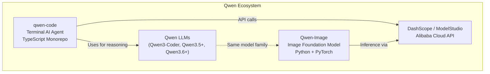
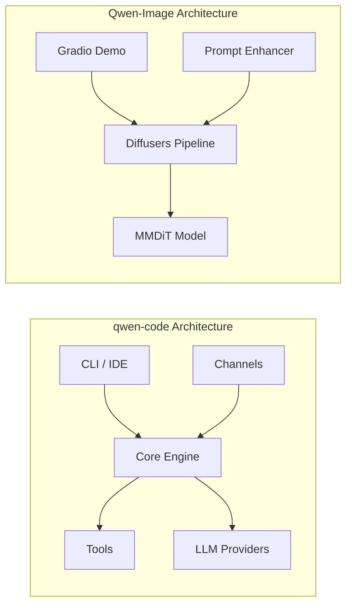

# QwenCode Umbrella -- Top-Level Exploration

This directory contains two distinct but related Alibaba/Qwen projects under a single umbrella. Both sit at the frontier of AI-augmented software development and AI-driven image generation respectively.

## Projects at a Glance

| Project | Primary Language | Domain | Repository |
|---------|-----------------|--------|-----------|
| **qwen-code** | TypeScript/Node.js | Terminal AI coding agent (monorepo) | `git@github.com:QwenLM/qwen-code.git` |
| **Qwen-Image** | Python | Image generation & editing foundation models (20B MMDiT) | `git@github.com:QwenLM/Qwen-Image.git` |

## Relationship Between the Projects

These projects are siblings in the Qwen ecosystem. Qwen-Code is a developer-facing tool that uses Qwen LLMs (Qwen3-Coder, Qwen3.5-Plus, Qwen3.6-Plus) as its reasoning backend, while Qwen-Image provides foundation models for visual content creation. They share:

1. **Alibaba Cloud infrastructure** -- both rely on DashScope/ModelStudio APIs for inference
2. **OAuth ecosystem** -- both authenticate through `chat.qwen.ai` when using Qwen OAuth
3. **Model family** -- part of the broader Qwen multi-modal model family

They do NOT share code directly; they are independent codebases with independent release cycles.

## qwen-code Overview

An open-source AI agent that lives in the terminal. It is a fork/evolution of Google Gemini CLI, adapted to optimally support Qwen-series models while remaining compatible with OpenAI, Anthropic, and Google Gemini APIs.

**Key characteristics:**
- **Monorepo** with 12+ packages managed via npm workspaces
- **Multi-protocol authentication**: Qwen OAuth, OpenAI-compatible, Anthropic, Google Gemini, Vertex AI
- **Multi-channel**: CLI, VS Code extension, Zed extension, Telegram, WeChat (Weixin), DingTalk, and custom plugins
- **Agent architecture**: tools, skills, sub-agents, hooks, MCP (Model Context Protocol) support
- **Sandboxed execution**: Docker/Podman sandbox support for safe code execution
- **Session management**: compression, recording, forked queries, loop detection

**Package breakdown:**
| Package | Purpose |
|---------|---------|
| `packages/cli` | CLI entry point, interactive & headless modes, UI rendering |
| `packages/core` | Core engine: LLM clients, tools, services, config, permissions |
| `packages/channels/base` | Channel abstraction: `ChannelBase`, `SessionRouter`, `PairingStore`, `AcpBridge` |
| `packages/channels/telegram` | Telegram bot adapter |
| `packages/channels/weixin` | WeChat (Weixin) bot adapter |
| `packages/channels/dingtalk` | DingTalk bot adapter |
| `packages/channels/plugin-example` | Example channel plugin for developers |
| `packages/sdk-typescript` | TypeScript SDK for programmatic access |
| `packages/sdk-java` | Java SDK (stub/early) |
| `packages/vscode-ide-companion` | VS Code extension for IDE integration |
| `packages/web-templates` | Embeddable web templates (JS/CSS strings) |
| `packages/webui` | Shared React UI components |
| `packages/zed-extension` | Zed editor extension |
| `packages/test-utils` | Shared testing utilities |

For full details, see [qwen-code/exploration.md](./qwen-code/exploration.md).

## Qwen-Image Overview

A 20B parameter MMDiT (Multi-Modal Diffusion Transformer) image foundation model achieving state-of-the-art performance in:

- **Text-to-Image generation** with exceptional multilingual text rendering (Chinese + English)
- **Image editing** with semantic and appearance editing capabilities
- **ControlNet-native support**: depth maps, edge maps, keypoint maps, sketches
- **Multi-image editing**: combining person+person, person+product, person+scene
- **Image understanding**: object detection, segmentation, depth estimation, super-resolution

**Model variants:**
| Model | Release | Focus |
|-------|---------|-------|
| Qwen-Image | 2025-08 | Original T2I with text rendering |
| Qwen-Image-Edit | 2025-08 | Single-image editing |
| Qwen-Image-Edit-2509 | 2025-09 | Multi-image editing, ControlNet |
| Qwen-Image-Edit-2511 | 2025-12 | Improved consistency, multi-image+ |
| Qwen-Image-2512 | 2025-12 | Better realism, textures, text |
| Qwen-Image-2.0 | 2026-02 | Professional typography, 2K native |

For full details, see [Qwen-Image/exploration.md](./Qwen-Image/exploration.md).

## Architecture Comparison

## Deep Dive Documents

### qwen-code
- [exploration.md](./qwen-code/exploration.md) -- comprehensive project deep dive
- [rust-revision.md](./qwen-code/rust-revision.md) -- Rust translation plan
- [architecture-deep-dive.md](./qwen-code/architecture-deep-dive.md) -- monorepo architecture, packages breakdown
- [networking-security-deep-dive.md](./qwen-code/networking-security-deep-dive.md) -- cross-platform agent connectivity, certificates, security
- [storage-deep-dive.md](./qwen-code/storage-deep-dive.md) -- resilient storage system design

### Qwen-Image
- [exploration.md](./Qwen-Image/exploration.md) -- comprehensive project deep dive
- [rust-revision.md](./Qwen-Image/rust-revision.md) -- Rust translation plan
- [algorithms-deep-dive.md](./Qwen-Image/algorithms-deep-dive.md) -- image generation/editing algorithms
