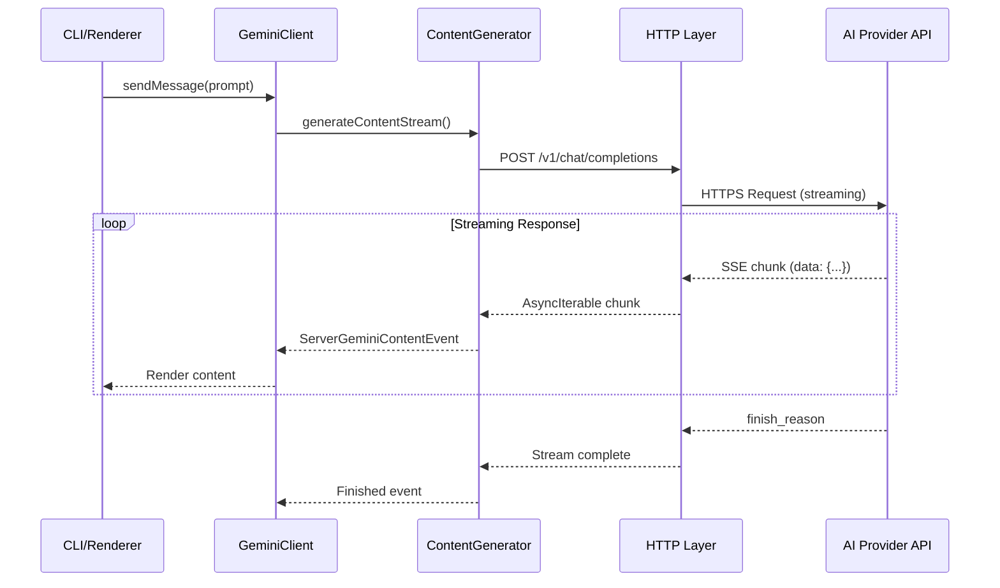
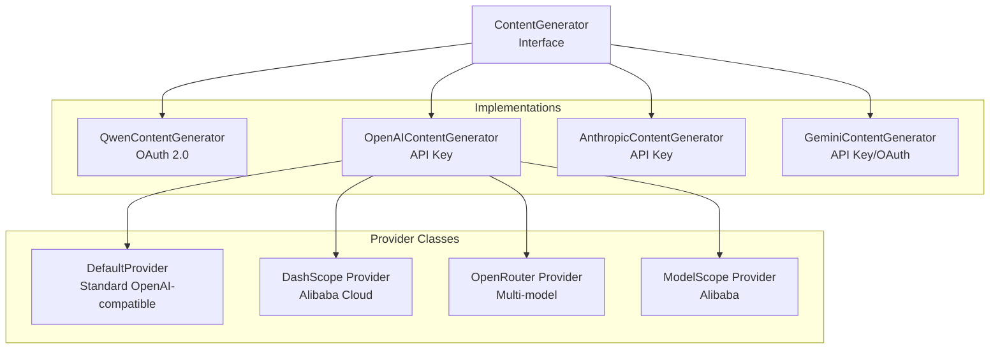
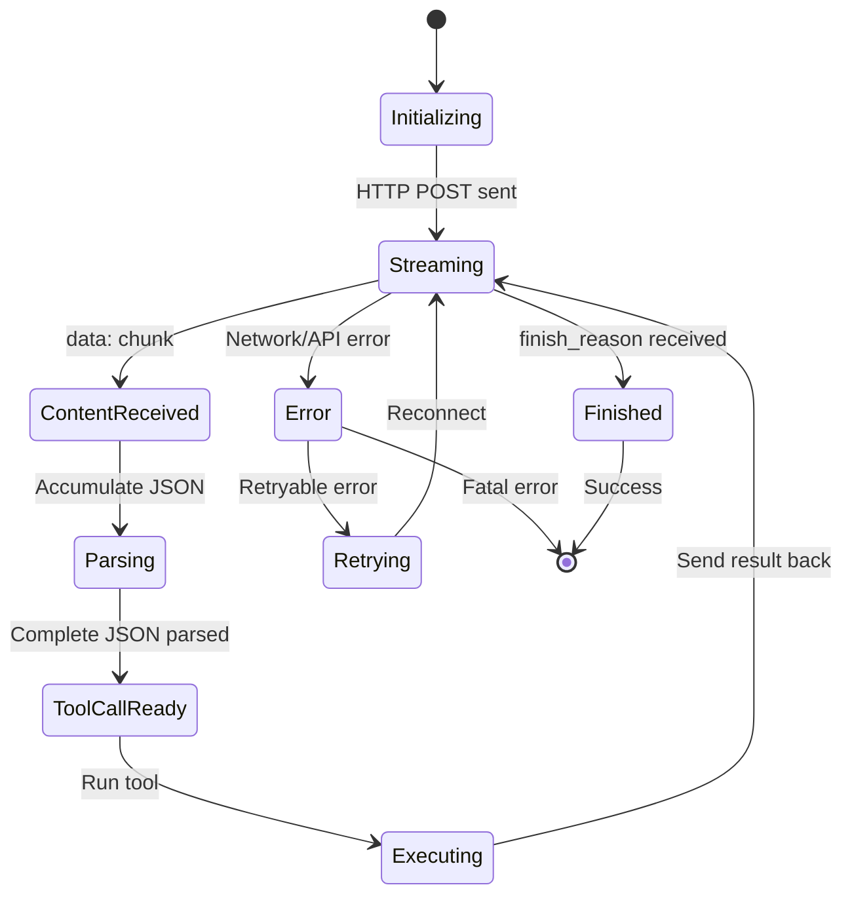
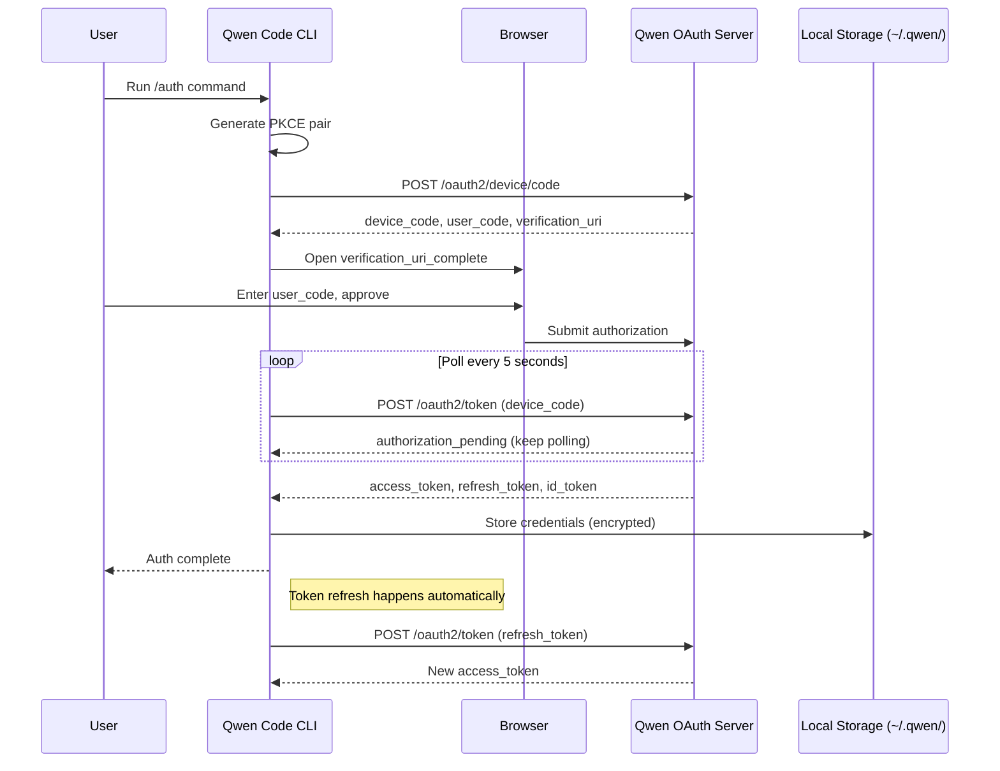

# Qwen Code: Networking Architecture Deep Dive

**Source:** `/home/darkvoid/Boxxed/@formulas/src.rust/src.llamacpp/src.QwenCode/qwen-code/`

**Explored At:** 2026-04-11

---

## Table of Contents

1. [Overview](#overview)
2. [Network Protocols](#network-protocols)
3. [HTTP Client Architecture](#http-client-architecture)
4. [Streaming Implementation](#streaming-implementation)
5. [Authentication & OAuth](#authentication--oauth)
6. [Security Model](#security-model)
7. [Connection Management](#connection-management)
8. [Rate Limiting & Retry Logic](#rate-limiting--retry-logic)
9. [Multi-Provider Network Handling](#multi-provider-network-handling)
10. [Error Handling](#error-handling)
11. [Rust Revision Plan](#rust-revision-plan)

---

## Overview

Qwen Code uses a **purely HTTP-based networking model** with no WebSockets or peer-to-peer connections. All communication with AI providers happens over HTTPS using streaming HTTP responses with Server-Sent Events (SSE)-like patterns.

### Key Characteristics

| Aspect | Implementation |
|--------|----------------|
| **Protocol** | HTTPS (HTTP/1.1 and HTTP/2) |
| **Streaming** | HTTP chunked transfer encoding with SSE-like streaming |
| **Authentication** | OAuth 2.0 Device Flow (Qwen), API Key (others) |
| **Security** | TLS 1.2+, PKCE for OAuth, certificate validation |
| **Connection** | Connection pooling via undici Agent |
| **Retry** | Exponential backoff with jitter, Retry-After header support |

### Network Flow



---

## Network Protocols

### No WebSockets

Qwen Code does **NOT** use WebSockets because:
1. **HTTP/2 multiplexing** provides sufficient performance
2. **Serverless compatibility** - HTTP works with all CDN/proxy setups
3. **Simpler authentication** - OAuth tokens work naturally with HTTP
4. **Firewall friendly** - Only port 443 needed

### HTTP Streaming Pattern

The streaming uses **HTTP chunked transfer encoding** with SSE-like event parsing:

```typescript
// Streaming response format from provider
data: {"choices":[{"delta":{"content":"Hello"}}]}
data: {"choices":[{"delta":{"content":" world"}}]}
data: {"choices":[{"finish_reason":"stop"}]}
```

**Parser implementation** (`streamingToolCallParser.ts`):
- Parses JSON chunks as they arrive
- Handles incomplete JSON across chunk boundaries
- Repairs common issues (unclosed strings, missing brackets)
- Tracks tool call state across multiple chunks

### Protocol Stack

```
┌────────────────────────────────────────┐
│ Application Layer                      │
│ - ContentGenerator                     │
│ - GeminiClient                         │
├────────────────────────────────────────┤
│ Streaming Parser                       │
│ - JSON chunk accumulation              │
│ - Tool call state tracking             │
│ - Event type detection                 │
├────────────────────────────────────────┤
│ HTTP Layer (undici)                    │
│ - Connection pooling                   │
│ - Proxy support                        │
│ - Timeout management                   │
├────────────────────────────────────────┤
│ TLS Layer (Node.js tls)                │
│ - Certificate validation               │
│ - Cipher negotiation                   │
├────────────────────────────────────────┤
│ TCP/IP                                 │
└────────────────────────────────────────┘
```

---

## HTTP Client Architecture

### Provider Abstraction

Each AI provider has a dedicated content generator:



### OpenAI-Compatible Provider (`default.ts`)

```typescript
class DefaultOpenAICompatibleProvider implements OpenAICompatibleProvider {
  buildClient(): OpenAI {
    const runtimeOptions = buildRuntimeFetchOptions(
      'openai',
      this.cliConfig.getProxy(),
    );
    
    return new OpenAI({
      apiKey,
      baseURL: baseUrl,
      timeout,          // Configurable (default 10 minutes)
      maxRetries,       // Configurable (default 7)
      defaultHeaders: this.buildHeaders(),
      ...runtimeOptions,
    });
  }
}
```

### Runtime Fetch Options (`runtimeFetchOptions.ts`)

The system adapts to different JavaScript runtimes:

| Runtime | Fetch Configuration |
|---------|---------------------|
| **Node.js** | undici Agent with ProxyAgent support |
| **Bun** | Native fetch with `{ timeout: false }` |
| **Unknown** | Fallback to undici (Node.js-like) |

**Key timeout handling:**
```typescript
// Always disable undici bodyTimeout/headersTimeout (set to 0)
// Let SDK's timeout parameter control the total request time
new Agent({
  headersTimeout: 0,  // Disable undici timeout
  bodyTimeout: 0,     // Disable undici timeout
});
```

This ensures user-configured timeouts work correctly for long-running requests.

---

## Streaming Implementation

### StreamingToolCallParser

The parser handles fragmented JSON tool calls arriving in chunks:

```typescript
class StreamingToolCallParser {
  private buffers: Map<number, string> = new Map();  // Per-index JSON accumulation
  private depths: Map<number, number> = new Map();   // JSON nesting depth
  private inStrings: Map<number, boolean> = new Map(); // Inside string literal?
  private escapes: Map<number, boolean> = new Map();   // Next char escaped?
  
  addChunk(index: number, chunk: string, id?: string, name?: string): ToolCallParseResult {
    // 1. Handle index collisions (same index reused for different tool calls)
    // 2. Add chunk to buffer
    // 3. Track JSON depth (count brackets outside strings)
    // 4. Track string boundaries (toggle on unescaped quotes)
    // 5. Attempt parse when depth === 0
    
    for (const char of chunk) {
      if (!inString) {
        if (char === '{' || char === '[') depth++;
        else if (char === '}' || char === ']') depth--;
      }
      if (char === '"' && !escape) {
        inString = !inString;
      }
      escape = char === '\\' && !escape;
    }
    
    if (depth === 0 && buffer.trim().length > 0) {
      try {
        const parsed = JSON.parse(buffer);
        return { complete: true, value: parsed };
      } catch (e) {
        // Try repair: auto-close unclosed strings
        if (inString) {
          const repaired = JSON.parse(buffer + '"');
          return { complete: true, value: repaired, repaired: true };
        }
      }
    }
    
    return { complete: false };
  }
}
```

### Event Types

Streaming produces these event types:

| Event Type | Description |
|------------|-------------|
| `GeminiEventType.Content` | Text content from LLM |
| `GeminiEventType.ToolCallRequest` | LLM wants to call a tool |
| `GeminiEventType.ToolCallResponse` | Tool execution result |
| `GeminiEventType.ToolCallConfirmation` | User approval needed |
| `GeminiEventType.Thought` | Model's reasoning (if enabled) |
| `GeminiEventType.Error` | Error occurred |
| `GeminiEventType.Finished` | Stream completed |
| `GeminiEventType.Citation` | Source citations |
| `GeminiEventType.Retry` | Rate limit, will retry |

### Stream Lifecycle



---

## Authentication & OAuth

### OAuth 2.0 Device Flow (Qwen)

Qwen uses the **Device Authorization Grant** (RFC 8628) for CLI authentication:



### PKCE Implementation

```typescript
// Generate cryptographically random verifier
export function generateCodeVerifier(): string {
  return crypto.randomBytes(32).toString('base64url');
}

// Generate SHA-256 challenge from verifier
export function generateCodeChallenge(codeVerifier: string): string {
  const hash = crypto.createHash('sha256');
  hash.update(codeVerifier);
  return hash.digest('base64url');
}
```

### Token Storage

Tokens are stored in `~/.qwen/oauth_creds.json`:

```json
{
  "access_token": "eyJhbGciOiJSUzI1NiIs...",
  "refresh_token": "1//0gZ...",
  "id_token": "eyJhbGciOiJSUzI1NiIs...",
  "token_type": "Bearer",
  "expiry_date": 1712851200000,
  "resource_url": "https://chat.qwen.ai"
}
```

**Shared Token Manager** (`sharedTokenManager.ts`):
- Single source of truth across sessions
- Prevents race conditions in concurrent CLI instances
- Automatic token refresh before expiry
- Atomic file operations (write to temp, then rename)

### API Key Authentication

For other providers:

| Provider | Config Location | Env Var |
|----------|----------------|---------|
| OpenAI | `~/.qwen/settings.json` | `OPENAI_API_KEY` |
| Anthropic | `~/.qwen/settings.json` | `ANTHROPIC_API_KEY` |
| Gemini | `~/.qwen/settings.json` | `GEMINI_API_KEY` |
| DashScope | `~/.qwen/settings.json` | `DASHSCOPE_API_KEY` |

---

## Security Model

### TLS Configuration

**Certificate Validation:**
```typescript
const TLS_ERROR_CODES = new Set([
  'UNABLE_TO_GET_ISSUER_CERT_LOCALLY',
  'UNABLE_TO_VERIFY_LEAF_SIGNATURE',
  'SELF_SIGNED_CERT_IN_CHAIN',
  'DEPTH_ZERO_SELF_SIGNED_CERT',
  'CERT_HAS_EXPIRED',
  'ERR_TLS_CERT_ALTNAME_INVALID',
]);
```

**Private IP Blocking:**
```typescript
const PRIVATE_IP_RANGES = [
  /^10\./,           // Class A private
  /^127\./,          // Loopback
  /^172\.(1[6-9]|2[0-9]|3[0-1])\./,  // Class B private
  /^192\.168\./,     // Class C private
  /^::1$/,           // IPv6 loopback
  /^fc00:/,          // IPv6 unique local
  /^fe80:/,          // IPv6 link-local
];
```

### Proxy Support

Proxies are configured via:
1. **CLI flag:** `--proxy http://proxy.company.com:8080`
2. **Settings:** `~/.qwen/settings.json` → `general.proxy`
3. **Environment:** `HTTP_PROXY`, `HTTPS_PROXY`

**ProxyAgent configuration:**
```typescript
const dispatcher = proxyUrl
  ? new ProxyAgent({
      uri: proxyUrl,
      headersTimeout: 0,
      bodyTimeout: 0,
    })
  : new Agent({
      headersTimeout: 0,
      bodyTimeout: 0,
    });
```

### Credential Security

1. **File permissions:** `~/.qwen/` should be `0700` (owner only)
2. **OAuth tokens:** Stored with minimal metadata
3. **API keys:** Never logged, redacted from error messages
4. **In-memory:** Cleared on process exit

---

## Connection Management

### Connection Pooling

Qwen Code uses **undici's Agent** for connection pooling:

```typescript
// Singleton Agent reused across all requests
const globalAgent = new Agent({
  headersTimeout: 0,
  bodyTimeout: 0,
  connections: 100,  // Max concurrent connections per origin
  keepAliveMaxTimeout: 5000,  // 5 seconds
  keepAliveTimeout: 5000,
});
```

**Benefits:**
- Reuses TCP connections across requests
- Reduces TLS handshake overhead
- Automatic keepalive management
- DNS caching

### Timeout Handling

Timeouts are managed at multiple layers:

| Layer | Timeout | Purpose |
|-------|---------|---------|
| **SDK** | `timeout` (ms) | Total request time |
| **undici** | `bodyTimeout: 0` | Disabled (let SDK control) |
| **undici** | `headersTimeout: 0` | Disabled (let SDK control) |
| **AbortSignal** | Dynamic | User-initiated cancellation |

**Retry-After header support:**
```typescript
function getRetryAfterDelayMs(error: unknown): number {
  // Check error.response.headers['retry-after']
  // Parse as seconds or HTTP date
  // Return milliseconds to wait
}
```

---

## Rate Limiting & Retry Logic

### Retry Strategy

```typescript
const DEFAULT_RETRY_OPTIONS: RetryOptions = {
  maxAttempts: 7,
  initialDelayMs: 1500,     // 1.5 seconds
  maxDelayMs: 30000,        // 30 seconds
  shouldRetryOnError: defaultShouldRetry,
};

function defaultShouldRetry(error: Error): boolean {
  const status = getErrorStatus(error);
  return (
    status === 429 ||  // Too Many Requests
    (status >= 500 && status < 600)  // Server errors
  );
}
```

### Exponential Backoff with Jitter

```typescript
async function retryWithBackoff<T>(fn: () => Promise<T>): Promise<T> {
  let attempt = 0;
  let currentDelay = initialDelayMs;
  
  while (attempt < maxAttempts) {
    try {
      return await fn();
    } catch (error) {
      if (attempt >= maxAttempts || !shouldRetryOnError(error)) {
        throw error;
      }
      
      // Respect Retry-After header if present
      const retryAfterMs = getRetryAfterDelayMs(error);
      
      if (retryAfterMs > 0) {
        await delay(retryAfterMs);
      } else {
        // Exponential backoff with +/- 30% jitter
        const jitter = currentDelay * 0.3 * (Math.random() * 2 - 1);
        const delayWithJitter = Math.max(0, currentDelay + jitter);
        await delay(delayWithJitter);
        currentDelay = Math.min(maxDelayMs, currentDelay * 2);
      }
      
      attempt++;
    }
  }
}
```

### Qwen OAuth Quota Handling

Special handling for Qwen OAuth daily quota:

```typescript
if (authType === AuthType.QWEN_OAUTH && isQwenQuotaExceededError(error)) {
  throw new Error(
    `Qwen OAuth quota exceeded: Your free daily quota has been reached.\n\n` +
    `To continue using Qwen Code without waiting, upgrade to the Alibaba Cloud Coding Plan:\n` +
    `  China:       https://help.aliyun.com/.../coding-plan\n` +
    `  Global/Intl: https://www.alibabacloud.com/.../coding-plan\n\n` +
    `After subscribing, run /auth to configure your Coding Plan API key.`,
  );
}
```

---

## Multi-Provider Network Handling

### Provider Configuration

Each provider has specific network settings:

```typescript
interface ContentGeneratorConfig {
  model: string;
  apiKey?: string;
  baseUrl?: string;
  timeout?: number;
  maxRetries?: number;
  retryErrorCodes?: number[];
  customHeaders?: Record<string, string>;
  extra_body?: Record<string, unknown>;
  proxy?: string;
}
```

### Provider-Specific Endpoints

| Provider | Base URL | Streaming |
|----------|----------|-----------|
| OpenAI | `https://api.openai.com/v1` | SSE chunks |
| Anthropic | `https://api.anthropic.com/v1` | SSE chunks |
| Qwen | `https://dashscope.aliyuncs.com/api/v1` | SSE chunks |
| Gemini | `https://generativelanguage.googleapis.com/v1` | HTTP stream |

### Token Limit Handling

Different models have different context windows:

```typescript
function tokenLimit(model: string, type: 'input' | 'output'): number {
  const OUTPUT_PATTERNS = {
    'claude-sonnet-4-6': 64000,
    'gpt-4o': 16384,
    'qwen-3.5-plus': 8192,
  };
  
  // Return model-specific limit or default
}
```

**Output token capping:**
- Default cap: 8K tokens (reduces GPU slot over-reservation)
- User override: `QWEN_CODE_MAX_OUTPUT_TOKENS` env var
- Retry at 64K if initial request hits cap

---

## Error Handling

### Error Classification

```typescript
enum GeminiEventType {
  Error = 'error',
  UserCancelled = 'user_cancelled',
  Retry = 'retry',
  // ...
}
```

### Fetch Error Handling

```typescript
function formatFetchErrorForUser(error: unknown): string {
  const code = getErrorCode(error);
  
  // Check if it's a known fetch error
  if (TLS_ERROR_CODES.has(code)) {
    return `TLS error: ${code}\n` +
           `- If your network uses corporate TLS inspection, set NODE_EXTRA_CA_CERTS`;
  }
  
  if (code === 'ECONNREFUSED') {
    return `Connection refused\n` +
           `- Check if the API endpoint is accessible\n` +
           `- If behind a proxy, set --proxy <url>`;
  }
  
  return error.message;
}
```

### Abort Handling

User-initiated aborts are handled gracefully:

```typescript
function shouldSuppressErrorLogging(error: unknown): boolean {
  // Only suppress for user-initiated cancellations
  if (isAbortError(error) && request.config?.abortSignal?.aborted) {
    return true;  // Don't log expected user cancellations
  }
  return false;
}
```

---

## Rust Revision Plan

### Workspace Structure

```
qwen-code-rs/
├── Cargo.toml
├── crates/
│   ├── qwen-network/         # Core networking
│   │   ├── src/
│   │   │   ├── http_client.rs    # HTTP client abstraction
│   │   │   ├── streaming.rs      # HTTP streaming
│   │   │   ├── tls.rs            # TLS configuration
│   │   │   └── proxy.rs          # Proxy support
│   │   └── Cargo.toml
│   │
│   ├── qwen-auth/            # Authentication
│   │   ├── src/
│   │   │   ├── oauth.rs          # OAuth 2.0 Device Flow
│   │   │   ├── pkce.rs           # PKCE implementation
│   │   │   ├── token_storage.rs  # Secure token storage
│   │   │   └── api_key.rs        # API key management
│   │   └── Cargo.toml
│   │
│   ├── qwen-provider/        # Provider abstraction
│   │   ├── src/
│   │   │   ├── trait.rs          # Provider trait
│   │   │   ├── openai.rs         # OpenAI provider
│   │   │   ├── anthropic.rs      # Anthropic provider
│   │   │   ├── qwen.rs           # Qwen provider
│   │   │   └── gemini.rs         # Gemini provider
│   │   └── Cargo.toml
│   │
│   ├── qwen-stream-parser/   # Stream parsing
│   │   ├── src/
│   │   │   ├── json_stream.rs    # JSON stream parser
│   │   │   ├── sse.rs            # SSE parser
│   │   │   └── tool_call.rs      # Tool call parsing
│   │   └── Cargo.toml
│   │
│   ├── qwen-retry/           # Retry logic
│   │   ├── src/
│   │   │   ├── backoff.rs        # Exponential backoff
│   │   │   ├── retry_after.rs    # Retry-After header
│   │   │   └── rate_limit.rs     # Rate limiting
│   │   └── Cargo.toml
│   │
│   └── qwen-cli/             # CLI application
│       └── Cargo.toml
```

### Key Crates & Dependencies

| Crate | Dependencies | Purpose |
|-------|--------------|---------|
| `qwen-network` | `reqwest`, `tokio`, `hyper-util` | HTTP client |
| `qwen-auth` | `oauth2`, `reqwest`, `keyring` | OAuth & auth |
| `qwen-provider` | `serde`, `async-trait` | Provider trait |
| `qwen-stream-parser` | `nom`, `tokio-stream` | Stream parsing |
| `qwen-retry` | `tokio`, `futures` | Retry logic |

### HTTP Client in Rust

```rust
use reqwest::{Client, Response, StatusCode};
use tokio::time::{timeout, Duration};
use std::collections::HashMap;

pub struct HttpClient {
    client: Client,
    proxy: Option<String>,
    timeout_ms: u64,
}

impl HttpClient {
    pub fn new(proxy: Option<String>, timeout_ms: u64) -> Result<Self, Error> {
        let mut builder = Client::builder()
            .timeout(Duration::from_millis(timeout_ms))
            .tcp_keepalive(Duration::from_secs(60))
            .pool_idle_timeout(Duration::from_secs(90))
            .pool_max_idle_per_host(10);
        
        if let Some(proxy_url) = proxy {
            builder = builder.proxy(reqwest::Proxy::all(&proxy_url)?);
        }
        
        Ok(Self {
            client: builder.build()?,
            proxy,
            timeout_ms,
        })
    }
    
    pub async fn post_stream(
        &self,
        url: &str,
        headers: HashMap<String, String>,
        body: serde_json::Value,
    ) -> Result<impl Stream<Item = Result<Bytes, Error>>, Error> {
        let response = self.client
            .post(url)
            .headers(headers.into_iter()
                .map(|(k, v)| (HeaderName::from_bytes(k.as_bytes()).unwrap(), 
                              HeaderValue::from_str(&v).unwrap()))
                .collect())
            .json(&body)
            .send()
            .await?;
        
        if !response.status().is_success() {
            return Err(ApiError::from_response(response).await);
        }
        
        Ok(response.bytes_stream()
            .map_err(|e| Error::Network(e.to_string())))
    }
}
```

### OAuth 2.0 Device Flow

```rust
use oauth2::basic::BasicDeviceAuthorizationResponse;
use oauth2::{DeviceAuthorizationUrl, ClientId, Scope};
use rand::RngCore;
use sha2::{Sha256, Digest};

pub struct OAuthClient {
    client_id: ClientId,
    device_auth_url: DeviceAuthorizationUrl,
    token_url: Url,
}

impl OAuthClient {
    pub fn generate_pkce_pair() -> (String, String) {
        // Generate 32-byte random verifier
        let mut verifier_bytes = [0u8; 32];
        rand::thread_rng().fill_bytes(&mut verifier_bytes);
        let code_verifier = base64_url::encode(&verifier_bytes);
        
        // Generate SHA-256 challenge
        let mut hasher = Sha256::new();
        hasher.update(code_verifier.as_bytes());
        let hash = hasher.finalize();
        let code_challenge = base64_url::encode(&hash);
        
        (code_verifier, code_challenge)
    }
    
    pub async fn request_device_code(
        &self,
        code_challenge: &str,
    ) -> Result<DeviceAuthorizationResponse, Error> {
        let response = self.client
            .post(self.device_auth_url.as_str())
            .form(&[
                ("client_id", &self.client_id),
                ("scope", "openid profile email model.completion"),
                ("code_challenge", code_challenge),
                ("code_challenge_method", "S256"),
            ])
            .send()
            .await?;
        
        Ok(response.json::<DeviceAuthorizationResponse>().await?)
    }
    
    pub async fn poll_device_token(
        &self,
        device_code: &str,
        code_verifier: &str,
    ) -> Result<TokenResponse, PollError> {
        let response = self.client
            .post(self.token_url.as_str())
            .form(&[
                ("grant_type", "urn:ietf:params:oauth:grant-type:device_code"),
                ("client_id", &self.client_id),
                ("device_code", device_code),
                ("code_verifier", code_verifier),
            ])
            .send()
            .await?;
        
        match response.status() {
            StatusCode::OK => Ok(response.json::<TokenResponse>().await?),
            StatusCode::BAD_REQUEST => {
                let error = response.json::<OAuthError>().await?;
                match error.error.as_str() {
                    "authorization_pending" => Err(PollError::Pending),
                    "slow_down" => Err(PollError::SlowDown),
                    _ => Err(PollError::Failed(error)),
                }
            }
            _ => Err(PollError::Http(response.status())),
        }
    }
}
```

### Stream Parser

```rust
use futures::stream::Stream;
use serde_json::Value;

pub struct JsonStreamParser {
    buffer: String,
    depth: usize,
    in_string: bool,
    escaped: bool,
}

impl JsonStreamParser {
    pub fn new() -> Self {
        Self {
            buffer: String::new(),
            depth: 0,
            in_string: false,
            escaped: false,
        }
    }
    
    pub fn push_chunk(&mut self, chunk: &str) -> Vec<Value> {
        self.buffer.push_str(chunk);
        
        // Track JSON structure
        for char in chunk.chars() {
            if !self.in_string {
                match char {
                    '{' | '[' => self.depth += 1,
                    '}' | ']' => self.depth = self.depth.saturating_sub(1),
                    _ => {}
                }
            }
            
            if char == '"' && !self.escaped {
                self.in_string = !self.in_string;
            }
            self.escaped = char == '\\' && !self.escaped;
        }
        
        // Parse if complete
        if self.depth == 0 && !self.buffer.trim().is_empty() {
            match serde_json::from_str::<Value>(&self.buffer) {
                Ok(value) => {
                    let result = vec![value];
                    self.buffer.clear();
                    self.depth = 0;
                    self.in_string = false;
                    self.escaped = false;
                    result
                }
                Err(_) if self.in_string => {
                    // Try repair: auto-close string
                    let repaired = format!("{}\"", self.buffer);
                    match serde_json::from_str::<Value>(&repaired) {
                        Ok(value) => {
                            let result = vec![value];
                            self.buffer.clear();
                            self.depth = 0;
                            self.in_string = false;
                            self.escaped = false;
                            result
                        }
                        Err(_) => vec![],
                    }
                }
                Err(_) => vec![],  // Incomplete, wait for more
            }
        } else {
            vec![]
        }
    }
}
```

### Retry Logic

```rust
use tokio::time::{sleep, Duration};
use rand::Rng;

pub struct RetryConfig {
    pub max_attempts: u32,
    pub initial_delay_ms: u64,
    pub max_delay_ms: u64,
    pub jitter_percent: f64,
}

pub async fn retry_with_backoff<F, T, E>(
    config: &RetryConfig,
    mut operation: F,
) -> Result<T, E>
where
    F: FnMut() -> futures::future::BoxFuture<'static, Result<T, E>>,
{
    let mut delay = config.initial_delay_ms;
    
    for attempt in 1..=config.max_attempts {
        match operation().await {
            Ok(result) => return Ok(result),
            Err(e) if attempt == config.max_attempts => return Err(e),
            Err(e) => {
                // Add jitter: delay ± jitter%
                let jitter = (delay as f64 * config.jitter_percent / 100.0) 
                    * (rand::thread_rng().gen::<f64>() * 2.0 - 1.0);
                let delay_with_jitter = (delay as f64 + jitter).max(0.0) as u64;
                
                sleep(Duration::from_millis(delay_with_jitter)).await;
                delay = (delay * 2).min(config.max_delay_ms);
            }
        }
    }
    
    unreachable!()
}
```

---

## Key Insights

### 1. HTTP-Only Architecture

No WebSockets needed - HTTP streaming with SSE-like parsing handles all use cases efficiently.

### 2. Runtime Adaptation

Different JavaScript runtimes (Node.js, Bun) require different timeout/dispatcher configurations.

### 3. PKCE for CLI OAuth

Device Flow + PKCE provides secure authentication without redirect URIs or client secrets.

### 4. JSON Stream Repair

Streaming JSON parsers must handle incomplete chunks and repair common issues (unclosed strings).

### 5. Connection Pooling Matters

Reusing connections via undici Agent reduces latency and TLS handshake overhead.

---

## Open Questions

1. **HTTP/3 Support**: Would QUIC improve streaming latency?
2. **GraphQL Alternative**: Would GraphQL subscriptions be better for structured updates?
3. **Compression**: Is gzip/brotli used for response compression?
4. **DNS Caching**: How is DNS TTL handled for long-running processes?
5. **Certificate Rotation**: How are rotating certificates handled for long-running connections?

---

*Networking deep dive completed on 2026-04-11.*
