# qwen-code -- Architecture Deep Dive

## Monorepo Structure

qwen-code uses npm workspaces to manage a TypeScript monorepo. The workspace configuration in the root `package.json`:

```json
{
  "workspaces": [
    "packages/*",
    "packages/channels/base",
    "packages/channels/telegram",
    "packages/channels/weixin",
    "packages/channels/dingtalk",
    "packages/channels/plugin-example"
  ]
}
```

This means `packages/*` captures top-level packages, while channel packages are explicitly listed since they are nested.

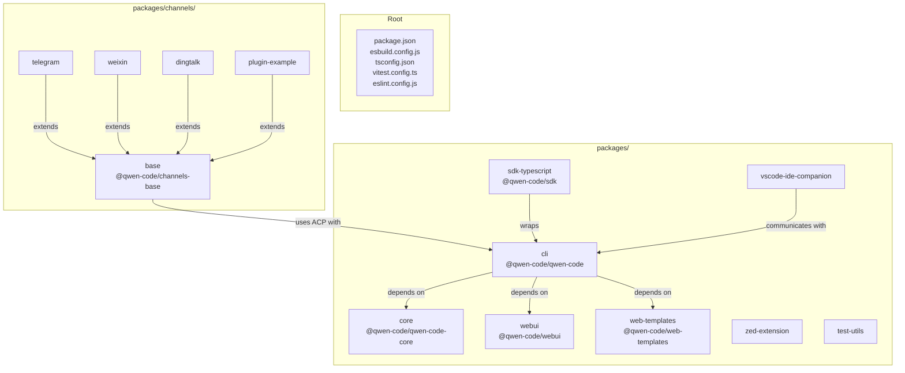

## The Config Object -- Dependency Injection Container

The `Config` class in `packages/core/src/config/config.ts` is the central wiring point. It constructs and connects every subsystem:

```mermaid
graph TB
    CONFIG["Config"]
    
    CONFIG --> CG["ContentGenerator<br/>(LLM client)"]
    CONFIG --> TR["ToolRegistry"]
    CONFIG --> PM["PermissionManager"]
    CONFIG --> HS["HookSystem"]
    CONFIG --> SM["SkillManager"]
    CONFIG --> SAM["SubAgentManager"]
    CONFIG --> EM["ExtensionManager"]
    CONFIG --> FSS["FileSystemService"]
    CONFIG --> GS["GitService"]
    CONFIG --> CS["CronScheduler"]
    CONFIG --> MB["MessageBus"]
    CONFIG --> PR["PromptRegistry"]
    CONFIG --> IDE["IdeContextStore"]
    CONFIG --> FDS["FileDiscoveryService"]
    CONFIG --> SES["ShellExecutionService"]
    CONFIG --> TEL["Telemetry"]
    
    subgraph "Tool Registration"
        TR --> SHELL["ShellTool"]
        TR --> EDIT_T["EditTool"]
        TR --> READ_T["ReadFileTool"]
        TR --> WRITE_T["WriteFileTool"]
        TR --> GLOB_T["GlobTool"]
        TR --> GREP_T["GrepTool / RipGrepTool"]
        TR --> WEB_T["WebFetchTool / WebSearchTool"]
        TR --> AGENT_T["AgentTool"]
        TR --> SKILL_T["SkillTool"]
        TR --> MEM_T["MemoryTool"]
        TR --> TODO_T["TodoWriteTool"]
        TR --> LSP_T["LspTool"]
        TR --> MCP_T["MCP Tools"]
        TR --> CRON_T["Cron Tools"]
        TR --> ASK_T["AskUserQuestionTool"]
        TR --> EXIT_T["ExitPlanModeTool"]
    end
```

### Config Construction Flow

1. **Settings loading**: Read `~/.qwen/settings.json` (global) and `.qwen/settings.json` (project), merge with CLI flags and environment variables
2. **Auth resolution**: Determine auth type and create appropriate `ContentGenerator`
3. **Storage initialization**: Set up `Storage` paths based on runtime dir settings
4. **Tool registration**: Create and register all tools in `ToolRegistry`
5. **Service initialization**: Create file system service, git service, shell execution service
6. **Extension loading**: Discover and load extensions from `.qwen/` and `.agents/`
7. **Skill loading**: Load bundled skills and user-defined skills
8. **Hook system**: Initialize hook registry, planner, runner
9. **Telemetry**: Initialize OpenTelemetry with configured endpoint
10. **Permission manager**: Load permission rules

## Content Generator Architecture

The content generator system abstracts away differences between LLM providers behind a unified interface.

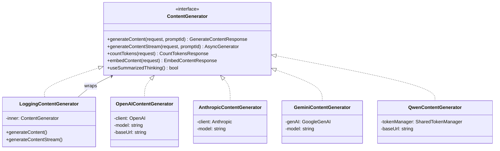

All content generators normalize their responses to the `@google/genai` types (`GenerateContentResponse`, `Content`, `Part`, etc.). This means the core engine only works with one set of types regardless of the underlying provider.

### Provider Normalization

For OpenAI-compatible APIs (including Qwen via DashScope):
- Request: Convert `Content[]` to OpenAI `messages[]` format
- Tool schemas: Convert `FunctionDeclaration` to OpenAI `tools[]` format
- Response: Convert OpenAI `ChatCompletion` back to `GenerateContentResponse`
- Streaming: Convert SSE chunks to async generator of `GenerateContentResponse`

For Anthropic:
- Request: Convert to Anthropic message format with system prompt separation
- Tool schemas: Convert to Anthropic tool use format
- Response: Map `content_block` events to `GenerateContentResponse`

## The GeminiClient Main Loop

The `GeminiClient` (despite the name, it works with all providers) implements the core agent loop:

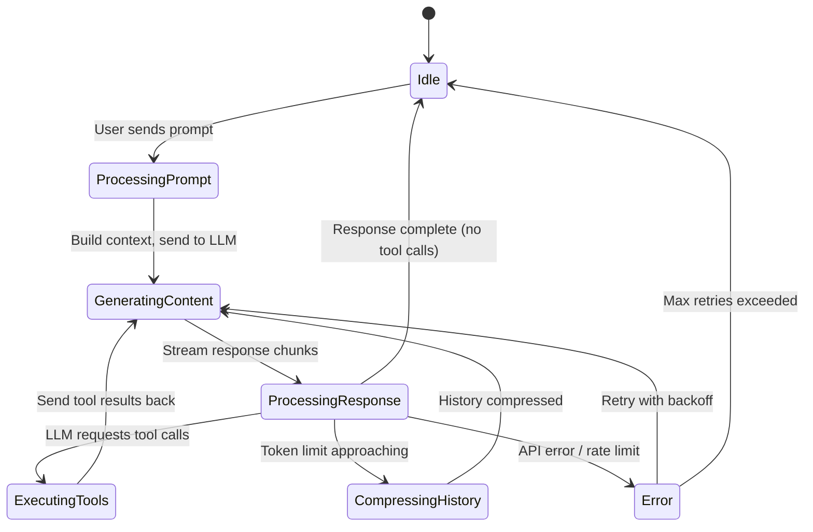

### Key mechanisms in the loop:

1. **System prompt construction**: Combines core system prompt, custom prompts (from AGENTS.md / .qwen/), plan mode reminder, subagent reminder, arena reminder

2. **Chat compression**: When conversation tokens exceed `COMPRESSION_TOKEN_THRESHOLD`, the system uses the LLM to summarize older messages while preserving the most recent `COMPRESSION_PRESERVE_THRESHOLD` messages

3. **Loop detection**: `LoopDetectionService` monitors repeated identical tool calls to prevent infinite loops

4. **Retry with backoff**: Both network-level retries (rate limits, transient errors) and content-level retries (empty responses, invalid tool calls)

5. **Forked query cache**: `saveCacheSafeParams` / `clearCacheSafeParams` for caching conversation state for follow-up queries

## Tool Registry and Execution

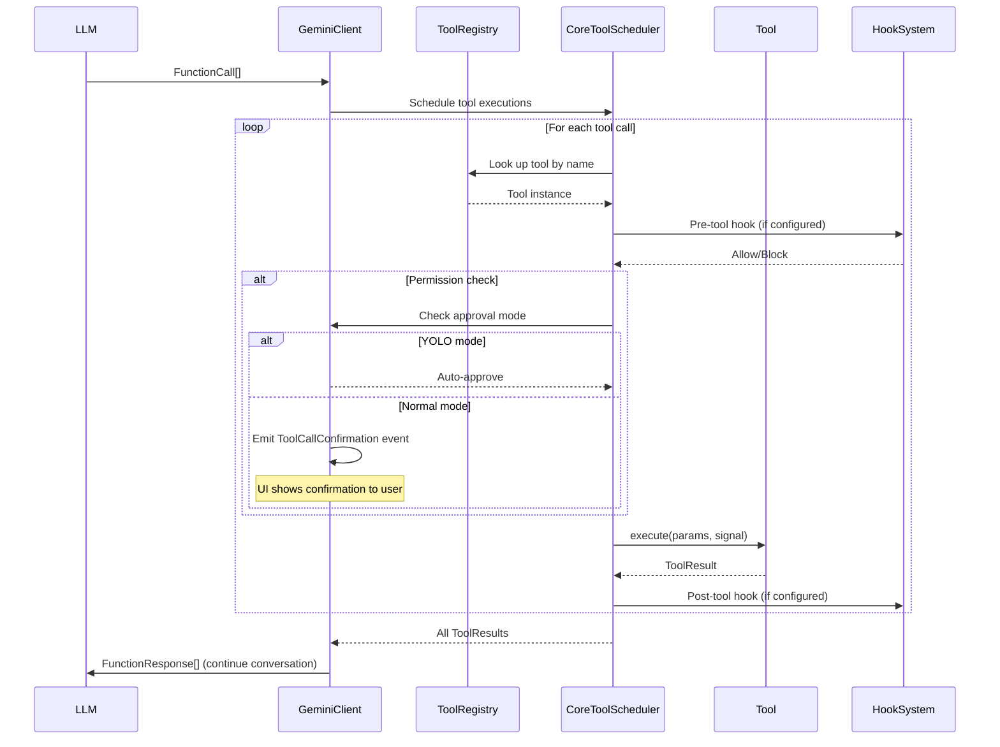

### Tool Result Structure

```typescript
interface ToolResult {
  output: string;           // Text output for the LLM
  display?: ToolResultDisplay;  // Rich display for the UI
  error?: boolean;          // Whether the tool errored
}
```

### Modifiable Tools

Some tools support modification through the permission system. The `modifiable-tool.ts` pattern allows tools to be dynamically adjusted based on project configuration.

## Hook System Architecture

Hooks provide extensibility points before and after tool executions:

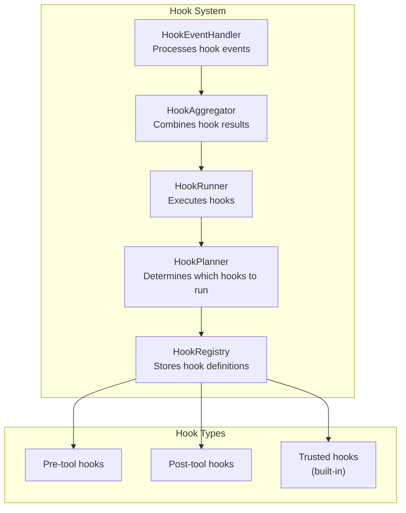

Hooks are configured in `settings.json` and can:
- Block tool executions
- Modify tool parameters
- Add system messages after tool execution
- Execute shell commands as side effects

## Skill System

Skills are reusable, self-contained capabilities that the agent can invoke:

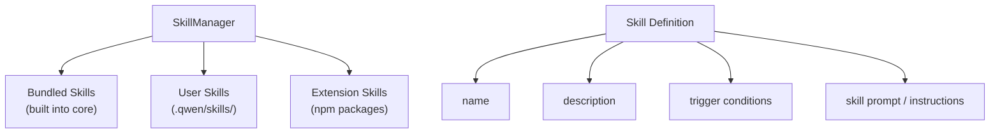

Skills are loaded from:
1. `packages/core/src/skills/bundled/` -- built-in skills
2. `.qwen/skills/` -- project-level custom skills
3. Extension-provided skills

## SubAgent System

SubAgents are specialized agent instances spawned for specific tasks:

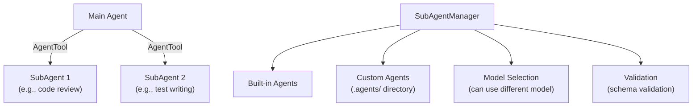

## Extension System

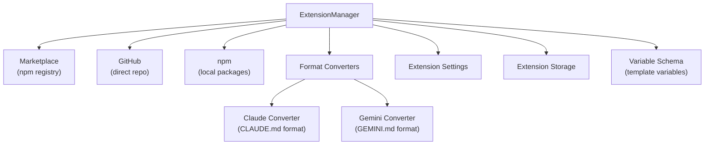

Extensions can provide:
- Additional tools
- Skills
- Configuration overrides
- Custom prompts

## MCP (Model Context Protocol) Integration

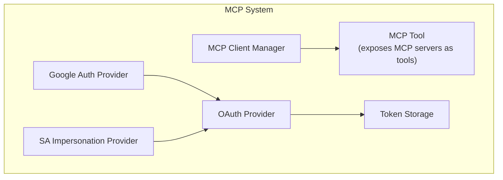

MCP allows qwen-code to connect to external tool servers, extending its capabilities dynamically.

## IDE Integration Architecture

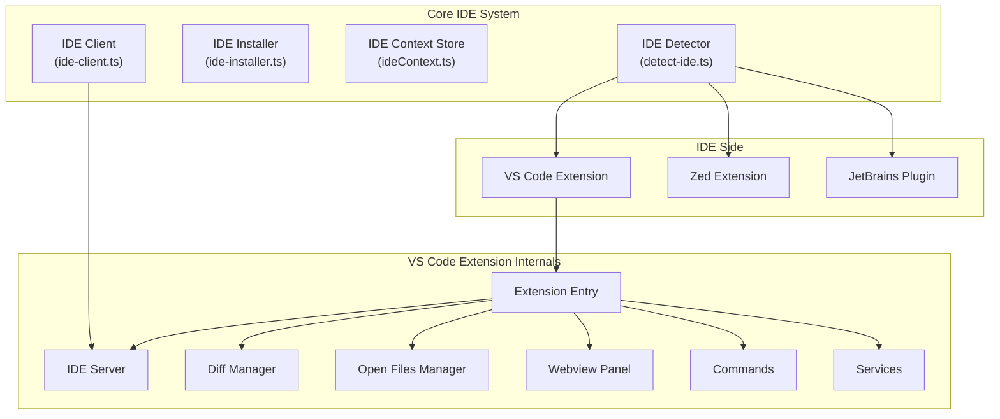

The IDE integration works by:
1. qwen-code detects running IDE instances
2. Connects via the IDE server (local socket/pipe)
3. Exchanges context: open files, diagnostics, selections
4. Pushes diffs back to the IDE for review

## What This Looks Like in Rust

### Workspace Structure (Cargo)

```toml
# Cargo.toml (workspace root)
[workspace]
members = [
    "crates/cli",
    "crates/core",
    "crates/channels-base",
    "crates/channel-telegram",
    "crates/channel-weixin",
    "crates/channel-dingtalk",
    "crates/sdk",
    "crates/webui",
]
```

### Config as Typed Builder

In Rust, the Config dependency injection would use a builder pattern with strong typing:

```rust
pub struct Config {
    content_generator: Box<dyn ContentGenerator>,
    tool_registry: ToolRegistry,
    permission_manager: PermissionManager,
    hook_system: HookSystem,
    skill_manager: SkillManager,
    subagent_manager: SubAgentManager,
    file_system: Arc<dyn FileSystem>,
    git_service: GitService,
    storage: Storage,
    // ...
}

impl Config {
    pub fn builder() -> ConfigBuilder {
        ConfigBuilder::default()
    }
}

pub struct ConfigBuilder {
    settings: Settings,
    auth_type: Option<AuthType>,
    cwd: PathBuf,
    // ...
}

impl ConfigBuilder {
    pub fn with_settings(mut self, settings: Settings) -> Self { ... }
    pub fn with_auth(mut self, auth: AuthType) -> Self { ... }
    pub fn build(self) -> Result<Config, ConfigError> { ... }
}
```

### Content Generator as Trait

```rust
#[async_trait]
pub trait ContentGenerator: Send + Sync {
    async fn generate_content(
        &self,
        request: GenerateContentRequest,
        prompt_id: &str,
    ) -> Result<GenerateContentResponse, GenerateError>;

    fn generate_content_stream(
        &self,
        request: GenerateContentRequest,
        prompt_id: &str,
    ) -> Pin<Box<dyn Stream<Item = Result<GenerateContentResponse, GenerateError>> + Send>>;

    async fn count_tokens(
        &self,
        request: CountTokensRequest,
    ) -> Result<CountTokensResponse, GenerateError>;
}
```

### Tool as Trait

```rust
#[async_trait]
pub trait Tool: Send + Sync {
    fn name(&self) -> &str;
    fn schema(&self) -> FunctionDeclaration;
    
    async fn execute(
        &self,
        params: serde_json::Value,
        cancel: CancellationToken,
    ) -> Result<ToolResult, ToolError>;
}

pub struct ToolRegistry {
    tools: HashMap<String, Box<dyn Tool>>,
}
```

## Production Grade Version

A production-grade version of this architecture would add:

### 1. Connection Pooling
HTTP client connection pools for each LLM provider, with configurable limits, keep-alive, and health checks.

### 2. Circuit Breaker Pattern
Wrap each content generator in a circuit breaker that opens after N consecutive failures, preventing cascade failures.

### 3. Structured Configuration Validation
JSON Schema validation of settings at load time with detailed error reporting, not just runtime crashes.

### 4. Session State Machine
Formalize the session state transitions with an explicit state machine:

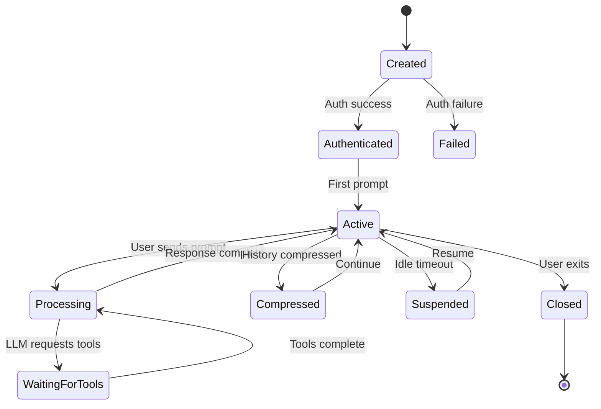

### 5. Observability Stack
- Structured JSON logging with correlation IDs
- Distributed tracing spans for each tool call
- Metrics: token usage, latency histograms, error rates
- Health check endpoint for monitoring

### 6. Graceful Degradation
- Fallback models when primary is unavailable
- Degraded mode without optional tools (web search, MCP)
- Cached responses for common queries
