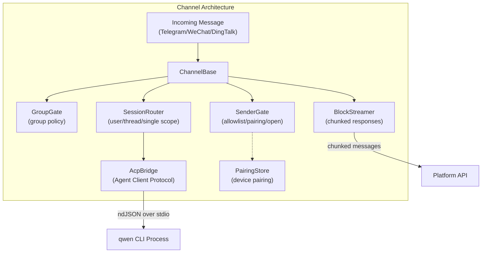
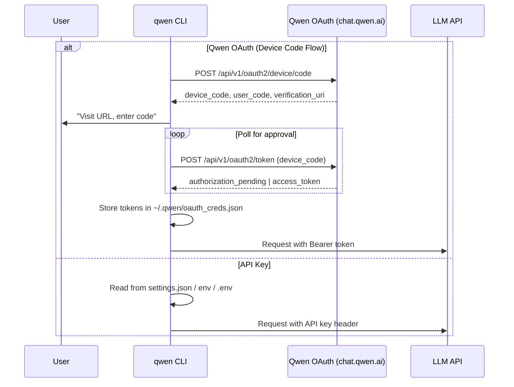
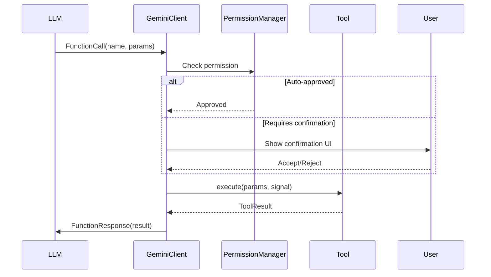

# qwen-code -- Comprehensive Exploration

## Project Identity

Qwen Code is an open-source AI agent that lives in the terminal, optimized for Qwen-series LLMs. It is a fork/evolution of Google's Gemini CLI, with parser-level adaptations for Qwen-Coder models while maintaining full compatibility with OpenAI, Anthropic, and Google Gemini APIs.

- **Version**: 0.14.3
- **License**: Apache-2.0 (inherited from Gemini CLI, some files retain Google copyright)
- **Node.js**: >= 20.0.0
- **Package manager**: npm workspaces
- **Binary**: `qwen` (installed via `npm install -g @qwen-code/qwen-code@latest`)

## High-Level Architecture

```mermaid
graph TB
    subgraph "Entry Points"
        CLI["CLI Package<br/>(Interactive / Headless)"]
        VSCODE["VS Code Extension"]
        ZED["Zed Extension"]
        SDK["TypeScript SDK"]
    end

    subgraph "Channel Adapters"
        TG["Telegram"]
        WX["Weixin (WeChat)"]
        DT["DingTalk"]
        PLUG["Custom Plugin"]
    end

    subgraph "Core Engine (@qwen-code/qwen-code-core)"
        CONFIG["Config System"]
        CLIENT["GeminiClient<br/>(Main Loop)"]
        TURN["Turn<br/>(Event Stream)"]
        CG["Content Generators"]
        TOOLS["Tool Registry"]
        SERVICES["Services Layer"]
        PERMS["Permission Manager"]
        HOOKS["Hook System"]
        SKILLS["Skill Manager"]
        SUBAG["SubAgent Manager"]
        MCP_SYS["MCP System"]
    end

    subgraph "Content Generators"
        OPENAI_CG["OpenAI CG"]
        ANTH_CG["Anthropic CG"]
        GEMINI_CG["Gemini CG"]
        QWEN_CG["Qwen OAuth CG"]
    end

    subgraph "Tools"
        SHELL["Shell"]
        EDIT["Edit"]
        READ["Read File"]
        WRITE["Write File"]
        GLOB_T["Glob"]
        GREP_T["Grep / RipGrep"]
        WEB["Web Fetch / Search"]
        AGENT_T["Agent (SubAgent)"]
        SKILL_T["Skill"]
        MEM["Memory"]
        TODO["Todo Write"]
        LSP_T["LSP"]
        CRON["Cron Create/List/Delete"]
        MCP_T["MCP Tool"]
    end

    subgraph "Services"
        SESS["Session Service"]
        COMPRESS["Chat Compression"]
        GIT["Git Service"]
        FS["File System Service"]
        FILEDISCOV["File Discovery"]
        SHELLEXEC["Shell Execution"]
        LOOP["Loop Detection"]
        RECORD["Chat Recording"]
        WORKTREE["Git Worktree"]
    end

    subgraph "Channel Base"
        CB["ChannelBase"]
        SR["SessionRouter"]
        PS["PairingStore"]
        GG["GroupGate"]
        SG["SenderGate"]
        BS["BlockStreamer"]
        ACP["AcpBridge"]
    end

    CLI --> CONFIG
    VSCODE --> CONFIG
    SDK --> CONFIG
    TG --> CB
    WX --> CB
    DT --> CB
    PLUG --> CB
    CB --> ACP
    ACP --> CLI

    CONFIG --> CLIENT
    CLIENT --> TURN
    CLIENT --> CG
    CG --> OPENAI_CG
    CG --> ANTH_CG
    CG --> GEMINI_CG
    CG --> QWEN_CG
    CLIENT --> TOOLS
    TOOLS --> SHELL
    TOOLS --> EDIT
    TOOLS --> READ
    TOOLS --> WRITE
    TOOLS --> GLOB_T
    TOOLS --> GREP_T
    TOOLS --> WEB
    TOOLS --> AGENT_T
    TOOLS --> SKILL_T
    TOOLS --> MEM
    TOOLS --> TODO
    TOOLS --> LSP_T
    TOOLS --> CRON
    TOOLS --> MCP_T
    CLIENT --> SERVICES
    SERVICES --> SESS
    SERVICES --> COMPRESS
    SERVICES --> GIT
    SERVICES --> FS
    SERVICES --> FILEDISCOV
    SERVICES --> SHELLEXEC
    SERVICES --> LOOP
    SERVICES --> RECORD
    SERVICES --> WORKTREE
    CONFIG --> PERMS
    CONFIG --> HOOKS
    CONFIG --> SKILLS
    CONFIG --> SUBAG
    CONFIG --> MCP_SYS
```



## Package-by-Package Breakdown

### packages/cli (`@qwen-code/qwen-code`)

The CLI entry point. This is what users install and run as `qwen`.

**Key files:**
- `src/gemini.tsx` -- Main entry point; initializes config, starts the interactive or headless session
- `src/nonInteractiveCli.ts` -- Headless mode (`qwen -p "prompt"`)
- `src/ui/` -- Terminal UI components (React/Ink-based rendering)
- `src/commands/` -- Slash commands (`/help`, `/auth`, `/model`, etc.)
- `src/i18n/` -- Internationalization (zh, de, fr, ja, ru, pt-BR)
- `src/acp-integration/` -- Agent Client Protocol integration
- `src/services/` -- CLI-specific services
- `src/config/` -- CLI-specific configuration

**Execution flow:**
1. User runs `qwen` or `qwen -p "prompt"`
2. CLI loads settings from `~/.qwen/settings.json` and `.qwen/settings.json`
3. Authentication is resolved (Qwen OAuth, API key, etc.)
4. `Config` object is constructed, wiring up all tools, services, permissions
5. `GeminiClient` is instantiated with the config
6. Interactive loop begins: user input -> Turn -> content generation -> tool calls -> response

### packages/core (`@qwen-code/qwen-code-core`)

The heart of the system. Contains all logic independent of the UI layer.

#### Config System (`src/config/`)

- **`config.ts`** -- The `Config` class is the central dependency injection container. It wires together:
  - Content generators (LLM clients)
  - Tool registry (all available tools)
  - Permission manager
  - Hook system
  - Skill manager
  - SubAgent manager
  - Extension manager
  - File system service, Git service, etc.
  - Session management
  - Telemetry

- **`storage.ts`** -- The `Storage` class manages all filesystem paths:
  - `~/.qwen/` -- global config, credentials, memory
  - `~/.qwen/settings.json` -- user settings
  - `.qwen/settings.json` -- project settings
  - Runtime directories for temp files, debug logs, IDE data, plans, arena

#### Core Engine (`src/core/`)

- **`client.ts`** (`GeminiClient`) -- The main orchestration loop:
  - Manages conversation history
  - Sends prompts to content generators
  - Processes tool calls
  - Handles compression, retry, loop detection
  - Emits events via `Turn` (the event stream)

- **`turn.ts`** (`Turn`) -- Defines the event model:
  - `GeminiEventType`: Content, ToolCallRequest, ToolCallResponse, ToolCallConfirmation, Error, ChatCompressed, Thought, Retry, etc.
  - Each turn is an async generator yielding `ServerGeminiStreamEvent`

- **`contentGenerator.ts`** -- The `ContentGenerator` interface:
  - `generateContent()` -- single response
  - `generateContentStream()` -- streaming response
  - `countTokens()` -- token counting
  - `embedContent()` -- embedding
  - Auth types: `USE_OPENAI`, `QWEN_OAUTH`, `USE_GEMINI`, `USE_VERTEX_AI`, `USE_ANTHROPIC`

- **`geminiChat.ts`** (`GeminiChat`) -- Manages the streaming conversation:
  - Handles retries for rate limits, invalid content, empty streams
  - Content retry with linear backoff
  - Stream event types: CHUNK, RETRY

- **`baseLlmClient.ts`** -- Utility for JSON-mode LLM calls with retry

- **Content Generators** (subdirectories):
  - `openaiContentGenerator/` -- OpenAI-compatible API adapter
  - `anthropicContentGenerator/` -- Anthropic API adapter
  - `geminiContentGenerator/` -- Google Gemini native adapter
  - `loggingContentGenerator/` -- Wrapper that logs all requests/responses

#### Qwen-Specific (`src/qwen/`)

- **`qwenOAuth2.ts`** -- Implements OAuth 2.0 Device Code flow with PKCE:
  - Endpoints: `https://chat.qwen.ai/api/v1/oauth2/device/code` and `.../token`
  - Client ID: `f0304373b74a44d2b584a3fb70ca9e56`
  - Scope: `openid profile email model.completion`
  - Stores credentials in `~/.qwen/oauth_creds.json`
  - Uses `SharedTokenManager` for concurrent token refresh

#### Tools (`src/tools/`)

Every tool follows the pattern:
1. Define a class extending a base tool interface
2. Declare the function schema (name, description, parameters)
3. Implement `execute()` returning `ToolResult`
4. Register in `ToolRegistry`

Available tools:
| Tool | File | Purpose |
|------|------|---------|
| Shell | `shell.ts` | Execute shell commands |
| Edit | `edit.ts` | Exact string replacement in files |
| Read File | `read-file.ts` | Read files with offset/limit |
| Write File | `write-file.ts` | Write/create files |
| Glob | `glob.ts` | File pattern matching |
| Grep / RipGrep | `grep.ts`, `ripGrep.ts` | Content search with regex |
| LS | `ls.ts` | List directory contents |
| Web Fetch | `web-fetch.ts` | Fetch web pages |
| Web Search | `web-search/` | Web search integration |
| Agent | `agent.ts` | Spawn sub-agents |
| Skill | `skill.ts` | Execute skills |
| Memory | `memoryTool.ts` | Read/write persistent memory |
| Todo Write | `todoWrite.ts` | Manage TODO items |
| LSP | `lsp.ts` | Language Server Protocol integration |
| MCP Tool | `mcp-tool.ts` | Model Context Protocol tool execution |
| MCP Client | `mcp-client.ts` | MCP client management |
| Ask User | `askUserQuestion.ts` | Prompt user for input |
| Cron | `cron-create.ts`, `cron-list.ts`, `cron-delete.ts` | Scheduled tasks |
| Exit Plan Mode | `exitPlanMode.ts` | Exit planning mode |
| Diff Options | `diffOptions.ts` | Diff display options |

#### Services (`src/services/`)

| Service | Purpose |
|---------|---------|
| `sessionService.ts` | Session persistence, replay |
| `chatCompressionService.ts` | Compress history when tokens exceed threshold |
| `chatRecordingService.ts` | Record conversations to disk |
| `fileDiscoveryService.ts` | Discover project files (gitignore-aware) |
| `fileSystemService.ts` | File I/O abstraction |
| `gitService.ts` | Git operations |
| `gitWorktreeService.ts` | Git worktree management |
| `shellExecutionService.ts` | Sandboxed shell execution |
| `loopDetectionService.ts` | Detect infinite tool call loops |
| `cronScheduler.ts` | Cron job scheduling |

#### Other Core Subsystems

- **`permissions/`** -- Permission manager with rule parser and shell semantics analysis
- **`hooks/`** -- Hook system: registry, planner, runner, aggregator, event handler
- **`skills/`** -- Skill manager with bundled skills and dynamic loading
- **`subagents/`** -- SubAgent manager with built-in agents, model selection, validation
- **`agents/`** -- Arena system for multi-agent evaluation, runtime agent backends
- **`mcp/`** -- MCP OAuth, token storage, Google auth provider
- **`extension/`** -- Extension system: marketplace, npm, GitHub, Claude/Gemini converters
- **`ide/`** -- IDE integration: detection, client, installer, context
- **`prompts/`** -- Prompt registry for system prompts
- **`followup/`** -- Forked query cache
- **`confirmation-bus/`** -- Message bus for hook execution requests/responses
- **`telemetry/`** -- OpenTelemetry-based telemetry
- **`output/`** -- JSON formatting, output types
- **`lsp/`** -- LSP client types

### packages/channels/base (`@qwen-code/channels-base`)

The channel abstraction layer enabling qwen-code to operate on messaging platforms.



**Key components:**

- **`ChannelBase`** -- Abstract base class that all channel adapters extend. Handles:
  - Command routing (`/` prefix commands)
  - Dispatch modes: `collect` (buffer messages), `steer` (one at a time), `followup` (chain)
  - Session queue serialization
  - Active prompt tracking

- **`AcpBridge`** -- Spawns qwen CLI as a child process and communicates via Agent Client Protocol (ndJSON over stdio). Manages sessions, sends prompts, receives events.

- **`SessionRouter`** -- Maps `(channel, sender, chat)` tuples to agent sessions. Supports scoping: per-user, per-thread, or single shared session. Persists routing state.

- **`PairingStore`** -- Implements device pairing for the `pairing` sender policy. Generates 8-character codes (safe alphabet), 1-hour expiry, max 3 pending requests.

- **`SenderGate`** -- Access control: `allowlist` (explicit list), `pairing` (code-based), `open` (anyone).

- **`GroupGate`** -- Controls bot behavior in group chats: disabled, allowlist, or open. Configurable mention requirement.

- **`BlockStreamer`** -- Breaks long LLM responses into platform-sized message chunks with configurable min/max characters and idle coalescing.

### packages/channels/telegram, weixin, dingtalk

Platform-specific adapters implementing `ChannelBase`:
- Parse platform webhook/polling events into `Envelope` objects
- Send responses back via platform APIs
- Handle platform-specific features (images, files, audio, video)

### packages/sdk-typescript (`@qwen-code/sdk`)

TypeScript SDK for programmatic access. Provides:
- Clean API to spawn and interact with qwen-code sessions
- Streaming responses
- Tool call handling
- Used in integration tests and external applications

### packages/vscode-ide-companion

VS Code extension that:
- Detects running qwen-code instances
- Provides IDE context (open files, diagnostics, selections)
- Implements diff management
- Exposes commands and webview panels

### packages/webui (`@qwen-code/webui`)

Shared React UI component library:
- Icon components
- Tailwind CSS preset
- Reusable UI primitives

### packages/web-templates (`@qwen-code/web-templates`)

Web templates bundled as embeddable JS/CSS strings. Built with Vite and React.

### packages/zed-extension

Zed editor extension for qwen-code integration.

## Authentication System



The system supports five auth types:
1. **Qwen OAuth** -- Device code flow with PKCE (RFC 7636), token refresh via SharedTokenManager
2. **OpenAI-compatible** -- API key in header, configurable base URL
3. **Anthropic** -- Anthropic SDK with API key
4. **Google Gemini** -- Google GenAI SDK
5. **Vertex AI** -- Google Cloud Vertex AI

## Configuration Hierarchy

```
Priority (high to low):
1. CLI flags (--model, --yolo, etc.)
2. Environment variables (DASHSCOPE_API_KEY, etc.)
3. .env files
4. .qwen/settings.json (project-level)
5. ~/.qwen/settings.json (user-level)
```

Key settings fields:
- `modelProviders` -- Model definitions per protocol
- `env` -- Fallback environment variables
- `security.auth.selectedType` -- Default auth type
- `model.name` -- Default model

## Tool Execution Flow



## Sandbox System

qwen-code supports sandboxed execution via Docker or Podman:
- Configured via `QWEN_SANDBOX` env var (`false`, `docker`, `podman`)
- Sandbox image: `ghcr.io/qwenlm/qwen-code:0.14.3`
- Shell commands execute inside the container
- File operations are mapped to host filesystem

## Testing Strategy

- **Unit tests**: Vitest, co-located with source files (`*.test.ts`)
- **Integration tests**: `integration-tests/` directory, tests across sandbox modes
- **Terminal benchmarks**: Measure agent performance on coding tasks
- **CI**: ESLint, Prettier, TypeScript type checking, test coverage

## Build System

- **esbuild** for bundling (`esbuild.config.js`)
- **TypeScript** compilation for packages
- **Vite** for web-templates and webui
- **Scripts** in `scripts/` for build orchestration, versioning, release

## Dependencies of Note

| Dependency | Purpose |
|-----------|---------|
| `@google/genai` | Google GenAI SDK (base types even for non-Google providers) |
| `@anthropic-ai/sdk` | Anthropic API client |
| `@modelcontextprotocol/sdk` | MCP protocol support |
| `@agentclientprotocol/sdk` | ACP for channel bridge communication |
| `@opentelemetry/api` | Telemetry |
| `@lydell/node-pty` | Pseudo-terminal for shell execution |
| `simple-git` | Git operations |
| `undici` | HTTP client with proxy support |
| `xterm` | Terminal emulation for headless mode |

## What This Looks Like in Rust

See [rust-revision.md](./rust-revision.md) for the complete Rust translation plan, and the deep-dive documents for subsystem-specific Rust approaches.

## Production-Grade Considerations

1. **Observability**: OpenTelemetry integration exists but needs strengthening -- structured logging, distributed tracing, metrics dashboards
2. **Rate limiting**: Basic retry-with-backoff exists; production needs circuit breakers, token bucket rate limiters
3. **Security**: Permission system is well-designed but relies on client-side enforcement; production deployment behind messaging platforms needs server-side validation
4. **Scalability**: Single-process per session; horizontal scaling requires session affinity and shared state
5. **Resilience**: AcpBridge handles process crashes with reconnection; needs dead letter queues for failed messages
