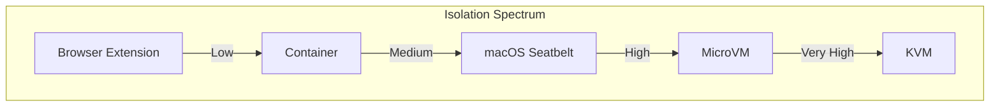
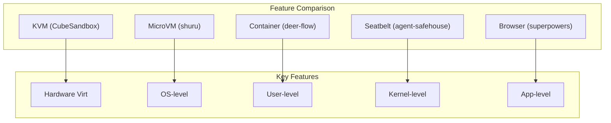

# Sandboxes Overview

A landscape of sandbox implementations for secure AI agent code execution.

## The Problem

AI agents need to execute code safely:
- **Isolation** — Prevent access to host system
- **Reproducibility** — Same input → same output
- **Observability** — Monitor what agents do
- **Limitation** — Control resource usage

## The Spectrum

| Approach | Isolation Level | Startup Time | Resource Overhead |
|----------|-----------------|--------------|-------------------|
| Browser extension | Low | Instant | Minimal |
| Container | Medium | Fast | Low |
| Seatbelt | Medium-High | Fast | Low |
| MicroVM | High | Medium | Medium |
| KVM | Very High | Slow | High |

## Projects

### agent-safehouse
**macOS Seatbelt sandboxing** for LLM agents.

Uses macOS's built-in sandboxing to restrict file system and network access.

### CubeSandbox
**KVM-based microVMs** in Rust/Go.

High-performance sandboxing using KVM virtualization with minimal overhead.

### deer-flow
**Super agent harness** with sub-agents.

Container-based orchestration for multi-agent workflows.

### flue
**Sandbox agent framework** in TypeScript.

Container-based with policy-based restrictions.

### Kami
**Document design system** for agents.

Browser-based sandbox for document processing.

### shuru
**Local microVM sandbox** in Rust.

Firecracker-based microVMs for local AI agents.

### superhq
**Sandboxed AI orchestration** in Rust.

GPUI-based platform with comprehensive sandboxing.

### ml-intern
**ML research agent** in Python.

Container-based with ML toolchains pre-installed.

### superpowers
**Chrome extension** for AI.

Browser extension for client-side AI interactions.

## Comparison Matrix

## Choosing a Sandbox

| Use Case | Recommended | Why |
|----------|-------------|-----|
| Local development | shuru | Fast, easy setup |
| Production workloads | CubeSandbox | Strongest isolation |
| macOS agents | agent-safehouse | Native integration |
| Multi-agent workflows | deer-flow | Orchestration built-in |
| Browser-based AI | superpowers | Client-side execution |
| ML research | ml-intern | Pre-configured tools |

## Common Patterns

All sandboxes share these patterns:

1. **Policy-based restrictions** — Define what code can do
2. **Resource limits** — CPU, memory, network quotas
3. **Audit logging** — Record all actions
4. **Network isolation** — Control external access
5. **Filesystem restrictions** — Limit file system access

## Next Steps

Continue to [agent-safehouse →](01-agent-safehouse.html) for macOS Seatbelt sandboxing.
