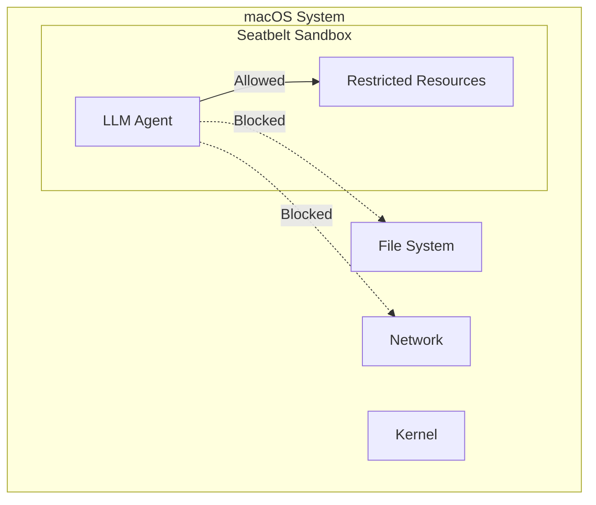

# agent-safehouse

macOS Seatbelt sandboxing for LLM agents.

## Overview

**Location:** `src.Sandboxes/agent-safehouse/`

Uses macOS's built-in sandboxing framework to restrict agent capabilities.

## What is Seatbelt?

Seatbelt is macOS's sandboxing mechanism:
- Kernel-enforced restrictions
- Policy-based access control
- Per-process sandbox profiles
- No virtualization overhead



## Sandbox Profile

Seatbelt profiles define allowed operations:

```xml
<!-- agent-safehouse.sb -->
<?xml version="1.0" encoding="UTF-8"?>
<!DOCTYPE plist PUBLIC "-//Apple//DTD PLIST 1.0//EN">
<plist version="1.0">
<dict>
    <!-- Allow read from agent directory -->
    <key>agent-home</key>
    <string>~/Agents/</string>

    <!-- Allow writes only to workspace -->
    <key>workspace</key>
    <string>~/Workspace/</string>

    <!-- Deny network by default -->
    <key>deny-network</key>
    <true/>

    <!-- Allow specific domains -->
    <key>allowed-domains</key>
    <array>
        <string>api.openai.com</string>
        <string>api.anthropic.com</string>
    </array>
</dict>
</plist>
```

## Running Sandboxed

```bash
# Apply sandbox profile
sandbox-exec -f agent-safehouse.sb ./agent

# Check sandbox status
sandbox-exec -p agent-safehouse.sb /bin/sh -c 'echo $SANDBOX_PROFILE'
```

## Policy Rules

### File System

```xml
<!-- Read-only access to system -->
<key>read-system</key>
<true/>

<!-- Write only to workspace -->
<key>write-paths</key>
<array>
    <string>~/Workspace/</string>
    <string>/tmp/agent-*/</string>
</array>

<!-- Deny access to sensitive paths -->
<key>deny-paths</key>
<array>
    <string>~/.ssh/</string>
    <string>~/Library/Keychains/</string>
    <string>/etc/passwd</string>
</array>
```

### Network

```xml
<!-- Outbound only -->
<key>network-outbound</key>
<true/>

<!-- No inbound connections -->
<key>network-inbound</key>
<false/>

<!-- Allowed ports -->
<key>allowed-ports</key>
<array>
    <integer>443</integer>
    <integer>80</integer>
</array>
```

## Aha: Seatbelt Tradeoffs

**Pros:**
- Native macOS integration
- No virtualization overhead
- Fast startup
- Kernel-enforced

**Cons:**
- macOS only
- Complex profile syntax
- Limited granularity
- Can be bypassed by privileged processes

## Use Cases

| Scenario | Seatbelt Fit |
|----------|--------------|
| Local LLM agents | ✓ Good |
| CI/CD pipelines | ✗ Poor |
| Production services | ✗ Poor |
| Developer tools | ✓ Good |

## Next Steps

Continue to [CubeSandbox →](02-cubesandbox.html) for KVM-based microVMs.
