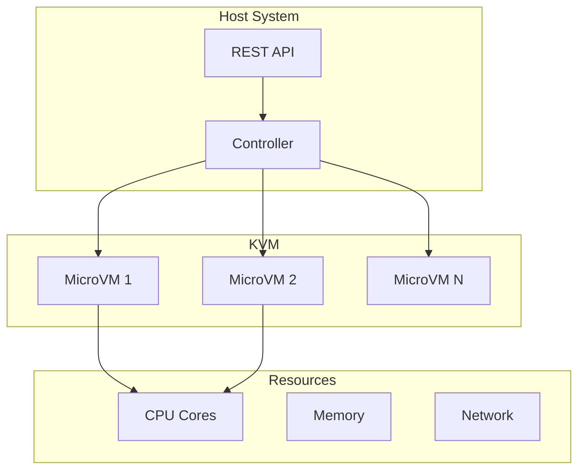
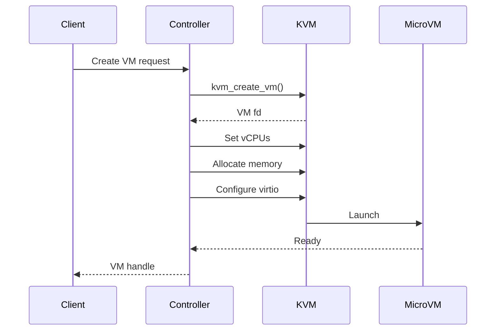

# CubeSandbox

High-performance KVM microVM sandbox service in Rust and Go.

## Overview

**Location:** `src.Sandboxes/CubeSandbox/`

Provides hardware-virtualized microVMs using KVM with minimal overhead.

## Architecture



## Components

### Controller (Rust)

**Location:** `CubeSandbox/src/controller/`

```rust
// controller/src/main.rs
use kvm_ioctls::{Kvm, VmFd};

pub struct CubeController {
    kvm: Kvm,
    vms: HashMap<String, MicroVM>,
}

impl CubeController {
    pub fn create_vm(&mut self, config: VMConfig) -> Result<MicroVM, Error> {
        let vm = self.kvm.create_vm()?;
        // Configure vCPUs
        // Set up memory
        // Configure network
        Ok(MicroVM::new(vm, config))
    }
}
```

### Agent (Go)

**Location:** `CubeSandbox/agent/`

```go
// agent/main.go
package main

import (
    "net/http"
    "github.com/cube-sandbox/agent/vm"
)

func main() {
    client := vm.NewClient("unix:///var/run/cube.sock")

    // Create VM
    vm, err := client.CreateVM(vm.Config{
        CPUs: 2,
        MemoryMB: 512,
        DiskSizeGB: 10,
    })

    // Execute code
    result, err := vm.Exec("python3", "script.py")
}
```

## MicroVM Configuration

```rust
// controller/src/config.rs
pub struct VMConfig {
    /// Number of vCPUs
    pub cpus: u8,

    /// Memory in MB
    pub memory_mb: u32,

    /// Root disk size in GB
    pub disk_size_gb: u32,

    /// Network policy
    pub network: NetworkPolicy,

    /// Filesystem access
    pub filesystem: FSConfig,
}

pub struct NetworkPolicy {
    pub allow_outbound: bool,
    pub allowed_hosts: Vec<String>,
    pub blocked_ports: Vec<u16>,
}
```

## Aha: Why KVM?

KVM provides hardware virtualization:
- **Performance** — Near-native speed
- **Isolation** — True hardware boundary
- **Security** — CPU-enforced separation
- **Compatibility** — Run any Linux workload

## Startup Sequence



## Performance

| Metric | Container | MicroVM | Full VM |
|--------|-----------|---------|---------|
| Boot time | 100ms | 300ms | 30s |
| Memory overhead | 10MB | 50MB | 500MB |
| CPU overhead | 0% | 1-2% | 5-10% |
| Isolation level | Process | Hardware | Hardware |

## Use Cases

- **CI/CD runners** — Isolated, ephemeral build environments
- **Serverless functions** — Fast cold start with strong isolation
- **Code execution** — Run untrusted code safely
- **Multi-tenant** — Secure workload isolation

## Next Steps

Continue to [deer-flow →](03-deer-flow.html) for container-based super agents.
