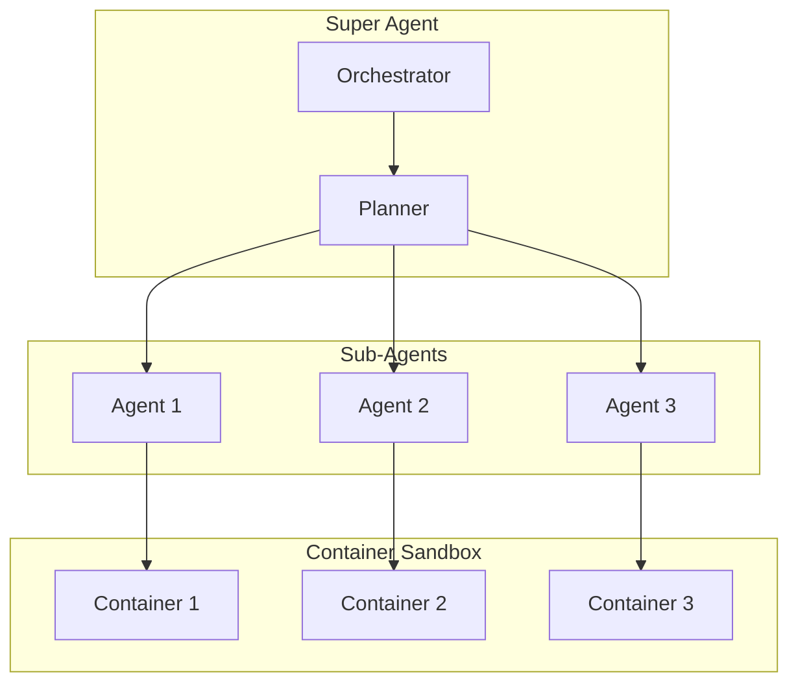

# deer-flow

Super agent harness with sub-agents.

## Overview

**Location:** `src.Sandboxes/deer-flow/`

A container-based agent framework that orchestrates multiple sub-agents.

## Architecture



## Components

### Orchestrator

```python
# orchestrator.py
class SuperAgent:
    def __init__(self):
        self.planner = Planner()
        self.agents: Dict[str, SubAgent] = {}

    async def execute_task(self, task: Task) -> Result:
        # Break task into sub-tasks
        subtasks = self.planner.decompose(task)

        # Spawn sub-agents
        for subtask in subtasks:
            agent = await self.spawn_agent(subtask)
            self.agents[subtask.id] = agent

        # Coordinate execution
        results = await self.coordinate(subtasks)

        # Merge results
        return self.planner.merge(results)

    async def spawn_agent(self, subtask: SubTask) -> SubAgent:
        # Create container sandbox
        container = await self.create_container(subtask.config)
        return SubAgent(container, subtask)
```

### Container Sandbox

```python
# sandbox/container.py
class ContainerSandbox:
    def __init__(self, image: str, limits: ResourceLimits):
        self.image = image
        self.limits = limits
        self.container: Optional[Container] = None

    async def create(self):
        self.container = await docker.containers.create(
            image=self.image,
            mem_limit=self.limits.memory,
            cpu_quota=self.limits.cpu * 100000,
            network_mode="none",  # Isolated by default
            read_only=True,       # Immutable root
            tmpfs={"/tmp": "rw,noexec,nosuid,size=100m"},
        )

    async def exec(self, command: List[str]) -> ExecResult:
        return await self.container.exec(command)

    async def destroy(self):
        await self.container.stop()
        await self.container.remove()
```

## Agent Communication

```python
# communication/bus.py
class AgentBus:
    """Message bus for inter-agent communication."""

    def __init__(self):
        self.channels: Dict[str, Channel] = {}

    async def publish(self, channel: str, message: Message):
        """Publish message to channel."""
        if channel not in self.channels:
            self.channels[channel] = Channel()
        await self.channels[channel].put(message)

    async def subscribe(self, channel: str) -> AsyncIterator[Message]:
        """Subscribe to channel messages."""
        while True:
            message = await self.channels[channel].get()
            yield message
```

## Resource Limits

```yaml
# config/resources.yaml
agent_defaults:
  memory: 512MB
  cpu: 1.0
  timeout: 300s
  network: restricted

restrictions:
  filesystem:
    read_only: true
    allowed_paths:
      - /workspace
      - /tmp
  network:
    allow_outbound: false
    allowed_hosts: []
```

## Workflow Example

```python
# example_workflow.py
async def main():
    super_agent = SuperAgent()

    task = Task(
        description="Analyze codebase",
        steps=[
            SubTask("Parse files", agent="parser"),
            SubTask("Find patterns", agent="analyzer"),
            SubTask("Generate report", agent="reporter"),
        ]
    )

    result = await super_agent.execute_task(task)
    print(result.report)

if __name__ == "__main__":
    asyncio.run(main())
```

## Aha: Multi-Agent Benefits

1. **Parallelism** — Multiple agents work simultaneously
2. **Specialization** — Each agent has specific expertise
3. **Isolation** — Failure contained to one agent
4. **Scalability** — Add agents as needed

## Next Steps

Continue to [flue →](04-flue.html) for TypeScript container framework.
