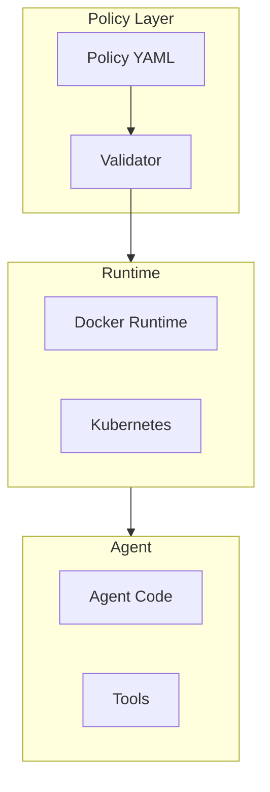

# flue

Sandbox agent framework in TypeScript.

## Overview

**Location:** `src.Sandboxes/flue/`

Policy-based container sandbox for agent execution.

## Architecture



## Policy Definition

```yaml
# flue.yaml
version: "1.0"

sandbox:
  # Container image
  image: node:18-alpine

  # Resource limits
  resources:
    memory: 512MB
    cpu: 1.0
    timeout: 5m

  # Filesystem restrictions
  filesystem:
    readOnlyRoot: true
    volumes:
      - path: /workspace
        type: bind
        source: ./workspace
      - path: /tmp
        type: tmpfs
        size: 100MB

  # Network policy
  network:
    mode: restricted
    allow:
      - host: api.openai.com
        port: 443
      - host: api.anthropic.com
        port: 443
    deny:
      - port: 22
      - port: 3389

  # Capabilities
  security:
    dropAll: true
    add:
      - NET_BIND_SERVICE
    seccomp: default
    apparmor: flue-default
```

## TypeScript API

```typescript
// src/sandbox.ts
export interface SandboxConfig {
  image: string;
  resources: ResourceLimits;
  filesystem: FileSystemPolicy;
  network: NetworkPolicy;
  security: SecurityPolicy;
}

export class FlueSandbox {
  private config: SandboxConfig;
  private container: Container | null = null;

  constructor(config: SandboxConfig) {
    this.config = config;
  }

  async init(): Promise<void> {
    this.container = await docker.createContainer({
      Image: this.config.image,
      HostConfig: {
        Memory: this.parseMemory(this.config.resources.memory),
        CpuQuota: this.config.resources.cpu * 100000,
        ReadonlyRootfs: this.config.filesystem.readOnlyRoot,
        NetworkMode: this.config.network.mode,
        SecurityOpt: this.buildSecurityOpts(),
      },
    });
  }

  async execute(command: string[]): Promise<ExecResult> {
    if (!this.container) {
      throw new Error("Sandbox not initialized");
    }
    return await this.container.exec({ Cmd: command });
  }

  async dispose(): Promise<void> {
    if (this.container) {
      await this.container.stop();
      await this.container.remove();
    }
  }
}
```

## Policy Enforcement

```typescript
// src/policy/validator.ts
export class PolicyValidator {
  validate(policy: Policy): ValidationResult {
    const errors: string[] = [];

    // Validate resources
    if (policy.resources.memory > MAX_MEMORY) {
      errors.push(`Memory exceeds maximum: ${MAX_MEMORY}`);
    }

    // Validate network
    if (policy.network.mode === 'open') {
      errors.push('Open network mode not allowed');
    }

    // Validate filesystem
    if (!policy.filesystem.readOnlyRoot) {
      errors.push('Read-only root required');
    }

    return {
      valid: errors.length === 0,
      errors,
    };
  }
}
```

## Tool Integration

```typescript
// src/tools/registry.ts
export class ToolRegistry {
  private tools: Map<string, Tool> = new Map();

  register(name: string, tool: Tool): void {
    this.tools.set(name, tool);
  }

  async execute(name: string, args: unknown[]): Promise<unknown> {
    const tool = this.tools.get(name);
    if (!tool) {
      throw new ToolNotFoundError(name);
    }
    return await tool.execute(args);
  }
}

// Sandboxed tool wrapper
export function createSandboxedTool(
  tool: Tool,
  sandbox: FlueSandbox
): Tool {
  return {
    async execute(args: unknown[]): Promise<unknown> {
      // Execute in sandbox
      return await sandbox.execute([
        'node',
        '-e',
        `require('./tool').run(${JSON.stringify(args)})`,
      ]);
    },
  };
}
```

## Aha: Policy as Code

**Benefits:**
- Version controlled restrictions
- Code review for policy changes
- Reproducible environments
- Audit trail

## Next Steps

Continue to [Kami →](05-kami.html) for browser-based sandboxing.
