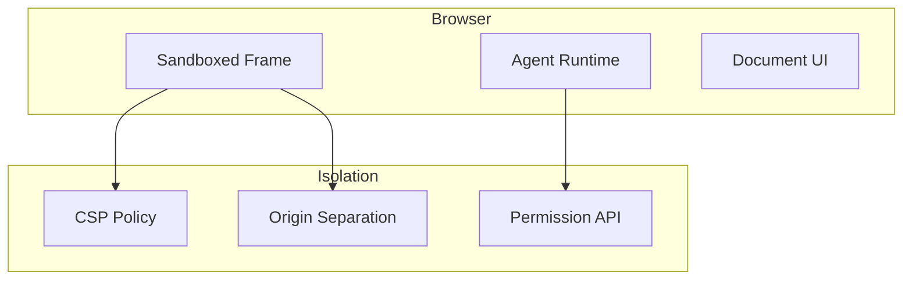

# Kami

Document design system for AI agents.

## Overview

**Location:** `src.Sandboxes/Kami/`

Browser-based sandbox for document processing and AI agent workflows.

## Architecture



## Sandboxed Frame

```html
<!-- index.html -->
<iframe
  id="agent-sandbox"
  sandbox="allow-scripts allow-same-origin"
  csp="default-src 'self'; script-src 'nonce-${nonce}'"
  src="/agent-runtime.html"
></iframe>
```

## Python Backend

```python
# kami/server.py
from flask import Flask, jsonify
from kami.sandbox import AgentSandbox

app = Flask(__name__)
sandbox = AgentSandbox()

@app.route('/agent/execute', methods=['POST'])
def execute_agent():
    code = request.json['code']
    result = sandbox.execute(code)
    return jsonify(result)

class AgentSandbox:
    def __init__(self):
        self.allowed_modules = {
            'json', 're', 'math', 'random',
            'datetime', 'collections', 'itertools',
        }

    def execute(self, code: str) -> dict:
        # Restricted Python execution
        restricted_globals = {
            '__builtins__': self.safe_builtins(),
        }

        try:
            exec(code, restricted_globals)
            return {'status': 'success'}
        except Exception as e:
            return {'status': 'error', 'message': str(e)}

    def safe_builtins(self):
        return {
            'len': len,
            'range': range,
            'enumerate': enumerate,
            'zip': zip,
            'map': map,
            'filter': filter,
            # No file operations, no exec, no eval
        }
```

## Document Model

```python
# kami/document.py
class Document:
    def __init__(self, id: str, content: str):
        self.id = id
        self.content = content
        self.blocks: List[Block] = self.parse(content)

    def parse(self, content: str) -> List[Block]:
        """Parse markdown into blocks."""
        blocks = []
        for line in content.split('\n\n'):
            if line.startswith('# '):
                blocks.append(HeadingBlock(level=1, text=line[2:]))
            elif line.startswith('```'):
                blocks.append(CodeBlock.from_text(line))
            else:
                blocks.append(ParagraphBlock(text=line))
        return blocks

    def execute_blocks(self):
        """Execute code blocks in sandbox."""
        for block in self.blocks:
            if isinstance(block, CodeBlock):
                result = sandbox.execute(block.code)
                block.output = result
```

## CSP Policy

```python
# kami/security.py
CONTENT_SECURITY_POLICY = """
default-src 'self';
script-src 'self' 'nonce-{nonce}';
style-src 'self' 'unsafe-inline';
img-src 'self' data: blob:;
font-src 'self';
connect-src 'self';
frame-src 'self';
object-src 'none';
base-uri 'self';
form-action 'self';
"""
```

## Agent Runtime

```javascript
// agent-runtime.js
class AgentRuntime {
  constructor() {
    this.tools = new Map();
    this.memory = new Map();
  }

  registerTool(name, tool) {
    this.tools.set(name, tool);
  }

  async execute(code) {
    // Sandboxed execution
    const sandboxedCode = `
      (async () => {
        ${code}
      })()
    `;

    try {
      return await eval(sandboxedCode);
    } catch (error) {
      return { error: error.message };
    }
  }
}

// Restrict available globals
const restrictedGlobals = {
  console,
  fetch, // Restricted via ServiceWorker
  setTimeout,
  clearTimeout,
  // No document, no window, no eval
};
```

## Aha: Browser Sandboxing

**Isolation Mechanisms:**
- **CSP** — Restrict resource loading
- **Sandbox attribute** — Limit iframe capabilities
- **Origin separation** — Different domains
- **Permission API** — Explicit user consent

**Limitations:**
- Shared browser resources
- No true process isolation
- Extension access possible
- Spectre/Meltdown vulnerabilities

## Next Steps

Continue to [shuru →](06-shuru.html) for Rust microVMs.
