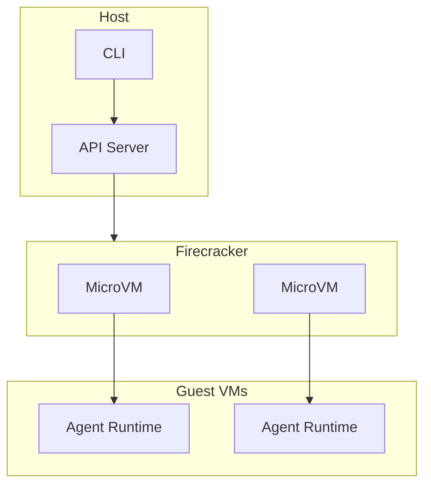

# shuru

Local microVM sandbox for AI agents.

## Overview

**Location:** `src.Sandboxes/shuru/`

Firecracker-based microVMs for local AI agent execution.

## Architecture



## Firecracker MicroVMs

```rust
// src/vm/manager.rs
use firecracker_config::VmConfig;

pub struct MicroVM {
    config: VmConfig,
    socket_path: PathBuf,
    process: Child,
}

impl MicroVM {
    pub async fn create(config: VmConfig) -> Result<Self, Error> {
        // Create VM socket
        let socket_path = temp_dir().join(format!("firecracker-{}.sock", uuid()));

        // Launch firecracker process
        let process = Command::new("firecracker")
            .arg("--api-sock")
            .arg(&socket_path)
            .spawn()?;

        // Configure VM via API
        let client = FirecrackerClient::new(&socket_path);
        client.configure_vm(&config).await?;

        Ok(MicroVM {
            config,
            socket_path,
            process,
        })
    }

    pub async fn start(&mut self) -> Result<(), Error> {
        let client = FirecrackerClient::new(&self.socket_path);
        client.start_vm().await?;
        Ok(())
    }

    pub async fn exec(&self, command: &str) -> Result<ExecResult, Error> {
        // Execute via vsock
        let vsock = VsockConnection::new(&self.socket_path, 52);
        vsock.send(command).await?;
        vsock.recv().await?
    }
}
```

## VM Configuration

```rust
// src/config.rs
pub struct VmConfig {
    /// Number of vCPUs (up to 32)
    pub vcpu_count: u8,

    /// Memory in MB
    pub mem_size_mib: u32,

    /// Root drive
    pub rootfs: DriveConfig,

    /// Network interface
    pub network: NetworkConfig,

    /// vsock for agent communication
    pub vsock: VsockConfig,
}

pub struct DriveConfig {
    pub path: PathBuf,
    pub read_only: bool,
}

pub struct NetworkConfig {
    pub host_dev_name: String,
    pub guest_mac: String,
}
```

## Root Filesystem

```dockerfile
# rootfs/Dockerfile
FROM debian:bullseye-slim

# Install agent runtime
RUN apt-get update && apt-get install -y \
    python3 \
    python3-pip \
    nodejs \
    npm \
    git \
    curl

# Install agent dependencies
COPY requirements.txt /tmp/
RUN pip3 install -r /tmp/requirements.txt

# Configure vsock agent
COPY agent/ /opt/agent/
CMD ["/opt/agent/start.sh"]
```

## Agent Runtime

```python
# agent/runtime.py
import socket
import json

class AgentRuntime:
    def __init__(self):
        self.tools = {}
        self.state = {}

    def listen(self):
        # vsock socket
        sock = socket.socket(socket.AF_VSOCK, socket.SOCK_STREAM)
        sock.bind((socket.VMADDR_CID_ANY, 52))
        sock.listen(1)

        while True:
            conn, _ = sock.accept()
            self.handle_connection(conn)

    def handle_connection(self, conn):
        while True:
            data = conn.recv(4096)
            if not data:
                break

            request = json.loads(data)
            result = self.execute(request)
            conn.send(json.dumps(result).encode())

    def execute(self, request):
        tool = request['tool']
        args = request['args']

        if tool in self.tools:
            return self.tools[tool](args)
        return {'error': f'Unknown tool: {tool}'}

if __name__ == '__main__':
    runtime = AgentRuntime()
    runtime.listen()
```

## Performance

```
Boot time: < 100ms
Memory overhead: ~15MB per VM
vCPU overhead: < 1%
Network latency: < 1ms
```

## Aha: Firecracker vs Containers

| Aspect | Firecracker | Container |
|--------|-------------|-----------|
| Isolation | Hardware | Process |
| Boot time | 100ms | 100ms |
| Memory | 15MB | 10MB |
| Security | Strong | Medium |
| Density | 1000s/CPU | Unlimited |

## Use Cases

- **Local agent execution** — Fast, isolated
- **CI/CD** — Ephemeral, clean
- **Development** — Multiple environments
- **Testing** — Reproducible

## Next Steps

Continue to [superhq →](07-superhq.html) for orchestrated sandboxing.
