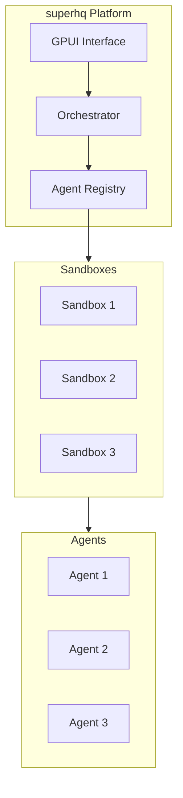

# superhq

Sandboxed AI agent orchestration platform.

## Overview

**Location:** `src.Sandboxes/superhq/`

GPUI-based platform with comprehensive sandboxing for AI agents.

## Architecture



## Components

### Orchestrator (Rust)

```rust
// src/orchestrator.rs
use std::collections::HashMap;

pub struct Orchestrator {
    agents: HashMap<String, AgentHandle>,
    sandboxes: HashMap<String, Sandbox>,
    bus: EventBus,
}

impl Orchestrator {
    pub fn spawn_agent(&mut self, config: AgentConfig) -> Result<AgentHandle, Error> {
        // Create sandbox
        let sandbox = self.create_sandbox(&config.sandbox)?;

        // Spawn agent in sandbox
        let agent = sandbox.spawn_agent(&config)?;

        let handle = AgentHandle {
            id: agent.id(),
            sandbox: sandbox.id(),
        };

        self.agents.insert(handle.id.clone(), handle);
        self.sandboxes.insert(sandbox.id(), sandbox);

        Ok(handle)
    }

    pub fn send_message(&self, from: &str, to: &str, msg: Message) -> Result<(), Error> {
        let agent = self.agents.get(to)
            .ok_or(Error::AgentNotFound)?;

        let sandbox = self.sandboxes.get(&agent.sandbox)
            .ok_or(Error::SandboxNotFound)?;

        sandbox.deliver_message(from, msg)?;
        Ok(())
    }
}
```

### Sandbox

```rust
// src/sandbox.rs
pub struct Sandbox {
    id: String,
    process: Child,
    vsock: Vsock,
}

impl Sandbox {
    pub fn create(config: SandboxConfig) -> Result<Self, Error> {
        // Launch microVM or container
        let process = match config.backend {
            Backend::Firecracker => Self::launch_firecracker(&config),
            Backend::Container => Self::launch_container(&config),
        }?;

        // Connect via vsock
        let vsock = Vsock::connect(&config.vsock_addr)?;

        Ok(Sandbox {
            id: uuid(),
            process,
            vsock,
        })
    }

    pub fn spawn_agent(&self, config: &AgentConfig) -> Result<Agent, Error> {
        // Send spawn command via vsock
        self.vsock.send(Command::SpawnAgent {
            name: config.name,
            code: config.code,
        })?;

        let response = self.vsock.recv()?;
        Ok(Agent::from(response))
    }
}
```

### GPUI Interface

```rust
// src/ui/app.rs
use gpui::*;

pub struct SuperHQApp {
    orchestrator: Arc<Mutex<Orchestrator>>,
    selected_agent: Option<String>,
}

impl Render for SuperHQApp {
    fn render(&mut self, cx: &mut ViewContext<Self>) -> impl Element {
        div()
            .flex()
            .size_full()
            .child(
                div()
                    .w(px(300))
                    .child(self.render_sidebar(cx))
            )
            .child(
                div()
                    .flex_1()
                    .child(self.render_main(cx))
            )
    }
}

impl SuperHQApp {
    fn render_sidebar(&self, cx: &mut ViewContext<Self>) -> impl Element {
        div()
            .flex_col()
            .child(
                div()
                    .child("Agents")
                    .text_size(px(18))
                    .font_weight(FontWeight::BOLD)
            )
            .child(
                div()
                    .flex_col()
                    .children(
                        self.orchestrator.agents.values().map(|agent| {
                            div()
                                .child(agent.id.clone())
                                .on_click(cx.listener(move |this, _, _| {
                                    this.selected_agent = Some(agent.id.clone());
                                }))
                        })
                    )
            )
    }
}
```

## Communication

```rust
// src/bus.rs
pub struct EventBus {
    subscribers: HashMap<String, Vec<Sender<Event>>>,
}

impl EventBus {
    pub fn subscribe(&mut self, channel: &str) -> Receiver<Event> {
        let (tx, rx) = channel::unbounded();
        self.subscribers
            .entry(channel.to_string())
            .or_default()
            .push(tx);
        rx
    }

    pub fn publish(&self, channel: &str, event: Event) {
        if let Some(subscribers) = self.subscribers.get(channel) {
            for tx in subscribers {
                tx.send(event.clone()).ok();
            }
        }
    }
}
```

## Aha: Agent Isolation

Each agent runs in its own sandbox:
- **No shared memory** — Complete isolation
- **Message passing** — Clean communication
- **Resource limits** — Per-agent quotas
- **Audit trail** — All actions logged

## Next Steps

Continue to [Others →](08-others.html) for ml-intern and superpowers.
