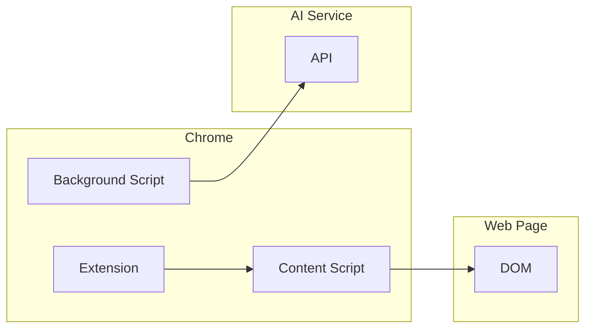

# Other Projects

ml-intern and superpowers.

## ml-intern

**Location:** `src.Sandboxes/ml-intern/`

ML research agent with sandboxed tools.

### Architecture

```python
# ml_intern/agent.py
class MLAgent:
    def __init__(self):
        self.sandbox = JupyterSandbox()
        self.tools = self.load_tools()

    def load_tools(self):
        return {
            'train': self.sandbox.wrap(self.train_model),
            'evaluate': self.sandbox.wrap(self.evaluate_model),
            'plot': self.sandbox.wrap(self.create_plot),
        }

    def execute(self, code: str):
        # Execute in Jupyter sandbox
        return self.sandbox.execute(code)
```

### Jupyter Sandbox

```python
# sandbox/jupyter.py
from jupyter_client import KernelManager

class JupyterSandbox:
    def __init__(self):
        self.km = KernelManager()
        self.km.start_kernel()
        self.kc = self.km.client()

    def execute(self, code: str):
        msg_id = self.kc.execute(code)
        reply = self.kc.get_shell_msg(msg_id)
        return reply['content']

    def wrap(self, func):
        def wrapper(*args, **kwargs):
            # Serialize function call
            code = f"""
import pickle
result = {func.__name__}(*pickle.loads({pickle.dumps(args)}),
                         **pickle.loads({pickle.dumps(kwargs)}))
pickle.dumps(result)
"""
            return self.execute(code)
        return wrapper
```

## superpowers

**Location:** `src.Sandboxes/superpowers/`

Chrome extension for AI interactions.

### Architecture



### Extension Manifest

```json
// manifest.json
{
  "manifest_version": 3,
  "name": "superpowers",
  "version": "1.0.0",
  "permissions": [
    "activeTab",
    "storage"
  ],
  "background": {
    "service_worker": "background.js"
  },
  "content_scripts": [{
    "matches": ["<all_urls>"],
    "js": ["content.js"]
  }],
  "action": {
    "default_popup": "popup.html"
  }
}
```

### Content Script

```typescript
// src/content.ts
class ContentScript {
  constructor() {
    this.injectUI();
    this.setupListeners();
  }

  injectUI() {
    const panel = document.createElement('div');
    panel.id = 'superpowers-panel';
    panel.innerHTML = `
      <div class="panel">
        <textarea id="prompt"></textarea>
        <button id="ask">Ask AI</button>
        <div id="response"></div>
      </div>
    `;
    document.body.appendChild(panel);
  }

  setupListeners() {
    document.getElementById('ask')?.addEventListener('click', async () => {
      const prompt = document.getElementById('prompt')?.value;
      const response = await chrome.runtime.sendMessage({
        type: 'ASK_AI',
        prompt,
        context: this.getPageContext(),
      });
      document.getElementById('response')!.textContent = response.text;
    });
  }

  getPageContext() {
    return {
      url: location.href,
      title: document.title,
      text: document.body.innerText.slice(0, 5000),
    };
  }
}

new ContentScript();
```

### Background Script

```typescript
// src/background.ts
chrome.runtime.onMessage.addListener((request, sender, sendResponse) => {
  if (request.type === 'ASK_AI') {
    fetch('https://api.anthropic.com/v1/messages', {
      method: 'POST',
      headers: {
        'Content-Type': 'application/json',
        'Authorization': `Bearer ${await getApiKey()}`,
      },
      body: JSON.stringify({
        model: 'claude-3-opus',
        messages: [{
          role: 'user',
          content: buildPrompt(request),
        }],
      }),
    })
    .then(r => r.json())
    .then(sendResponse);
    return true; // Async response
  }
});

function buildPrompt(request: Request): string {
  return `Context: ${request.context.title}
URL: ${request.context.url}

Page content:
${request.context.text}

User question: ${request.prompt}`;
}
```

## Comparison

| Project | Type | Isolation | Use Case |
|---------|------|-----------|----------|
| ml-intern | Jupyter sandbox | Process | ML research |
| superpowers | Browser extension | CSP | Web AI assistant |

## Summary

The Sandboxes collection demonstrates multiple approaches to secure AI agent execution:

1. **agent-safehouse** — OS-level (Seatbelt)
2. **CubeSandbox** — Hardware-level (KVM)
3. **deer-flow** — Container orchestration
4. **flue** — Policy-based containers
5. **Kami** — Browser-based
6. **shuru** — MicroVMs (Firecracker)
7. **superhq** — Sandboxed orchestration
8. **ml-intern** — Jupyter notebooks
9. **superpowers** — Browser extension

Each approach has tradeoffs in isolation, performance, and complexity.
