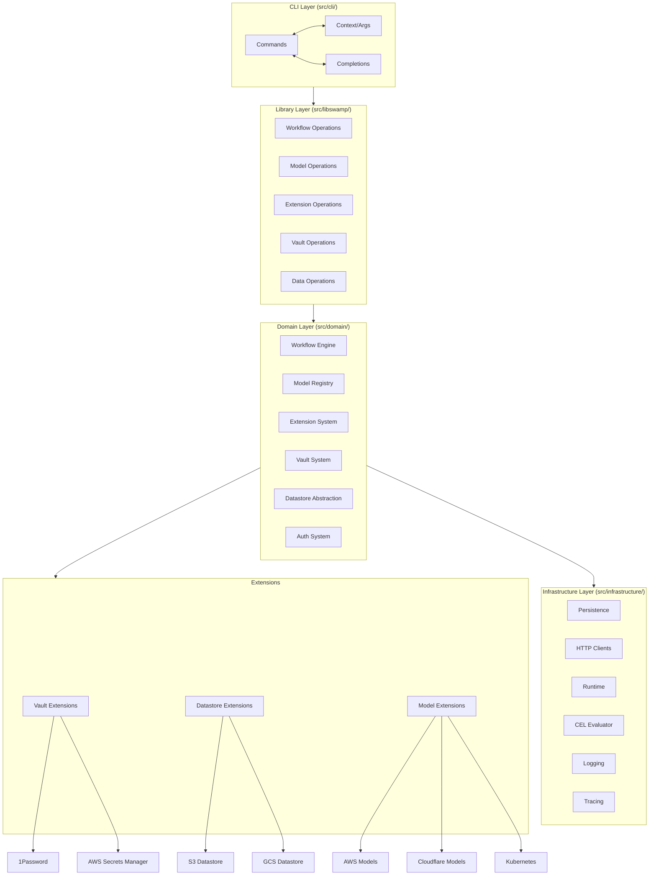
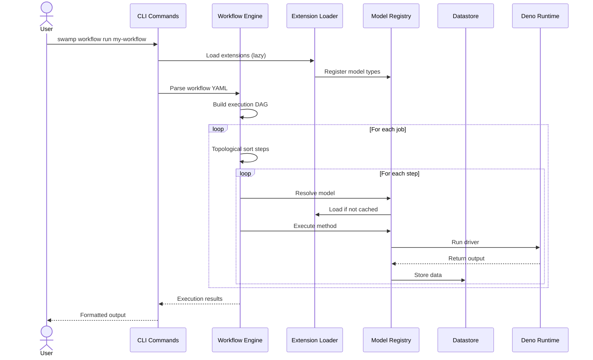
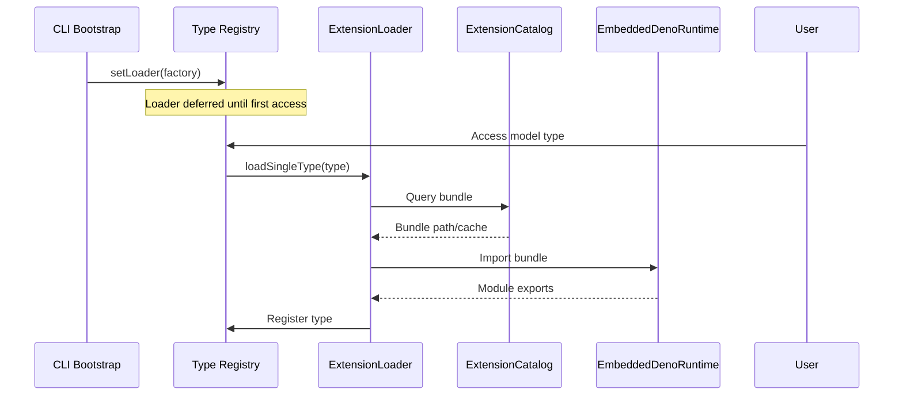
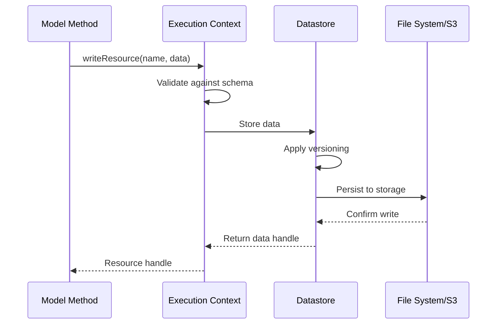

# Project Exploration: Swamp

## Overview

Swamp is an AI Native Automation CLI framework developed by System Initiative, Inc. It provides a declarative infrastructure-as-code platform that enables AI agents to create operational workflows that are reviewable, shareable, and accurate. The core philosophy is "Built for agents, there to empower humans" — all data lives in a `.swamp/` directory within a Git repository.

Swamp uses a model-driven architecture where **Models** represent typed abstractions of external systems (cloud resources, CLI tools, APIs). Each model type defines metadata, arguments, methods, and inputs. **Definitions** are YAML files that instantiate a model type with specific configuration, supporting CEL (Common Expression Language) expressions for dynamic values. **Workflows** orchestrate model method executions across parallel jobs and steps with dependency ordering. **Data** is versioned and immutable, produced by method runs and searchable by tags. **Vaults** provide secure storage for secrets referenced via CEL expressions.

The project is structured as three main components: `setup-swamp/` (GitHub Action for CI/CD integration), `swamp/` (the core CLI and runtime written in TypeScript/Deno), and `swamp-extensions/` (official extensions for vaults, datastores, cloud providers, and workflows).

## Repository

- **Location:** `/home/darkvoid/Boxxed/@formulas/src.rust/src.llamacpp/src.Swamp`
- **Remote:** N/A (filesystem source)
- **Primary Language:** TypeScript (Deno runtime)
- **License:** GNU Affero General Public License v3.0 with Swamp Extension and Definition Exception

## Directory Structure

```
/home/darkvoid/Boxxed/@formulas/src.rust/src.llamacpp/src.Swamp/
├── setup-swamp/                    # GitHub Action for swamp installation
│   ├── action.yml                  # GitHub Action definition
│   ├── COPYING                     # License file
│   ├── COPYING-EXCEPTION           # Extension exception license
│   ├── LICENSE                     # AGPL v3 license
│   └── README.md                   # Action documentation
│
├── swamp/                          # Core CLI and runtime (main project)
│   ├── main.ts                     # CLI entry point
│   ├── deno.json                   # Deno configuration and dependencies
│   ├── deno.lock                   # Dependency lock file
│   ├── Dockerfile                  # Container build definition
│   ├── CLAUDE.md                   # Claude Code instructions
│   ├── README.md                   # Project documentation
│   ├── design/                     # Architecture documentation
│   │   ├── high-level.md           # High-level architecture
│   │   ├── workflow.md             # Workflow design
│   │   ├── models.md               # Model design
│   │   ├── extension.md            # Extension system design
│   │   ├── datastores.md           # Datastore abstraction
│   │   ├── vaults.md               # Vault system design
│   │   ├── skills.md               # AI skills design
│   │   └── [20+ more design docs] # Comprehensive design documentation
│   ├── src/
│   │   ├── cli/                    # CLI layer (commands, parsing, context)
│   │   │   ├── mod.ts              # CLI bootstrap and command registration
│   │   │   ├── commands/           # 30+ command implementations
│   │   │   │   ├── model_*.ts      # Model commands (create, delete, edit, etc.)
│   │   │   │   ├── workflow_*.ts   # Workflow commands
│   │   │   │   ├── vault_*.ts      # Vault commands
│   │   │   │   ├── extension_*.ts  # Extension commands
│   │   │   │   └── [20+ more]     # Data, datastore, driver, auth commands
│   │   │   └── [parser files]      # Arg rewriting, completions, context
│   │   ├── domain/                 # Domain layer (business logic)
│   │   │   ├── models/             # Model domain (types, registry, execution)
│   │   │   ├── workflows/          # Workflow domain (execution, scheduling)
│   │   │   ├── vaults/               # Vault domain
│   │   │   ├── extensions/           # Extension domain
│   │   │   ├── datastore/            # Datastore abstraction
│   │   │   ├── data/                 # Data management
│   │   │   ├── drivers/              # Execution drivers
│   │   │   ├── inputs/               # Input handling
│   │   │   └── [15+ more]           # Auth, telemetry, reports, secrets
│   │   ├── infrastructure/         # Infrastructure layer
│   │   │   ├── persistence/          # File system, repositories
│   │   │   ├── http/                 # HTTP clients
│   │   │   ├── runtime/              # Deno runtime, process execution
│   │   │   ├── cel/                  # CEL expression evaluation
│   │   │   ├── logging/              # LogTape integration
│   │   │   └── [10+ more]           # Tracing, telemetry, security
│   │   ├── libswamp/               # Public API (libswamp)
│   │   │   ├── mod.ts                # Public exports
│   │   │   ├── workflows/            # Workflow operations
│   │   │   ├── models/               # Model operations
│   │   │   ├── extensions/             # Extension operations
│   │   │   └── [10+ more]             # Data, vault, auth operations
│   │   ├── presentation/             # Presentation layer
│   │   │   ├── renderer.ts           # Output rendering
│   │   │   ├── markdown_renderer.ts  # Markdown output
│   │   │   └── output/               # Error rendering, formatters
│   │   └── serve/                    # Server/webhook mode
│   │       ├── mod.ts                # Server entry
│   │       ├── webhook.ts            # Webhook handler
│   │       └── protocol.ts           # Protocol definitions
│   ├── integration/                # Integration tests
│   ├── extensions/                 # Example/user extensions
│   ├── evals/                      # Evaluation/promptfoo tests
│   └── .claude/skills/             # Claude Code skills (15 skills)
│       ├── swamp-workflow/         # Workflow authoring skill
│       ├── swamp-model/            # Model authoring skill
│       ├── swamp-extension/        # Extension development skill
│       └── [12+ more skills]       # Domain-specific skills
│
└── swamp-extensions/               # Official extensions
    ├── vault/                      # Vault extensions (1password, aws-sm, azure-kv)
    ├── datastore/                  # Datastore extensions (s3, gcs)
    ├── workflows/                    # Workflow extensions (bootstrap, CVE checks)
    ├── model/                        # Cloud provider models
    │   ├── aws/                      # AWS service models (~249 services)
    │   ├── cloudflare/               # Cloudflare models (~69 services)
    │   ├── gcp/                      # GCP models
    │   ├── hetzner-cloud/            # Hetzner Cloud models
    │   └── digitalocean/             # DigitalOcean models
    ├── kubernetes/                   # Kubernetes extension
    ├── ssh/                          # SSH extension
    ├── cve/                          # CVE detection extensions
    ├── codegen/                      # Schema generation for providers
    ├── extensions/                   # Built-in extensions
    ├── issue-lifecycle/              # Issue lifecycle automation
    └── [config files]                # deno.json, CLAUDE.md, etc.
```

## Architecture

### High-Level Diagram



### Component Breakdown

#### CLI Layer (`src/cli/`)
- **Location:** `src/cli/`
- **Purpose:** Command-line interface, argument parsing, and user interaction
- **Key Files:**
  - `mod.ts` - CLI bootstrap, command registration, extension loading
  - `commands/` - 30+ command implementations organized by domain
  - `context.ts` - Global options, repo context, output mode detection
  - `arg_rewriter.ts` - AI tool argument rewriting
- **Dependencies:** Cliffy (command framework), Deno standard library
- **Dependents:** All user interactions flow through this layer

#### Domain Layer (`src/domain/`)
- **Location:** `src/domain/`
- **Purpose:** Core business logic and domain models
- **Key Components:**
  - **Models** (`models/`) - Type definitions, method execution, CalVer versioning
  - **Workflows** (`workflows/`) - DAG execution, job scheduling, step orchestration
  - **Extensions** (`extensions/`) - Extension lifecycle, loading, registry
  - **Vaults** (`vaults/`) - Secret storage abstraction
  - **Datastore** (`datastore/`) - Pluggable storage backends
  - **Inputs** (`inputs/`) - Input validation and CEL expression handling
- **Design Patterns:** Registry pattern, Adapter pattern, Dependency injection

#### Infrastructure Layer (`src/infrastructure/`)
- **Location:** `src/infrastructure/`
- **Purpose:** Technical capabilities and external integrations
- **Key Components:**
  - **Persistence** (`persistence/`) - File system, JSON repositories, lock files
  - **Runtime** (`runtime/`) - Deno subprocess execution, embedded runtime
  - **CEL** (`cel/`) - Expression evaluation engine
  - **HTTP** (`http/`) - Extension API client, telemetry sender
  - **Tracing** (`tracing/`) - OpenTelemetry integration
- **External Integrations:** Deno runtime, AWS SDK, GitHub API

#### Library Layer (`src/libswamp/`)
- **Location:** `src/libswamp/`
- **Purpose:** Public API surface for programmatic usage
- **Exports:** Workflow operations, model operations, extension management, data queries
- **Consumers:** CLI commands, external tools, test suites

#### Presentation Layer (`src/presentation/`)
- **Location:** `src/presentation/`
- **Purpose:** Output formatting and user-facing displays
- **Key Components:**
  - `renderer.ts` - Main rendering abstraction
  - `markdown_renderer.ts` - Markdown output formatting
  - `spinner.ts` - Interactive loading indicators

## Entry Points

### Main CLI Entry Point
- **File:** `main.ts`
- **Description:** CLI bootstrap, tracing initialization, error handling
- **Flow:**
  1. Initialize OpenTelemetry tracing
  2. Run CLI with args
  3. Handle errors with appropriate output mode
  4. Flush datastore sync
  5. Shutdown tracing
  6. Explicit exit to prevent hanging promises

### Server Mode Entry Point
- **File:** `src/serve/mod.ts`
- **Description:** Webhook server mode for remote triggers
- **Flow:**
  1. Start HTTP server
  2. Listen for webhook requests
  3. Deserialize and execute workflows
  4. Return structured responses

### Command Entry Points
Each command in `src/cli/commands/` follows a pattern:
- **File:** `{domain}_{action}.ts`
- **Structure:**
  1. Define Zod schemas for inputs/options
  2. Create command with Cliffy
  3. Implement action with dependency injection
  4. Emit events for streaming output
  5. Handle errors with UserError

Example execution flow for `swamp workflow run`:
```
main.ts
  -> runCli()
    -> configureExtensionLoaders() [lazy loading]
    -> cli.parse(args)
      -> workflowCommand
        -> workflowRun command
          -> Build execution graph
          -> Execute jobs in parallel
          -> Emit events to output
```

## Data Flow

### Workflow Execution Flow



### Extension Loading Flow



### Data Storage Flow



## External Dependencies

| Dependency | Version | Purpose |
|------------|---------|---------|
| `@cliffy/command` | ^1.0.1 | CLI framework for commands and options |
| `@cliffy/table` | ^1.0.1 | Table formatting for CLI output |
| `@std/assert` | ^1.0.19 | Testing assertions |
| `@std/cli` | ^1.0.29 | CLI utilities |
| `@std/fmt` | ^1.0.10 | String formatting |
| `@std/fs` | ^1.0.23 | File system operations |
| `@std/path` | ^1.1.4 | Path manipulation |
| `@std/tar` | ^0.1.10 | Archive handling |
| `@std/yaml` | ^1.1.0 | YAML parsing/generation |
| `@std/streams` | ^1.1.0 | Stream utilities |
| `zod` | ^4.4.3 | Schema validation |
| `@logtape/logtape` | ^2.0.7 | Structured logging |
| `@logtape/pretty` | ^2.0.7 | Pretty log formatting |
| `ink` | ^6.8.0 | React-based terminal UI |
| `react` | ^19.2.5 | UI component framework |
| `cel-js` | 7.6.1 | CEL expression evaluation |
| `croner` | ^9.1.0 | Cron scheduling |
| `fast-json-patch` | ^3.1.1 | JSON Patch operations |
| `marked` | ^14.1.4 | Markdown parsing |
| `@opentelemetry/*` | ^1.30.1 | Distributed tracing |
| `@aws-sdk/client-cloudcontrol` | ^3.1042.0 | AWS Cloud Control API |

## Configuration

### Repository Configuration (`.swamp.yaml`)
```yaml
# Repository marker file
tool: claude  # Primary AI tool (claude|cursor|opencode|codex)
tools:      # Multiple tools supported
  - claude
  - cursor
datastore:  # Optional external datastore
  type: "@swamp/s3-datastore"
  config:
    bucket: my-bucket
    prefix: swamp-data
    region: us-east-1
logLevel: debug           # Optional logging level
telemetryDisabled: false  # Opt-out of telemetry
telemetryEndpoint: https://telemetry.swamp-club.com
```

### Environment Variables
| Variable | Purpose |
|----------|---------|
| `SWAMP_REPO_DIR` | Override repository directory |
| `SWAMP_LOG_LEVEL` | Set logging level (trace/debug/info/warning/error/fatal) |
| `SWAMP_NO_TELEMETRY` | Disable telemetry collection |
| `SWAMP_NO_UPDATE_CHECK` | Disable update checks |
| `SWAMP_DATASTORE` | Override datastore (s3:bucket/prefix or filesystem:path) |
| `SWAMP_API_KEY` | Authentication with swamp.club |
| `SWAMP_CLUB_URL` | Override swamp.club server URL |
| `OTEL_EXPORTER_OTLP_ENDPOINT` | OpenTelemetry collector endpoint |

### Extension Sources (`.swamp-sources.yaml`)
```yaml
sources:
  - path: /path/to/shared/extensions
  - git:
      url: https://github.com/org/shared-swamp-exts
      ref: main
```

## Testing

### Test Organization
- **Unit Tests:** Co-located with source files (`foo.ts` -> `foo_test.ts`)
- **Integration Tests:** `integration/` directory at project root
- **Test Framework:** Deno built-in test runner with `@std/assert`

### Running Tests
```bash
deno run test              # Run all tests
deno run test src/path/to/file_test.ts  # Single test file
deno check                 # Type checking
deno lint                  # Linting
deno fmt                   # Formatting
```

### Testing Patterns
- Use `ink-testing-library` for TUI component tests
- Use `withTempDir` for filesystem isolation
- Mock external services via dependency injection
- Platform-aware assertions for Windows/Unix paths

## Key Insights

1. **AI-Native Design:** Swamp is built from the ground up for AI agent interaction, with first-class skills for Claude Code, Cursor, OpenCode, and Codex. The `.claude/skills/` directory contains 15+ specialized skills that teach agents how to work with swamp.

2. **Extension Ecosystem:** The extension system is the primary mechanism for expanding swamp's capabilities. Extensions can provide models, vaults, drivers, datastores, and reports. The registry at swamp.club enables sharing.

3. **Declarative Workflows:** Workflows are YAML-defined DAGs that orchestrate model method executions. They support parallel execution, dependency conditions, for-each expansions, and manual approval gates.

4. **CalVer Versioning:** Both models and extensions use Calendar Versioning (`YYYY.MM.DD.MICRO`) allowing for clear lineage and upgrade paths. Models support version upgrade functions for schema evolution.

5. **Pluggable Storage:** The datastore abstraction supports local filesystem (default), external filesystem, S3, and GCS. Datastores provide distributed locking for team collaboration.

6. **Security-First:** Supply chain security is prioritized through an issue-driven contribution model. No external PRs are accepted; all code is written by maintainers with AI assistance under direct control.

7. **Local-First:** All execution happens locally. Credentials never leave the machine unless explicitly sent by a model method. The `.swamp/` directory contains all runtime data.

8. **CEL Integration:** Common Expression Language is used throughout for dynamic configuration, cross-model references, and conditional logic in workflows.

9. **Observability:** Built-in OpenTelemetry tracing, structured logging with LogTape, and anonymous telemetry collection (opt-out available).

10. **Deno Runtime:** Leverages Deno's security sandbox, TypeScript native support, and built-in tooling (fmt, lint, test).

## Open Questions

1. **Scaling:** How does the local-first architecture scale for large teams? The S3 datastore with distributed locking helps, but are there limits on concurrent workflow runs?

2. **Extension Security:** Extensions execute with full Deno permissions. Is there a sandboxing strategy for untrusted extensions from the registry?

3. **State Management:** How are long-running workflows with manual approvals persisted? Is there a garbage collection strategy for old workflow runs?

4. **Migration Strategy:** What happens when a model's schema changes and existing definitions need migration? The upgrade function pattern exists but how are breaking changes handled?

5. **Collaboration:** With all data local, how do teams share state? The datastore abstraction supports shared backends but what's the conflict resolution strategy?

6. **Performance:** The extension loading uses lazy loading via `setLoader()` patterns. Are there performance benchmarks for cold-start times with many extensions?

7. **Model Generation:** The cloud provider models (AWS, Cloudflare, GCP) are auto-generated from schemas. How frequently are these regenerated and how are schema changes tracked?

8. **Server Mode:** The `swamp serve` command provides webhook endpoints. Is this intended for production use or just local development? What's the authentication/authorization model?
