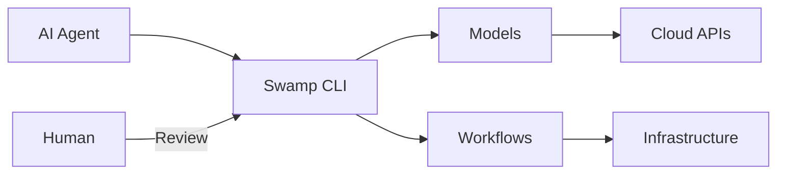
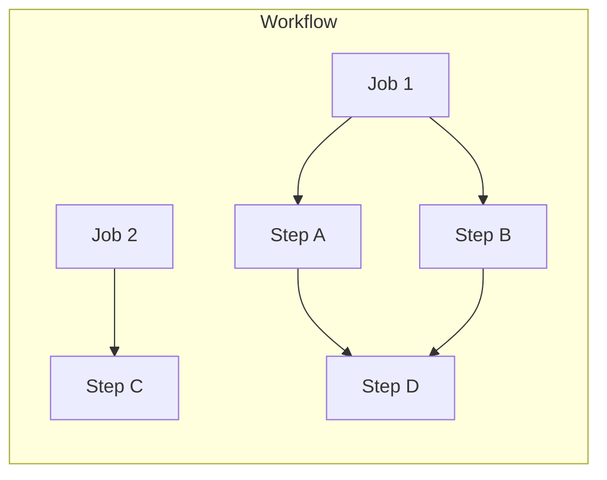
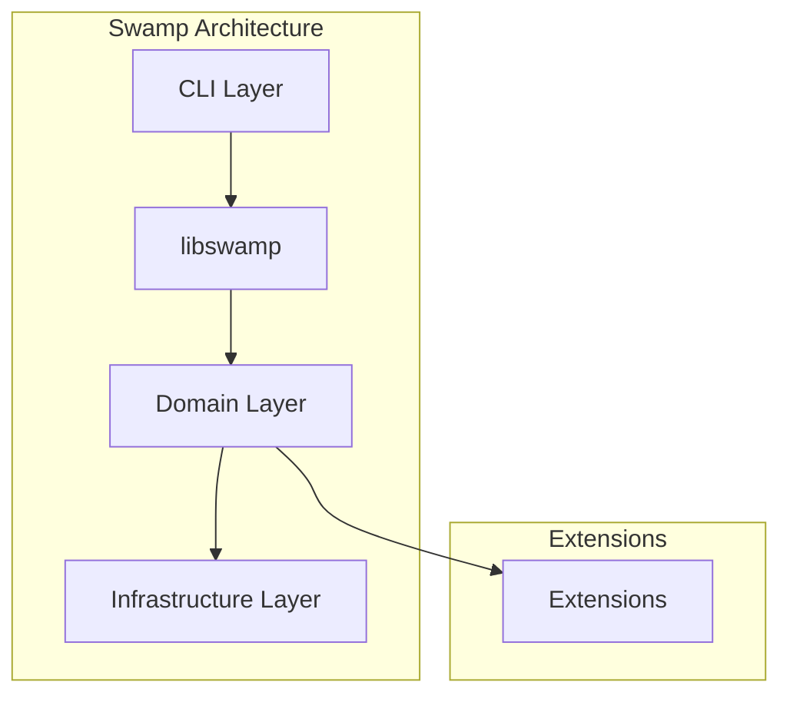

# Swamp Overview

Swamp is an AI Native Automation CLI framework developed by System Initiative. Its core philosophy: **"Built for agents, there to empower humans."** All data lives in a `.swamp/` directory within a Git repository.

## Core Philosophy

Swamp treats AI agents as first-class citizens. Rather than bolting AI onto existing tools, Swamp is designed from the ground up for agent-driven automation while remaining human-reviewable and maintainable.



## Key Concepts

### Models

Models are typed abstractions of external systems — cloud resources, CLI tools, APIs. Each model type defines:

- Metadata (name, version, CalVer)
- Arguments (configuration schema)
- Methods (operations the model can perform)
- Inputs (dependencies on other models)

**Example from source:**

```typescript
// swamp/src/domain/models/types.ts
export interface ModelType {
  name: string;
  version: CalVer;
  arguments: Argument[];
  methods: Method[];
  inputs: Input[];
}
```

### Definitions

Definitions instantiate a model type with specific configuration. They are YAML files stored in `.swamp/definitions/`.

```yaml
# Example definition
apiVersion: swamp.systeminit.com/v1
kind: Definition
metadata:
  name: production-database
spec:
  model: aws/rds-postgres
  arguments:
    instance_class: db.t3.micro
    storage: 20
```

**Aha:** Definitions support CEL (Common Expression Language) expressions for dynamic values, allowing references to other resources and conditional logic.

### Workflows

Workflows orchestrate model method executions across parallel jobs and steps with dependency ordering.



### Data

Data is versioned and immutable, produced by method runs and searchable by tags. Each data artifact has:
- A unique hash-based ID
- Content-addressed storage
- Lineage tracking (which run produced it)
- Tag-based organization

### Vaults

Vaults provide secure storage for secrets. Secrets are referenced via CEL expressions and resolved at runtime:

```yaml
arguments:
  api_key: ${vault("production-api-key")}
```

## Project Components

Swamp consists of three main components:

| Component | Language | Purpose |
|-----------|----------|---------|
| `setup-swamp/` | YAML | GitHub Action for CI/CD |
| `swamp/` | TypeScript/Deno | Core CLI and runtime |
| `swamp-extensions/` | TypeScript/Deno | Official extensions |

## Layered Architecture

Swamp follows a clean architecture with four layers:



| Layer | Responsibility | Key Files |
|-------|--------------|-----------|
| CLI | Command parsing, user interaction | `src/cli/mod.ts`, `src/cli/commands/` |
| libswamp | Public API surface | `src/libswamp/mod.ts` |
| Domain | Business logic, rules | `src/domain/*` |
| Infrastructure | External integrations | `src/infrastructure/*` |

## Technology Stack

- **Runtime:** Deno 2.x
- **Language:** TypeScript 5.x
- **CLI Framework:** Cliffy
- **Expression Engine:** CEL (Common Expression Language)
- **Tracing:** OpenTelemetry
- **Logging:** LogTape

## Next Steps

Continue to [Architecture →](01-architecture.html) for the full architectural breakdown.
