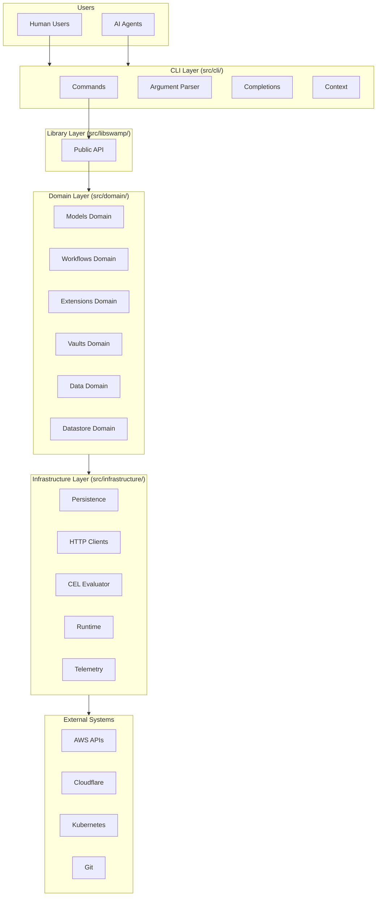
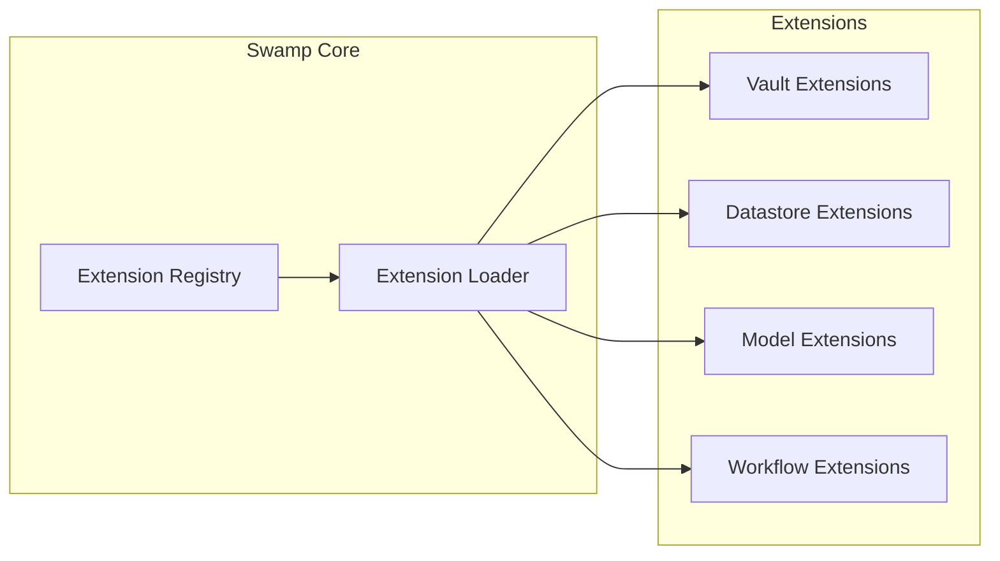
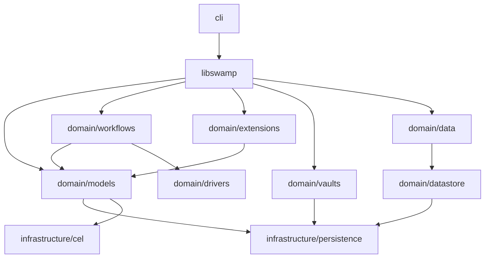

# Swamp Architecture

Swamp implements a clean architecture pattern with four distinct layers, each with clear responsibilities and dependencies flowing inward.

## High-Level Architecture



## Layer Breakdown

### CLI Layer

**Location:** `swamp/src/cli/`

The CLI layer handles all user interaction. It's responsible for:
- Parsing command-line arguments
- Providing shell completions
- Managing global context and options
- Rendering output
- Loading and validating extensions

**Key Files:**
- `mod.ts` — CLI bootstrap and command registration
- `context.ts` — Global options and repo context
- `commands/` — 30+ command implementations

**Aha:** The CLI uses a lazy loading pattern for commands. Each command is defined in its own file and only loaded when invoked, keeping startup time fast.

### libswamp Layer

**Location:** `swamp/src/libswamp/`

The public API surface of Swamp. This layer provides programmatic access to Swamp functionality for embedding in other applications.

**Key Files:**
- `mod.ts` — Public exports
- `workflows/` — Workflow operations
- `models/` — Model operations
- `extensions/` — Extension operations
- `vaults/` — Vault operations

**Design Principle:** libswamp is intentionally thin. It delegates to the domain layer for all operations, serving as a stable API contract.

### Domain Layer

**Location:** `swamp/src/domain/`

The heart of Swamp — all business logic lives here. Each subdomain has its own directory:

| Subdomain | Purpose | Key Files |
|-----------|---------|-----------|
| `models/` | Model types, methods, execution | `types.ts`, `registry.ts`, `executor.ts` |
| `workflows/` | DAG execution, job scheduling | `engine.ts`, `scheduler.ts`, `runner.ts` |
| `extensions/` | Extension lifecycle, loading | `loader.ts`, `registry.ts`, `validator.ts` |
| `vaults/` | Secret storage abstraction | `types.ts`, `resolver.ts` |
| `datastore/` | Pluggable storage backends | `interface.ts`, `local.ts` |
| `data/` | Data management | `manager.ts`, `tagger.ts` |
| `inputs/` | Input validation | `validator.ts`, `cel_resolver.ts` |
| `drivers/` | Execution drivers | `local.ts`, `remote.ts` |
| `audit/` | Audit logging | `logger.ts`, `events.ts` |
| `definitions/` | Definition management | `parser.ts`, `validator.ts` |
| `events/` | Event bus | `bus.ts`, `handlers.ts` |
| `expressions/` | Expression evaluation | `evaluator.ts`, `parser.ts` |
| `identity/` | Identity management | `user.ts`, `org.ts` |
| `repo/` | Repository operations | `init.ts`, `status.ts` |
| `reports/` | Report generation | `generator.ts`, `formatter.ts` |
| `runtime/` | Runtime management | `config.ts`, `state.ts` |
| `secrets/` | Secret handling | `manager.ts`, `resolver.ts` |
| `source/` | Source code management | `loader.ts`, `sync.ts` |
| `summary/` | Summary operations | `generator.ts` |
| `telemetry/` | Metrics and traces | `collector.ts`, `exporter.ts` |
| `update/` | Update management | `checker.ts`, `applier.ts` |

**Note:** Additional utility files: `errors.ts`, `string_distance.ts`, `zod_compat.ts`

### Infrastructure Layer

**Location:** `swamp/src/infrastructure/`

External integrations and low-level services:

| Component | Purpose | Key Files |
|-----------|---------|-----------|
| `persistence/` | File system operations | `filesystem.ts`, `git.ts` |
| `http/` | HTTP clients | `client.ts`, `retry.ts` |
| `cel/` | CEL expression evaluation | `evaluator.ts`, `functions.ts` |
| `runtime/` | Deno runtime utilities | `permissions.ts`, `sandbox.ts` |
| `logging/` | Structured logging | `config.ts` (LogTape) |
| `tracing/` | OpenTelemetry tracing | `otel.ts` |
| `security/` | Security utilities | `hash.ts`, `crypto.ts` |
| `archive/` | Archive operations | `tar.ts`, `zip.ts` |
| `assets/` | Asset management | `loader.ts`, `resolver.ts` |
| `editor/` | Editor integration | `open.ts`, `config.ts` |
| `github/` | GitHub integration | `client.ts`, `webhooks.ts` |
| `io/` | I/O operations | `reader.ts`, `writer.ts` |
| `process/` | Process execution | `spawn.ts`, `exec.ts` |
| `repo/` | Repository operations | `clone.ts`, `sync.ts` |
| `source/` | Source management | `loader.ts`, `sync.ts` |
| `stream/` | Streaming utilities | `buffer.ts`, `transform.ts` |
| `testing/` | Test utilities | `fixtures.ts`, `mocks.ts` |
| `update/` | Update infrastructure | `downloader.ts`, `verifier.ts` |

## Dependency Flow

Dependencies always flow inward:

```
CLI → libswamp → Domain → Infrastructure → External
```

**Key Insight:** The domain layer has no knowledge of the CLI. It could be driven by a web API, a scheduled job, or any other interface.

## Extension Architecture

Extensions are loaded dynamically and extend Swamp's capabilities:



Extensions are loaded from:
1. Built-in extensions in the core
2. `.swamp/extensions/` directory
3. Official extensions from `swamp-extensions/`

## Repository Pattern

The domain layer uses the Repository pattern for data access:

```typescript
// src/domain/models/repository.ts
export interface ModelRepository {
  find(id: string): Promise<Model | null>;
  findAll(): Promise<Model[]>;
  save(model: Model): Promise<void>;
  delete(id: string): Promise<void>;
}

// Implementation in infrastructure
// src/infrastructure/persistence/model_repo.ts
export class FileSystemModelRepository implements ModelRepository {
  // Uses Git for versioning
}
```

**Aha:** All repositories use Git for versioning. Each change creates a commit, providing an audit trail and enabling rollback.

## Module Dependencies



## Cross-Cutting Concerns

### Authentication

- **CLI:** OAuth2 flow, token storage in system keychain
- **libswamp:** Token passed via API
- **Domain:** Auth context propagated through operations

### Telemetry

- **OpenTelemetry:** All layers emit traces
- **LogTape:** Structured logging throughout
- **Metrics:** Operation counts, durations, errors

### Error Handling

- **Domain:** Result types with structured errors
- **Infrastructure:** Translate external errors to domain errors
- **CLI:** Render user-friendly error messages

## Design Patterns

| Pattern | Usage |
|---------|-------|
| Repository | Data access abstraction |
| Registry | Extension and model registration |
| Strategy | Pluggable vaults, datastores, drivers |
| Factory | Model and extension instantiation |
| Observer | Event propagation |
| Command | CLI command pattern |

## Next Steps

Continue to [CLI Layer →](02-cli-layer.html) for command structure and argument parsing.
