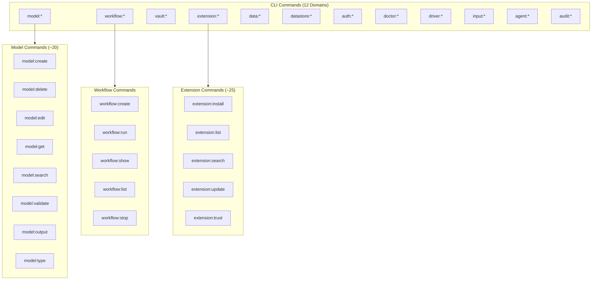

# CLI Layer

The CLI layer handles all user interaction, command parsing, and output rendering. Built on the Cliffy framework, it provides a rich command-line experience with completions, help generation, and structured output.

## Command Organization

Swamp exposes **130+ commands** organized by domain:



## Entry Point

**Source:** `swamp/main.ts`

```typescript
// swamp/main.ts
import { cli } from "./src/cli/mod.ts";

if (import.meta.main) {
  await cli.run();
}
```

**Aha:** The main entry point is intentionally minimal. All CLI logic is in `src/cli/mod.ts` for testability.

## Command Registration

**Source:** `swamp/src/cli/mod.ts`

Commands are registered in a central router:

```typescript
// src/cli/mod.ts (simplified)
import { Command } from "@cliffy/command";
import { modelCreateCmd } from "./commands/model_create.ts";
import { modelDeleteCmd } from "./commands/model_delete.ts";
// ... 30+ more imports

export const cli = new Command()
  .name("swamp")
  .version("0.1.0")
  .description("AI Native Automation CLI")
  .command("model:create", modelCreateCmd)
  .command("model:delete", modelDeleteCmd)
  // ... more commands
  .command("workflow:create", workflowCreateCmd)
  .command("workflow:run", workflowRunCmd);
```

## Command Structure

Each command follows a consistent structure:

```typescript
// src/cli/commands/model_create.ts (simplified)
import { Command } from "@cliffy/command";
import { createModel } from "../libswamp/models.ts";

export const modelCreateCmd = new Command()
  .name("create")
  .description("Create a new model definition")
  .option("--type <type>", "Model type to instantiate")
  .option("--name <name>", "Name for the definition")
  .option("--file <file>", "YAML file with definition")
  .action(async (options) => {
    const context = await getContext();
    const result = await createModel(context, options);
    renderOutput(result);
  });
```

## Global Context

**Source:** `swamp/src/cli/context.ts`

All commands share a global context that provides:
- Repository root path
- Current working directory
- Output mode (human, json, yaml)
- Extension registry
- Authentication tokens

```typescript
// src/cli/context.ts
export interface CliContext {
  repoRoot: string;
  cwd: string;
  outputMode: "human" | "json" | "yaml";
  extensions: ExtensionRegistry;
  auth: AuthContext;
}

export async function getContext(): Promise<CliContext> {
  // Detects repo root by finding .swamp/ directory
  // Loads extensions
  // Sets up output mode
}
```

## Argument Rewriting

**Source:** `swamp/src/cli/arg_rewriter.ts`

Swamp supports AI-friendly argument rewriting. Commands can be invoked with natural language and are rewritten to structured arguments:

```typescript
// arg_rewriter.ts (simplified)
export function rewriteArgs(args: string[]): string[] {
  // "create a postgres database named prod"
  // → ["model:create", "--type", "aws/rds-postgres", "--name", "prod"]
}
```

## Output Rendering

**Source:** `swamp/src/presentation/renderer.ts`

Three output modes supported:

| Mode | Use Case | Example Output |
|------|----------|----------------|
| `human` | Interactive use | Tables, colors, progress bars |
| `json` | Machine parsing | Structured JSON |
| `yaml` | Configuration | YAML documents |

```typescript
// renderer.ts (simplified)
export function renderOutput(result: unknown, mode: OutputMode) {
  switch (mode) {
    case "human":
      return renderHuman(result);
    case "json":
      return console.log(JSON.stringify(result, null, 2));
    case "yaml":
      return console.log(toYaml(result));
  }
}
```

## Shell Completions

**Source:** `swamp/src/cli/completions.ts`

Dynamically generated completions for:
- Command names
- Model types (from registry)
- Definition names
- Extension names
- Vault names

```bash
# Generate completions
swamp completions bash > ~/.bashrc.d/swamp
swamp completions zsh > ~/.zsh/completions/_swamp
swamp completions fish > ~/.config/fish/completions/swamp.fish
```

## Interactive Mode

Some commands support interactive mode when TTY is available:

```typescript
// Example: model create without --type
// → Interactive prompt to select from available types
const type = await Select.prompt({
  message: "Select model type",
  options: await listModelTypes(),
});
```

## Error Handling

**Source:** `swamp/src/cli/error_handler.ts`

Errors are rendered based on type:

```typescript
// error_handler.ts (simplified)
export function handleError(error: SwampError) {
  switch (error.code) {
    case "MODEL_NOT_FOUND":
      console.error(`Model "${error.modelName}" not found`);
      console.error(`Did you mean: ${error.suggestions.join(", ")}?`);
      break;
    case "VAULT_ACCESS_DENIED":
      console.error(`Cannot access vault "${error.vaultName}"`);
      console.error(`Run: swamp auth:login`);
      break;
    // ... more cases
  }
}
```

## Webhook Mode

**Source:** `swamp/src/serve/`

Swamp can run as a server for webhook-triggered workflows:

```typescript
// src/serve/mod.ts
export async function serve(options: ServeOptions) {
  const server = Deno.listen({ port: options.port });
  console.log(`Swamp server listening on :${options.port}`);

  for await (const conn of server) {
    handleConnection(conn);
  }
}
```

## Key Commands Reference

### Model Commands (~20)

| Command | Description |
|---------|-------------|
| `model:create` | Create a model definition |
| `model:delete` | Delete a model definition |
| `model:edit` | Edit a model definition |
| `model:get` | Get model details |
| `model:search` | Search model definitions |
| `model:validate` | Validate a model definition |
| `model:output` | Get model outputs |
| `model:output:data` | Get output data |
| `model:output:logs` | Get output logs |
| `model:type` | List available model types |
| `model:method:run` | Execute a model method |
| `model:method:history` | View method execution history |
| `model:evaluate` | Evaluate a model |

### Workflow Commands

| Command | Description |
|---------|-------------|
| `workflow:create` | Create a workflow |
| `workflow:run` | Execute a workflow |
| `workflow:show` | Show workflow details |
| `workflow:list` | List workflows |
| `workflow:stop` | Stop a running workflow |

### Extension Commands (~25)

| Command | Description |
|---------|-------------|
| `extension:install` | Install an extension |
| `extension:list` | List installed extensions |
| `extension:search` | Search extensions |
| `extension:update` | Update extensions |
| `extension:rm` | Remove an extension |
| `extension:trust` | Trust an extension |
| `extension:source:add` | Add extension source |
| `extension:source:list` | List extension sources |
| `extension:info` | Show extension info |
| `extension:outdated` | Show outdated extensions |
| `extension:quality` | Check extension quality |
| `extension:fmt` | Format extension code |

### Data Commands (~15)

| Command | Description |
|---------|-------------|
| `data:show` | Show data artifact |
| `data:tag` | Tag data artifact |
| `data:untag` | Remove tag |
| `data:list` | List data artifacts |
| `data:search` | Search data |
| `data:query` | Query data |
| `data:delete` | Delete data |
| `data:gc` | Run garbage collection |
| `data:versions` | List data versions |
| `data:rename` | Rename data |
| `data:get` | Get data content |

### Datastore Commands (~10)

| Command | Description |
|---------|-------------|
| `datastore:setup` | Setup datastore |
| `datastore:status` | Show datastore status |
| `datastore:sync` | Sync datastore |
| `datastore:lock` | Lock datastore |
| `datastore:compact` | Compact datastore |
| `datastore:type:search` | Search datastore types |

### Vault Commands (~15)

| Command | Description |
|---------|-------------|
| `vault:create` | Create a vault |
| `vault:put` | Store a secret |
| `vault:get` | Get a secret |
| `vault:list:keys` | List vault keys |
| `vault:edit` | Edit vault |
| `vault:delete` | Delete vault |
| `vault:migrate` | Migrate vault |
| `vault:read:secret` | Read secret value |

### Auth Commands

| Command | Description |
|---------|-------------|
| `auth:login` | Authenticate |
| `auth:logout` | Log out |
| `auth:whoami` | Show current user |

### Doctor Commands (~8)

| Command | Description |
|---------|-------------|
| `doctor` | Run diagnostics |
| `doctor:audit` | Audit installation |
| `doctor:extensions` | Check extensions |
| `doctor:install` | Install diagnostics |
| `doctor:secrets` | Check secrets |
| `doctor:workflows` | Check workflows |

### Other Commands

| Command | Description |
|---------|-------------|
| `agent:setup` | Setup agent |
| `audit` | View audit log |
| `completion` | Generate shell completions |
| `config` | Manage configuration |
| `driver` | Manage drivers |

**Aha:** Commands follow the pattern `domain:action`. Each domain has its own set of actions, making 130+ total commands.

## Next Steps

Continue to [Domain Layer →](03-domain-layer.html) for business logic and domain models.
