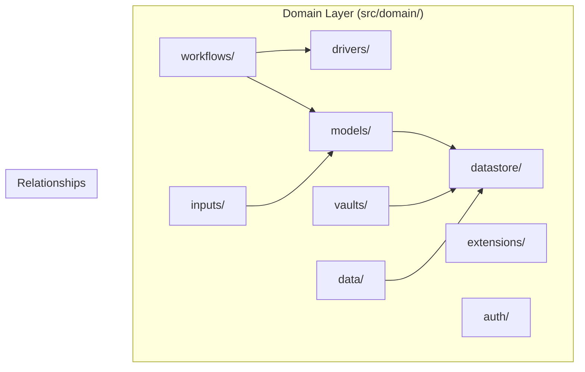
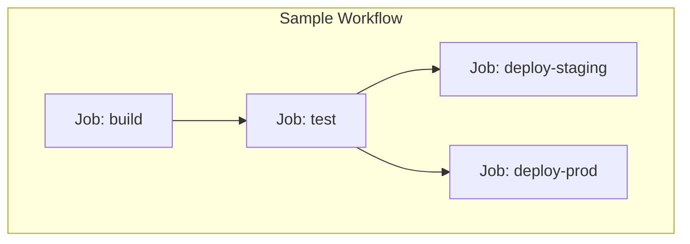

# Domain Layer

The domain layer contains all business logic and domain models. This is the heart of Swamp — code here has no knowledge of the CLI or external systems.

## Domain Organization

The domain is organized into subdomains, each handling a specific concern:



## Models Domain

**Source:** `swamp/src/domain/models/`

The models domain handles:
- Model type definitions
- Model registration
- Method execution
- CalVer versioning

### Model Type Definition

```typescript
// src/domain/models/types.ts
export interface ModelType {
  name: string;
  version: CalVer;
  arguments: Argument[];
  methods: Method[];
  inputs: Input[];
  outputs: Output[];
}

export interface Method {
  name: string;
  arguments: Argument[];
  returnType: DataType;
  execute: (args: Record<string, unknown>) => Promise<unknown>;
}

export interface CalVer {
  year: number;
  month: number;
  patch: number;
}
```

### Model Registry

**Source:** `swamp/src/domain/models/registry.ts`

```typescript
// registry.ts (simplified)
export class ModelRegistry {
  private models: Map<string, ModelType> = new Map();

  register(model: ModelType) {
    const key = `${model.name}@${formatCalVer(model.version)}`;
    this.models.set(key, model);
  }

  get(name: string, version?: CalVer): ModelType | undefined {
    if (version) {
      return this.models.get(`${name}@${formatCalVer(version)}`);
    }
    // Return latest version
    return this.findLatest(name);
  }

  private findLatest(name: string): ModelType | undefined {
    // Find highest CalVer for model name
  }
}
```

**Aha:** Model versions use CalVer (Calendar Versioning) instead of SemVer. This aligns with cloud provider API versions which follow YYYY.MM format.

## Workflows Domain

**Source:** `swamp/src/domain/workflows/`

The workflows domain handles DAG execution, job scheduling, and step orchestration.

### Workflow Definition

```typescript
// src/domain/workflows/types.ts
export interface Workflow {
  name: string;
  jobs: Job[];
  inputs: Record<string, unknown>;
}

export interface Job {
  id: string;
  name: string;
  steps: Step[];
  needs: string[]; // Dependencies on other jobs
  parallel: number; // Parallel execution limit
}

export interface Step {
  id: string;
  name: string;
  run: string; // Model method invocation
  with: Record<string, unknown>; // Arguments
  if?: string; // CEL condition
}
```

### Workflow Engine

**Source:** `swamp/src/domain/workflows/engine.ts`

```typescript
// engine.ts (simplified)
export class WorkflowEngine {
  async execute(workflow: Workflow): Promise<WorkflowResult> {
    const graph = this.buildDependencyGraph(workflow);
    const results = new Map<string, JobResult>();

    // Execute jobs in topological order
    for (const jobBatch of graph.topologicalSort()) {
      await Promise.all(
        jobBatch.map(job => this.executeJob(job, results))
      );
    }

    return { results };
  }

  private async executeJob(
    job: Job,
    context: Map<string, JobResult>
  ): Promise<JobResult> {
    // Execute steps sequentially within a job
    for (const step of job.steps) {
      await this.executeStep(step, context);
    }
  }
}
```

### Dependency Graph



## Extensions Domain

**Source:** `swamp/src/domain/extensions/`

Handles extension lifecycle:
- Discovery
- Loading
- Validation
- Registration
- Hot reload

## Vaults Domain

**Source:** `swamp/src/domain/vaults/`

Manages secret storage:

```typescript
// src/domain/vaults/types.ts
export interface Vault {
  name: string;
  type: string;
  config: Record<string, unknown>;
}

export interface VaultProvider {
  name: string;
  get(secretName: string): Promise<string>;
  set(secretName: string, value: string): Promise<void>;
  list(): Promise<string[]>;
}
```

## Data Domain

**Source:** `swamp/src/domain/data/`

Handles data management:
- Content-addressed storage
- Tagging
- Lineage tracking
- Garbage collection

```typescript
// src/domain/data/types.ts
export interface DataArtifact {
  id: string; // Hash of content
  size: number;
  contentType: string;
  createdAt: Date;
  createdBy: string; // Run ID that produced it
}

export interface Tag {
  name: string;
  artifactId: string;
  createdAt: Date;
}
```

## Datastore Domain

**Source:** `swamp/src/domain/datastore/`

Abstracts storage backends:

```typescript
// src/domain/datastore/interface.ts
export interface Datastore {
  read(id: string): Promise<Uint8Array>;
  write(content: Uint8Array): Promise<string>; // Returns hash
  exists(id: string): Promise<boolean>;
  delete(id: string): Promise<void>;
}
```

## Inputs Domain

**Source:** `swamp/src/domain/inputs/`

Handles input validation and CEL resolution:

```typescript
// src/domain/inputs/validator.ts
export function validateInput(
  value: unknown,
  schema: Argument
): ValidationResult {
  // Type checking
  // Constraint validation
  // CEL expression evaluation
}
```

## Drivers Domain

**Source:** `swamp/src/domain/drivers/`

Execution drivers for different environments:

| Driver | Purpose | Use Case |
|--------|---------|----------|
| `local` | Execute locally | Development, CI |
| `remote` | Execute on remote | Distributed workflows |
| `container` | Execute in container | Isolated environments |

## Auth Domain

**Source:** `swamp/src/domain/auth/`

Handles authentication:

```typescript
// src/domain/auth/types.ts
export interface AuthContext {
  token: string;
  userId: string;
  orgId: string;
}

export interface AuthProvider {
  authenticate(): Promise<AuthContext>;
  refresh(ctx: AuthContext): Promise<AuthContext>;
}
```

## Additional Domain Subsystems

### Audit Domain

**Source:** `swamp/src/domain/audit/`

Audit logging for compliance and debugging:

```typescript
// src/domain/audit/logger.ts
export interface AuditLog {
  id: string;
  timestamp: Date;
  userId: string;
  action: string;
  resource: string;
  details: Record<string, unknown>;
}

export class AuditLogger {
  async log(event: AuditEvent): Promise<void> {
    // Write to audit log
    // Ensure immutability
  }
}
```

### Definitions Domain

**Source:** `swamp/src/domain/definitions/`

Parses and validates YAML definition files:

```typescript
// src/domain/definitions/parser.ts
export class DefinitionParser {
  parse(yamlContent: string): Definition {
    const raw = yaml.parse(yamlContent);
    return this.validate(raw);
  }

  private validate(raw: unknown): Definition {
    // Schema validation
    // Type checking
  }
}
```

### Events Domain

**Source:** `swamp/src/domain/events/`

Event bus for cross-domain communication:

```typescript
// src/domain/events/bus.ts
export class EventBus {
  private handlers: Map<string, EventHandler[]> = new Map();

  subscribe(eventType: string, handler: EventHandler): void {
    const handlers = this.handlers.get(eventType) || [];
    handlers.push(handler);
    this.handlers.set(eventType, handlers);
  }

  async publish(event: DomainEvent): Promise<void> {
    const handlers = this.handlers.get(event.type) || [];
    await Promise.all(handlers.map(h => h(event)));
  }
}
```

### Identity Domain

**Source:** `swamp/src/domain/identity/`

User and organization management:

```typescript
// src/domain/identity/user.ts
export interface User {
  id: string;
  email: string;
  orgId: string;
  role: Role;
}

export interface Organization {
  id: string;
  name: string;
  settings: OrgSettings;
}
```

### Repo Domain

**Source:** `swamp/src/domain/repo/`

Git repository operations:

```typescript
// src/domain/repo/init.ts
export class RepoManager {
  async init(path: string): Promise<Repo> {
    // Initialize .swamp/ directory
    // Set up git hooks
    // Create default config
  }

  async status(repo: Repo): Promise<RepoStatus> {
    // Check for uncommitted changes
    // Show sync status
  }
}
```

### Reports Domain

**Source:** `swamp/src/domain/reports/`

Report generation and formatting:

```typescript
// src/domain/reports/generator.ts
export class ReportGenerator {
  async generateWorkflowReport(
    workflowId: string
  ): Promise<WorkflowReport> {
    // Gather execution data
    // Calculate metrics
    // Format output
  }
}
```

### Runtime Domain

**Source:** `swamp/src/domain/runtime/`

Runtime configuration and state:

```typescript
// src/domain/runtime/config.ts
export interface RuntimeConfig {
  maxConcurrentJobs: number;
  defaultTimeout: number;
  logLevel: LogLevel;
  telemetryEnabled: boolean;
}
```

### Secrets Domain

**Source:** `swamp/src/domain/secrets/`

Secret resolution and caching:

```typescript
// src/domain/secrets/manager.ts
export class SecretManager {
  private cache: Map<string, Secret> = new Map();

  async resolve(ref: SecretRef): Promise<string> {
    // Check cache
    // Resolve from vault
    // Cache result
  }
}
```

### Source Domain

**Source:** `swamp/src/domain/source/`

Source code loading and synchronization:

```typescript
// src/domain/source/loader.ts
export class SourceLoader {
  async load(url: string): Promise<SourceCode> {
    // Download from URL
    // Verify checksum
    // Cache locally
  }
}
```

### Telemetry Domain

**Source:** `swamp/src/domain/telemetry/`

Metrics collection and export:

```typescript
// src/domain/telemetry/collector.ts
export class TelemetryCollector {
  recordMetric(name: string, value: number, labels: Labels): void {
    // Collect metric
    // Batch for export
  }

  async export(): Promise<void> {
    // Send to collector
  }
}
```

### Update Domain

**Source:** `swamp/src/domain/update/`

Update checking and application:

```typescript
// src/domain/update/checker.ts
export class UpdateChecker {
  async check(): Promise<UpdateInfo | null> {
    // Query update server
    // Compare versions
    // Return update info
  }
}
```

## Error Types

**Source:** `swamp/src/domain/errors.ts`

Domain errors use discriminated unions:

```typescript
// errors.ts
export type DomainError =
  | { code: "MODEL_NOT_FOUND"; modelName: string }
  | { code: "VAULT_ACCESS_DENIED"; vaultName: string }
  | { code: "WORKFLOW_CYCLE"; jobIds: string[] }
  | { code: "CEL_EVAL_ERROR"; expression: string; message: string };
```

## Domain Events

**Source:** `swamp/src/domain/events.ts`

The domain emits events for cross-cutting concerns:

```typescript
// events.ts
export interface DomainEvent {
  type: string;
  timestamp: Date;
  payload: unknown;
}

export const Events = {
  MODEL_CREATED: "model:created",
  WORKFLOW_STARTED: "workflow:started",
  WORKFLOW_COMPLETED: "workflow:completed",
  STEP_FAILED: "step:failed",
};
```

## Design Principles

1. **Pure functions** — Domain logic has no side effects
2. **Immutable data** — All data structures are immutable
3. **Explicit errors** — Errors are values, not exceptions
4. **No external deps** — Domain has no knowledge of HTTP, files, etc.

## Next Steps

Continue to [Extension System →](04-extension-system.html) for extension lifecycle and registry.
