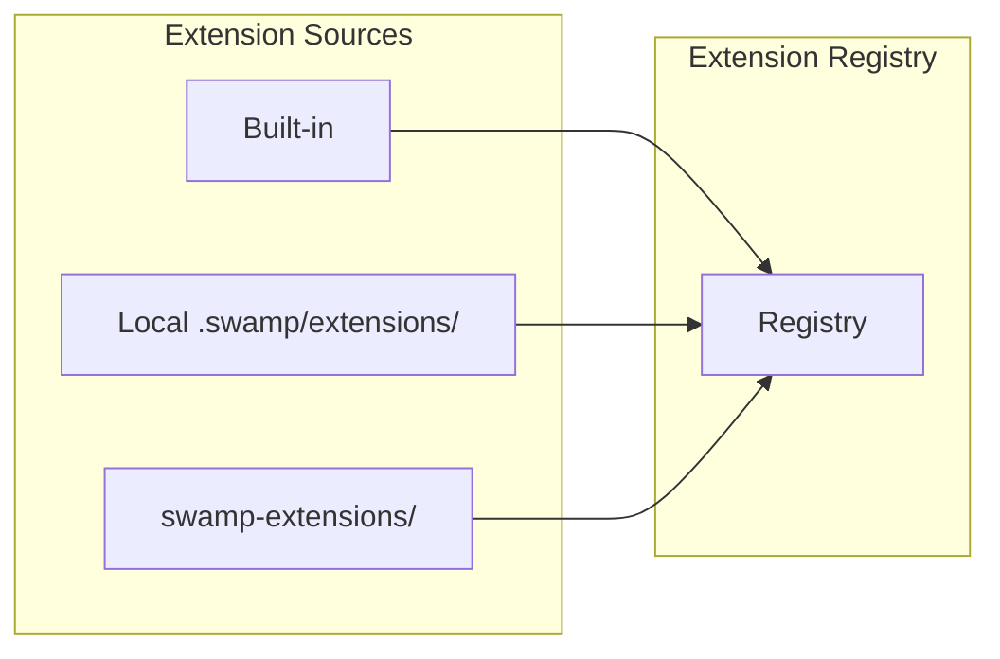
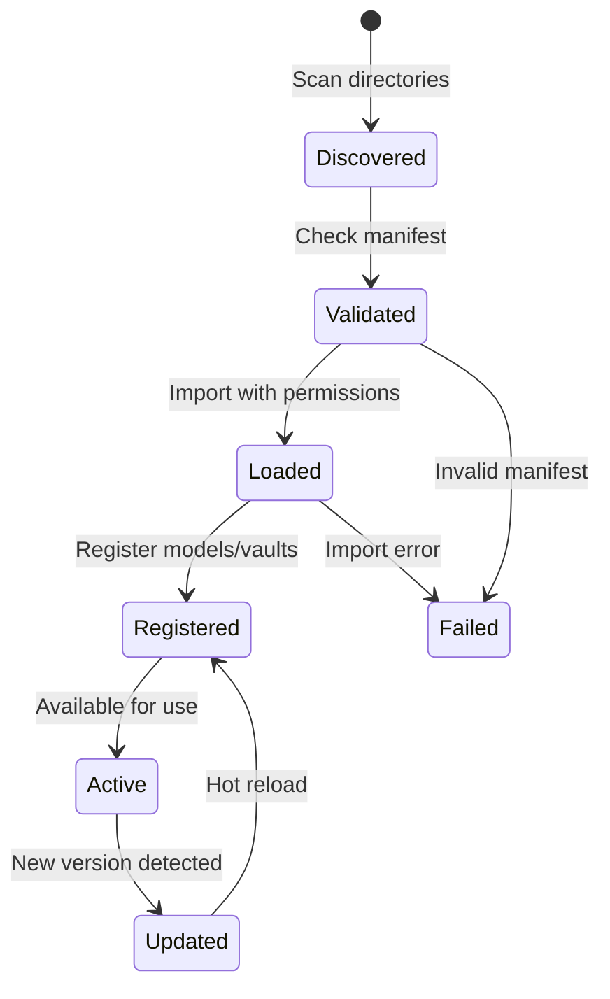

# Extension System

Extensions are the primary mechanism for extending Swamp's capabilities. They provide models, vaults, datastores, and workflow templates.

## Extension Sources

Extensions are loaded from three sources:



| Source | Priority | Use Case |
|--------|----------|----------|
| Built-in | 1 | Core functionality, always available |
| Local | 2 | Project-specific extensions |
| Official | 3 | Community/official extensions |

## Extension Structure

**Source:** `swamp-extensions/` (official extensions)

Each extension is a Deno project with a standard structure:

```
my-extension/
├── deno.json          # Extension manifest
├── main.ts            # Entry point
├── src/
│   ├── models/        # Model definitions
│   ├── vaults/        # Vault providers (if any)
│   └── datastores/    # Datastore providers (if any)
└── README.md
```

### Extension Manifest

**Source:** `deno.json`

```json
{
  "name": "@myorg/swamp-extension",
  "version": "1.0.0",
  "exports": {
    ".": "./main.ts"
  },
  "swamp": {
    "models": [
      {
        "name": "my-service",
        "entry": "./src/models/my-service.ts"
      }
    ],
    "vaults": [
      {
        "name": "my-vault",
        "entry": "./src/vaults/my-vault.ts"
      }
    ]
  }
}
```

**Aha:** The manifest uses Deno's native `deno.json` format, avoiding a separate configuration file.

## Built-in Extensions

**Source:** `swamp/src/extensions/`

Swamp includes several built-in extensions:

| Extension | Purpose | Models |
|-----------|---------|--------|
| `core` | Core utilities | file, exec |
| `git` | Git operations | git-repo, git-worktree |
| `http` | HTTP requests | http-request, http-server |

## Official Extensions

**Source:** `swamp-extensions/`

### Vault Extensions

| Extension | Provider | Authentication |
|-----------|----------|------------------|
| `vault/1password` | 1Password | Service account token |
| `vault/aws-secrets-manager` | AWS SM | IAM role |
| `vault/azure-keyvault` | Azure KV | Managed identity |

### Datastore Extensions

| Extension | Backend | Use Case |
|-----------|---------|----------|
| `datastore/s3` | Amazon S3 | Remote storage |
| `datastore/gcs` | Google GCS | Remote storage |

### Model Extensions

**AWS Models** (`swamp-extensions/model/aws/`)
- ~249 AWS services supported
- Auto-generated from AWS SDK
- CalVer aligned with AWS API versions

Example: `aws/ec2`, `aws/rds`, `aws/s3`

**Cloudflare Models** (`swamp-extensions/model/cloudflare/`)
- ~69 Cloudflare services
- DNS, Workers, R2, Pages, etc.

### Extension Loading

**Source:** `swamp/src/domain/extensions/loader.ts`

```typescript
// loader.ts (simplified)
export async function loadExtension(
  path: string
): Promise<Extension> {
  // 1. Read deno.json
  const manifest = await readManifest(path);

  // 2. Validate manifest
  validateManifest(manifest);

  // 3. Import entry point with Deno permissions
  const entry = await import(entryPath);

  // 4. Register components
  const extension: Extension = {
    name: manifest.name,
    version: manifest.version,
    manifest: manifest.swamp,
    entryPoint: entry,
  };

  return extension;
}
```

### Permission Model

Extensions run with restricted Deno permissions:

```typescript
// Permissions granted to extensions
const permissions: Deno.PermissionOptions = {
  read: ["./"],           // Can read own directory
  write: ["./.swamp/data/"],  // Can write to data dir
  net: ["api.aws.com", "api.cloudflare.com"],
  env: ["AWS_REGION", "CF_TOKEN"],
  run: false,             // Cannot spawn subprocesses
  ffi: false,             // Cannot use FFI
};
```

**Aha:** Extensions cannot spawn subprocesses or use FFI, preventing arbitrary code execution. All external access is through Swamp's HTTP client abstraction.

## Extension Lifecycle



## Extension Registry

**Source:** `swamp/src/domain/extensions/registry.ts`

The registry manages loaded extensions:

```typescript
// registry.ts (simplified)
export class ExtensionRegistry {
  private extensions: Map<string, Extension> = new Map();
  private models: Map<string, ModelType> = new Map();
  private vaults: Map<string, VaultProvider> = new Map();

  register(extension: Extension) {
    this.extensions.set(extension.name, extension);

    // Register models
    for (const model of extension.manifest.models) {
      const key = `${extension.name}/${model.name}`;
      this.models.set(key, model);
    }

    // Register vaults
    for (const vault of extension.manifest.vaults ?? []) {
      this.vaults.set(vault.name, vault);
    }
  }

  getModel(name: string): ModelType | undefined {
    return this.models.get(name);
  }
}
```

## Extension Commands

**Source:** `swamp/src/cli/commands/extension_*.ts`

| Command | Description |
|---------|-------------|
| `extension:list` | List installed extensions |
| `extension:install <url>` | Install from Git URL |
| `extension:remove <name>` | Remove extension |
| `extension:update` | Update all extensions |
| `extension:show <name>` | Show extension details |

## Developing Extensions

### Minimal Extension Template

```typescript
// my-extension/main.ts
import { defineExtension } from "swamp/extension";

export default defineExtension({
  models: [
    {
      name: "hello",
      version: { year: 2025, month: 6, patch: 0 },
      methods: [
        {
          name: "greet",
          arguments: [
            { name: "name", type: "string" }
          ],
          async execute({ name }) {
            return { message: `Hello, ${name}!` };
          },
        },
      ],
    },
  ],
});
```

### Testing Extensions

Extensions can be tested with Swamp's evaluation framework:

```yaml
# evals/hello.yaml
evaluations:
  - name: "Hello World"
    model: hello
    method: greet
    arguments:
      name: "Swamp"
    expected:
      message: "Hello, Swamp!"
```

## Extension Versioning

Extensions follow SemVer:

| Version | Compatibility |
|---------|---------------|
| `1.0.0` | Initial release |
| `1.1.0` | New feature, backward compatible |
| `2.0.0` | Breaking change |

**Aha:** Extension versions are independent of model CalVer. An extension can bundle multiple model versions.

## Security Model

Extensions are sandboxed with:
- Deno permission system
- No subprocess spawning
- Controlled network access
- Read/write isolation

**Best Practice:** Extensions should use environment variables for secrets, never hardcode credentials.

## Next Steps

Continue to [Workflow Engine →](05-workflow-engine.html) for DAG execution and job scheduling.
