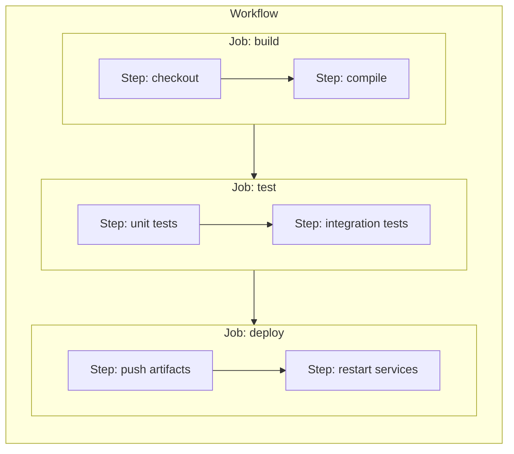
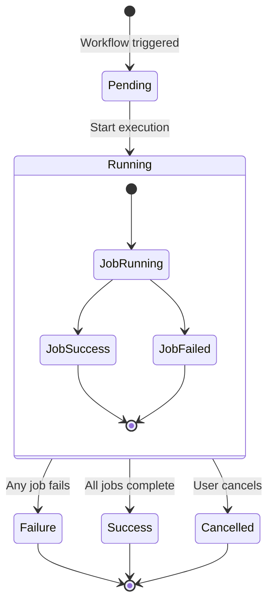

# Workflow Engine

The workflow engine executes DAGs (Directed Acyclic Graphs) of jobs with parallel execution, dependency management, and step-by-step orchestration.

## Workflow Structure



## Execution Model

### Jobs

- Jobs execute in parallel batches based on dependencies
- Each job has a configurable parallelism limit
- Jobs can depend on other jobs via `needs`

### Steps

- Steps execute sequentially within a job
- Each step invokes a model method
- Steps can reference outputs from previous steps

## DAG Construction

**Source:** `swamp/src/domain/workflows/graph.ts`

```typescript
// graph.ts (simplified)
export class WorkflowGraph {
  private nodes: Map<string, Job> = new Map();
  private edges: Map<string, Set<string>> = new Map();

  addNode(job: Job) {
    this.nodes.set(job.id, job);
    this.edges.set(job.id, new Set());
  }

  addEdge(from: string, to: string) {
    this.edges.get(to)?.add(from);
  }

  topologicalSort(): Job[][] {
    // Returns batches of jobs that can execute in parallel
    const batches: Job[][] = [];
    const visited = new Set<string>();

    while (visited.size < this.nodes.size) {
      const batch: Job[] = [];
      for (const [id, job] of this.nodes) {
        if (visited.has(id)) continue;

        const deps = this.edges.get(id) ?? new Set();
        if (deps.every(dep => visited.has(dep))) {
          batch.push(job);
        }
      }

      batch.forEach(job => visited.add(job.id));
      batches.push(batch);
    }

    return batches;
  }
}
```

**Aha:** The topological sort returns *batches* of jobs, not a linear sequence. All jobs in a batch can execute in parallel.

## Workflow Definition

**Source:** `.swamp/workflows/*.yaml`

```yaml
# example.yaml
name: CI/CD Pipeline

on:
  push:
    branches: [main]

jobs:
  build:
    runs-on: ubuntu-latest
    steps:
      - name: Checkout
        uses: git/checkout@v1
        with:
          ref: ${{ github.sha }}

      - name: Build
        run: myapp/build
        with:
          target: release

  test:
    needs: [build]
    runs-on: ubuntu-latest
    steps:
      - name: Run Tests
        run: myapp/test
        with:
          coverage: true

  deploy-staging:
    needs: [test]
    environment: staging
    steps:
      - name: Deploy
        run: aws/ec2/deploy
        with:
          region: us-east-1

  deploy-prod:
    needs: [test]
    environment: production
    if: ${{ inputs.deploy-prod }}
    steps:
      - name: Deploy
        run: aws/ec2/deploy
        with:
          region: us-east-1
```

## Step Execution

**Source:** `swamp/src/domain/workflows/runner.ts`

```typescript
// runner.ts (simplified)
export class StepRunner {
  async execute(
    step: Step,
    context: ExecutionContext
  ): Promise<StepResult> {
    // 1. Resolve CEL expressions in arguments
    const resolvedArgs = await this.resolveArgs(step.with, context);

    // 2. Evaluate condition (if present)
    if (step.if) {
      const shouldRun = await this.evaluateCondition(step.if, context);
      if (!shouldRun) {
        return { status: "skipped" };
      }
    }

    // 3. Execute model method
    const modelRef = this.parseModelRef(step.run);
    const result = await this.executeModel(modelRef, resolvedArgs);

    // 4. Store outputs in context
    context.setOutput(step.id, result);

    return { status: "success", outputs: result };
  }
}
```

## Parallel Execution

**Source:** `swamp/src/domain/workflows/scheduler.ts`

```typescript
// scheduler.ts (simplified)
export class WorkflowScheduler {
  async executeBatch(
    jobs: Job[],
    context: ExecutionContext
  ): Promise<JobResult[]> {
    // Execute all jobs in parallel with concurrency limit
    const limit = pLimit(this.concurrency);

    return Promise.all(
      jobs.map(job =>
        limit(() => this.executeJob(job, context))
      )
    );
  }
}
```

## CEL Expressions

Workflows use CEL for dynamic values:

```yaml
steps:
  - name: Deploy
    run: aws/ec2/deploy
    with:
      # Reference job outputs
      ami: ${{ jobs.build.outputs.ami-id }}
      # Reference workflow inputs
      count: ${{ inputs.instance-count }}
      # Conditional logic
      dry-run: ${{ inputs.env != 'production' }}
```

**Aha:** CEL expressions are evaluated lazily at runtime, allowing dynamic values based on previous step outputs.

## State Management



## Event Streaming

Workflows emit events for real-time monitoring:

```typescript
interface WorkflowEvent {
  type: "job.started" | "job.completed" | "step.started" | "step.completed" | "step.failed";
  timestamp: Date;
  workflowId: string;
  jobId?: string;
  stepId?: string;
  data?: unknown;
}
```

## Retry Logic

**Source:** `swamp/src/domain/workflows/retry.ts`

```typescript
// retry.ts
export async function withRetry<T>(
  fn: () => Promise<T>,
  options: RetryOptions
): Promise<T> {
  let lastError: Error;

  for (let attempt = 1; attempt <= options.maxAttempts; attempt++) {
    try {
      return await fn();
    } catch (error) {
      lastError = error;

      if (attempt < options.maxAttempts) {
        const delay = calculateBackoff(attempt, options);
        await sleep(delay);
      }
    }
  }

  throw lastError;
}
```

## Execution Context

**Source:** `swamp/src/domain/workflows/context.ts`

The execution context tracks:
- Job outputs
- Step outputs
- Workflow inputs
- Secrets (vault references)
- Environment variables

```typescript
interface ExecutionContext {
  workflowInputs: Record<string, unknown>;
  jobOutputs: Map<string, Record<string, unknown>>;
  stepOutputs: Map<string, Record<string, unknown>>;
  secrets: SecretResolver;
}
```

## Error Handling

When a step fails:

1. Mark job as failed
2. Cancel dependent jobs
3. Emit failure event
4. Clean up resources
5. Report to user

```yaml
steps:
  - name: Risky Operation
    run: risky/model
    continue-on-error: true  # Don't fail workflow

  - name: Fallback
    if: ${{ steps.risky.outcome == 'failure' }}
    run: fallback/model
```

## Next Steps

Continue to [Model System →](06-model-system.html) for models, methods, and CalVer versioning.
