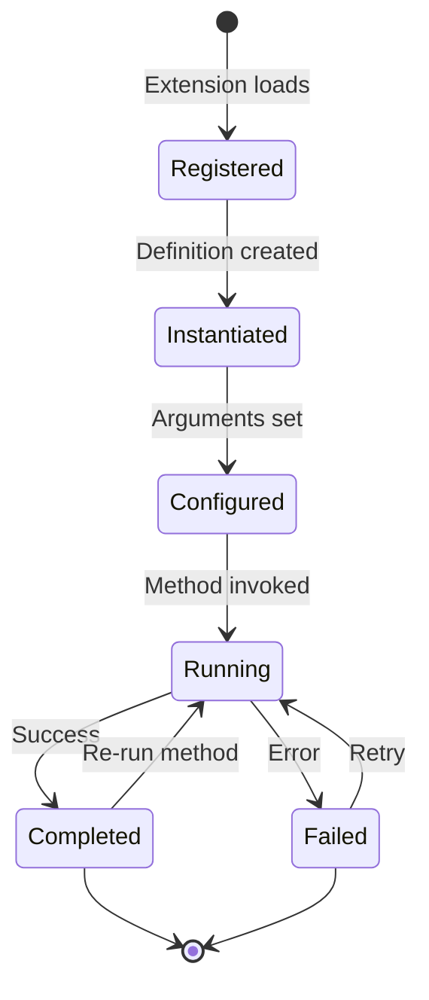

# Model System

Models are typed abstractions of external systems. They define metadata, arguments, methods, and inputs that enable Swamp to interact with cloud resources, CLI tools, and APIs.

## Model Type Definition

**Source:** `swamp/src/domain/models/types.ts`

```typescript
export interface ModelType {
  // Model name (e.g., "aws/ec2")
  name: string;

  // Calendar version (YYYY.MM.PATCH)
  version: CalVer;

  // Arguments for instantiation
  arguments: Argument[];

  // Methods that can be invoked
  methods: Method[];

  // Dependencies on other models
  inputs: Input[];

  // Output specifications
  outputs: Output[];
}

export interface CalVer {
  year: number;
  month: number;
  patch: number;
}

export interface Method {
  name: string;
  description?: string;
  arguments: Argument[];
  returnType: DataType;
  execute: (args: Record<string, unknown>) => Promise<unknown>;
}

export interface Argument {
  name: string;
  type: DataType;
  required: boolean;
  default?: unknown;
  description?: string;
}

export type DataType =
  | "string"
  | "number"
  | "boolean"
  | "object"
  | "array"
  | { type: "enum"; values: string[] }
  | { type: "ref"; model: string };
```

## CalVer Versioning

**Aha:** Swamp uses CalVer (Calendar Versioning) instead of SemVer for models. This aligns with cloud provider API versions.

```typescript
// CalVer format: YYYY.MM.PATCH
const version: CalVer = {
  year: 2025,
  month: 6,
  patch: 0
};

// Format as string
formatCalVer(version); // "2025.06.0"
```

| Component | Meaning |
|-----------|---------|
| `year` | Year of release |
| `month` | Month of release (1-12) |
| `patch` | Patch revision within month |

### Comparison

```typescript
// CalVer comparison
compareCalVer({ year: 2025, month: 6, patch: 0 },
              { year: 2025, month: 5, patch: 0 }); // > 0

// Find latest version
const versions: CalVer[] = [...];
const latest = versions.sort((a, b) => -compareCalVer(a, b))[0];
```

## Model Registration

**Source:** `swamp/src/domain/models/registry.ts`

```typescript
export class ModelRegistry {
  private models: Map<string, ModelType> = new Map();

  register(model: ModelType) {
    const key = `${model.name}@${formatCalVer(model.version)}`;

    if (this.models.has(key)) {
      throw new ModelVersionConflictError(key);
    }

    this.models.set(key, model);
  }

  get(name: string, version?: CalVer): ModelType | undefined {
    if (version) {
      return this.models.get(`${name}@${formatCalVer(version)}`);
    }
    return this.findLatest(name);
  }

  list(): ModelType[] {
    return Array.from(this.models.values());
  }

  private findLatest(name: string): ModelType | undefined {
    const versions = this.list()
      .filter(m => m.name === name)
      .sort((a, b) => -compareCalVer(a.version, b.version));

    return versions[0];
  }
}
```

## Model Definition

Definitions instantiate model types:

**Source:** `.swamp/definitions/*.yaml`

```yaml
# rds-postgres.yaml
apiVersion: swamp.systeminit.com/v1
kind: Definition
metadata:
  name: production-database
spec:
  model: aws/rds-postgres@2025.06.0
  arguments:
    db_name: myapp
    instance_class: db.t3.micro
    allocated_storage: 20
    engine_version: "15.4"
    username: admin
    password: ${vault("prod-db-password")}
```

## Method Execution

**Source:** `swamp/src/domain/models/executor.ts`

```typescript
export class MethodExecutor {
  async execute(
    modelRef: ModelReference,
    methodName: string,
    args: Record<string, unknown>
  ): Promise<unknown> {
    // 1. Resolve model
    const model = await this.registry.get(
      modelRef.name,
      modelRef.version
    );

    if (!model) {
      throw new ModelNotFoundError(modelRef);
    }

    // 2. Find method
    const method = model.methods.find(m => m.name === methodName);
    if (!method) {
      throw new MethodNotFoundError(modelRef, methodName);
    }

    // 3. Validate arguments
    this.validateArgs(args, method.arguments);

    // 4. Execute with timeout
    return await this.withTimeout(
      () => method.execute(args),
      method.timeout ?? 300000 // 5min default
    );
  }

  private validateArgs(
    args: Record<string, unknown>,
    schema: Argument[]
  ): void {
    for (const arg of schema) {
      if (arg.required && !(arg.name in args)) {
        throw new MissingArgumentError(arg.name);
      }
      // Type checking...
    }
  }
}
```

## Model Schema

### Type Validation

```typescript
// src/domain/models/validator.ts
export function validateType(
  value: unknown,
  type: DataType
): boolean {
  switch (type) {
    case "string":
      return typeof value === "string";
    case "number":
      return typeof value === "number";
    case "boolean":
      return typeof value === "boolean";
    case "object":
      return typeof value === "object" && value !== null;
    case "array":
      return Array.isArray(value);
    default:
      if (typeof type === "object") {
        if (type.type === "enum") {
          return type.values.includes(value as string);
        }
        if (type.type === "ref") {
          // Check if value is a reference to model
          return isModelReference(value);
        }
      }
      return false;
  }
}
```

### Input Dependencies

Models can depend on other models:

```typescript
export interface Input {
  name: string;
  model: string;
  required: boolean;
}
```

```yaml
# vpc-dependency.yaml
spec:
  model: aws/ec2
  arguments:
    subnet_id: subnet-12345
  inputs:
    - name: vpc
      model: aws/vpc
      required: true
```

## Auto-Generated Models

**Source:** `swamp-extensions/model/aws/`

AWS models are auto-generated from the AWS SDK:

```typescript
// Generated from AWS SDK
export const EC2Model: ModelType = {
  name: "aws/ec2",
  version: { year: 2025, month: 6, patch: 0 },
  arguments: [
    { name: "region", type: "string", required: true },
    // ... 200+ more arguments
  ],
  methods: [
    {
      name: "describe-instances",
      arguments: [
        { name: "instance_ids", type: "array", required: false }
      ],
      returnType: "object",
      execute: async (args) => {
        // Call AWS SDK
      }
    },
    // ... 100+ more methods
  ],
  inputs: [],
  outputs: []
};
```

**Aha:** ~249 AWS services are supported, each with comprehensive method coverage.

## Model Commands

**Source:** `swamp/src/cli/commands/model_*.ts`

| Command | Description |
|---------|-------------|
| `model:create` | Create a definition from a model type |
| `model:run` | Execute a model method |
| `model:show` | Show model definition |
| `model:list` | List definitions |
| `model:edit` | Edit definition in editor |
| `model:delete` | Delete definition |
| `model:logs` | Show execution logs |
| `model:types` | List available model types |

## Model Lifecycle



## Next Steps

Continue to [Vault and Datastore →](07-vault-datastore.html) for secret storage and data persistence.
