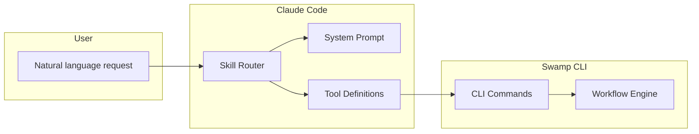

# Claude Code Skills

Swamp includes 15+ Claude Code skills that enable AI agents to author workflows, models, and extensions through natural language.

## Skills Overview

**Location:** `swamp/.claude/skills/`

| Skill | Purpose | Commands |
|-------|---------|----------|
| `swamp-workflow` | Author workflows | Create, edit, run workflows |
| `swamp-model` | Author models | Create, edit model definitions |
| `swamp-extension` | Develop extensions | Scaffold, test extensions |
| `swamp-vault` | Manage secrets | Create vaults, set secrets |
| `swamp-data` | Manage data | Tag, query data artifacts |
| `swamp-debug` | Debug workflows | Inspect runs, view logs |

## Skill Structure

Each skill is a directory with a standard structure:

```
swamp/.claude/skills/swamp-workflow/
├── skill.yaml          # Skill manifest
├── system-prompt.md    # System prompt for Claude
├── examples/           # Example conversations
│   ├── create-workflow.md
│   └── edit-workflow.md
└── tools/              # Tool definitions (if any)
```

### Skill Manifest

**Source:** `swamp/.claude/skills/swamp-workflow/skill.yaml`

```yaml
name: swamp-workflow
description: Author and manage Swamp workflows
version: 1.0.0
categories:
  - automation
  - infrastructure

system_prompt: system-prompt.md

examples:
  - examples/create-workflow.md
  - examples/edit-workflow.md

tools:
  - name: list_workflows
    description: List available workflows
  - name: create_workflow
    description: Create a new workflow
  - name: run_workflow
    description: Execute a workflow
```

## swamp-workflow Skill

**Source:** `swamp/.claude/skills/swamp-workflow/`

This skill enables AI agents to create and manage workflows through natural language.

### System Prompt

**Source:** `swamp/.claude/skills/swamp-workflow/system-prompt.md`

```markdown
You are a workflow automation expert. Your job is to help users
author Swamp workflows that orchestrate infrastructure operations.

Key concepts:
- Workflows are DAGs of jobs with parallel execution
- Each step invokes a model method
- CEL expressions enable dynamic values
- Jobs can depend on other jobs

When creating workflows:
1. Ask clarifying questions to understand the goal
2. Identify the required models and methods
3. Design the job dependency graph
4. Write clean, readable YAML
5. Include comments explaining non-obvious choices
```

### Example Usage

```markdown
# User
Create a workflow that builds a Docker image and deploys it to ECS

# Claude (via swamp-workflow skill)
I'll create a CI/CD workflow for you. Let me design this:

1. Job: build - Build Docker image
2. Job: test - Run tests (depends on build)
3. Job: deploy - Deploy to ECS (depends on test)

```yaml
name: Docker Build and Deploy

on:
  push:
    branches: [main]

jobs:
  build:
    steps:
      - name: Checkout
        uses: git/checkout@v1

      - name: Build Image
        run: docker/build
        with:
          dockerfile: Dockerfile
          tag: ${{ github.sha }}

  test:
    needs: [build]
    steps:
      - name: Run Tests
        run: docker/run
        with:
          image: myapp:${{ github.sha }}
          command: npm test

  deploy:
    needs: [test]
    environment: production
    steps:
      - name: Deploy to ECS
        run: aws/ecs/update-service
        with:
          cluster: prod
          service: myapp
          image: myapp:${{ github.sha }}
```
```

## swamp-model Skill

**Source:** `swamp/.claude/skills/swamp-model/`

Helps create model definitions.

### Example

```markdown
# User
Create a model definition for a production PostgreSQL database

# Claude
I'll create a definition using the aws/rds-postgres model:

```yaml
apiVersion: swamp.systeminit.com/v1
kind: Definition
metadata:
  name: production-database
  description: Primary production database
spec:
  model: aws/rds-postgres@2025.06.0
  arguments:
    db_name: myapp_production
    instance_class: db.t3.medium
    allocated_storage: 100
    engine_version: "15.4"
    username: app_admin
    password: ${vault("prod-db-password")}
    backup_retention_period: 7
    deletion_protection: true
    storage_encrypted: true
```

This creates:
- A db.t3.medium instance (2 vCPU, 4GB RAM)
- 100GB storage with encryption
- Daily backups retained for 7 days
- Deletion protection enabled
```

## swamp-extension Skill

**Source:** `swamp/.claude/skills/swamp-extension/`

Scaffolds new extensions.

### Example

```markdown
# User
Create a new extension for DigitalOcean

# Claude
I'll scaffold a DigitalOcean extension with:
1. Extension manifest (deno.json)
2. Entry point
3. Example model for droplets

[Creates files...]
```

## Skill Commands

Skills are invoked via the `/` command in Claude Code:

```bash
/swamp-workflow create ci-cd-pipeline
/swamp-model create rds-definition
/swamp-extension list
```

## Integration Architecture



## Design Principles

1. **Natural language first** — Users describe intent, AI generates artifacts
2. **Iterative refinement** — Start simple, add complexity as needed
3. **Safety by default** — AI suggests safe defaults (encryption, backups)
4. **Explain choices** — AI explains why specific values were chosen

## Benefits

| Without Skills | With Skills |
|----------------|-------------|
| Learn YAML syntax | Describe intent in English |
| Read model docs | AI suggests relevant models |
| Manual validation | AI validates as it creates |
| Error-prone edits | AI understands context |
| Copy-paste templates | Generated for specific use case |

## Next Steps

- Explore `swamp/.claude/skills/` for full skill definitions
- See `design/skills.md` for design documentation
- Use `/help swamp-workflow` in Claude Code for skill help
