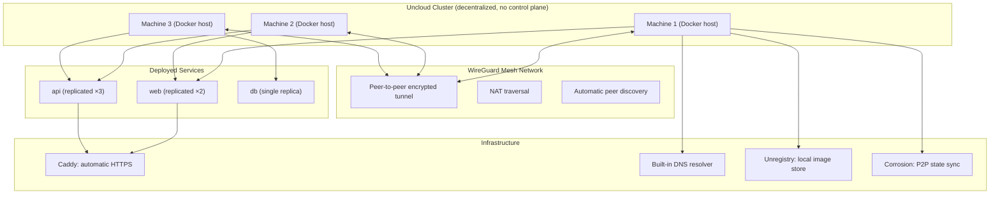
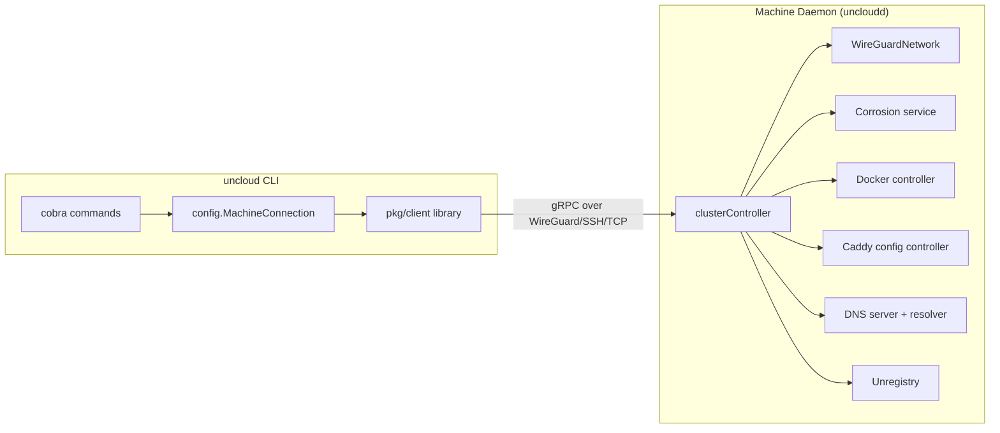

# Uncloud — Decentralized Container Orchestration

**Uncloud is a lightweight clustering and container orchestration tool — deploy and scale containerised apps across servers without Swarm or Kubernetes overhead. It creates a secure WireGuard mesh network between Docker hosts and provides automatic service discovery, load balancing, and ingress with HTTPS.**

## What It Does

**Aha:** Uncloud has **no central control plane**. Every machine is equal — there's no master node, no quorum to maintain, no single point of failure. Each machine maintains a synchronized copy of the cluster state through peer-to-peer communication via Corrosion (a SQLite-based CRDT). The cluster stays functional even if some machines go offline.

## Key Differentiators vs Kubernetes/Swarm

| Feature | Kubernetes | Docker Swarm | Uncloud |
|---------|-----------|-------------|---------|
| Control plane | Central (etcd, API server) | Central (manager nodes) | **None — fully decentralized** |
| Networking | CNI plugins (complex) | Overlay network | **WireGuard mesh** |
| State sync | etcd (Raft consensus) | Raft | **Corrosion (SQLite CRDT)** |
| Service discovery | kube-dns | Built-in DNS | **Built-in DNS + WireGuard IPs** |
| Ingress | Ingress controllers | Routing mesh | **Caddy with automatic HTTPS** |
| Image registry | External (required) | External (required) | **Unregistry (built-in, layer-sync)** |
| Deployment format | YAML manifests | Docker Compose | **Docker Compose** |
| Complexity | High | Medium | **Low** |

## Architecture Overview

## Component Breakdown

| Component | LOC | Purpose |
|-----------|-----|---------|
| `internal/machine` | 21,581 | Core machine/cluster management |
| `pkg/client` | 15,442 | Client library for CLI |
| `cmd/uncloud` | 6,165 | CLI commands (cobra) |
| `pkg/api` | 3,794 | API types (ServiceSpec, ContainerSpec, etc.) |
| `internal/machine/api` | 9,696 | gRPC/protobuf definitions |
| `internal/machine/caddyconfig` | 2,648 | Caddy reverse proxy config generation |
| `internal/machine/docker` | 2,998 | Docker controller and server |
| `internal/machine/network` | 1,105 | WireGuard mesh networking |
| `internal/cli` | 2,668 | CLI implementation with TUI |
| `internal/corrosion` | 1,514 | Corrosion client for P2P state sync |
| `internal/sshexec` | 429 | SSH execution for remote management |
| `internal/ucind` | 727 | Cluster-in-Docker for testing |
| `test/e2e` | 4,524 | End-to-end tests |

## What's Next

- [01 — Architecture](01-architecture.md) — Full dependency graph, cluster model, P2P design
- [02 — WireGuard Mesh](02-wireguard-mesh.md) — Network setup, peer discovery, NAT traversal
- [03 — Machine & Cluster](03-machine-cluster.md) — clusterController, state management
- [04 — Service Deployment](04-service-deployment.md) — ServiceSpec, scheduling, container lifecycle
- [05 — Caddy & HTTPS](05-caddy-https.md) — Automatic HTTPS, load balancing
- [06 — CLI](06-cli.md) — Commands, config, connection types
- [07 — API & gRPC](07-api-grpc.md) — Protobuf definitions, gRPC services
- [08 — Corrosion CRDT](08-corrosion-crdt.md) — P2P state synchronization
- [09 — Docker Integration](09-docker-integration.md) — Docker controller, Unregistry
- [10 — Client Library](10-client-library.md) — pkg/client API
- [11 — Cross-Cutting](11-cross-cutting.md) — Testing, metrics, logging
