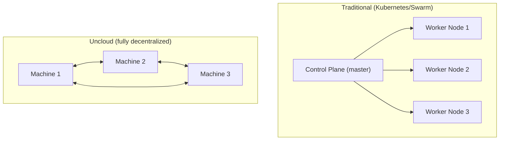
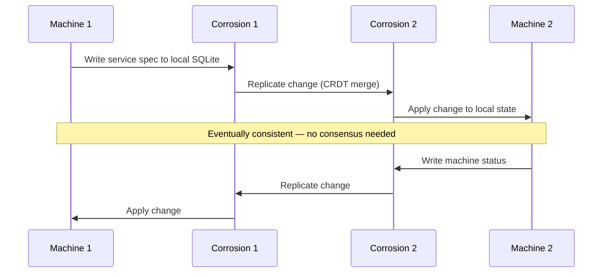
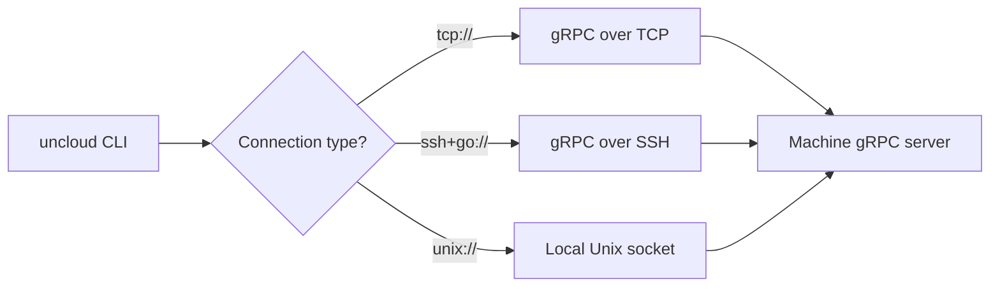

# Architecture — Decentralized Cluster, P2P Design

**Uncloud's core innovation is its fully decentralized architecture — no central control plane, no quorum, no single point of failure. Every machine is equal.**

## Decentralized Design



**Aha:** In Kubernetes, if the control plane goes down, you can't deploy, scale, or manage services. In Uncloud, every machine is independently functional — it can deploy services, resolve DNS, and proxy traffic even if all other machines are offline.

## State Synchronization via Corrosion



Each machine runs **Corrosion** — a SQLite-based CRDT (Conflict-free Replicated Data Type) that synchronizes cluster state peer-to-peer. Changes are written to the local SQLite database and replicated to other machines. CRDTs guarantee eventual consistency without coordination.

## Machine Daemon (uncloudd)

Source: `internal/machine/machine.go` (1,286 lines)

The `clusterController` is the central orchestrator on each machine:

```go
type clusterController struct {
    state           *State
    store           *store.Store
    wgnet           *network.WireGuardNetwork    // WireGuard mesh
    server          *grpc.Server                  // gRPC API server
    corroService    corroservice.Service          // Corrosion P2P sync
    dockerCtrl      *docker.Controller            // Docker management
    caddyconfigCtrl *caddyconfig.Controller       // Caddy reverse proxy
    dnsServer       *dns.Server                   // DNS server
    dnsResolver     *dns.ClusterResolver          // Cluster DNS resolver
    unregistry      *unregistry.Registry          // Local image registry
    metricsServer   *metrics.Server               // Prometheus metrics
}
```

## Client-Server Model

The CLI communicates with machines via three connection types:



| Connection | Use Case |
|------------|----------|
| `tcp://host:port` | Direct TCP connection to machine's gRPC server |
| `ssh+go://user@host` | SSH tunnel to machine (remote management) |
| `unix://path` | Local Unix socket (on-machine access) |

**Aha:** You can manage an entire Uncloud cluster through SSH access to any single machine. The CLI connects to one machine via SSH, and that machine's cluster state (synchronized via Corrosion) gives visibility into the entire cluster.

## Directory Structure

```
uncloud/
├── cmd/
│   ├── uncloud/         # CLI (6,165 LOC) — cobra commands
│   ├── uncloudd/        # Machine daemon (275 LOC)
│   └── ucind/           # Cluster-in-Docker (191 LOC)
├── internal/
│   ├── machine/         # Core machine logic (21,581 LOC)
│   │   ├── api/pb/      # Protobuf definitions
│   │   ├── caddyconfig/ # Caddy config generation
│   │   ├── cluster/     # Cluster state management
│   │   ├── docker/      # Docker controller
│   │   ├── network/     # WireGuard networking
│   │   ├── store/       # SQLite storage
│   │   └── dns/         # DNS server
│   ├── corrosion/       # Corrosion client (1,514 LOC)
│   ├── cli/             # CLI implementation (2,668 LOC)
│   └── sshexec/         # SSH execution (429 LOC)
├── pkg/
│   ├── api/             # API types (3,794 LOC)
│   └── client/          # Client library (15,442 LOC)
└── test/e2e/            # End-to-end tests (4,524 LOC)
```

## What's Next

- [02 — WireGuard Mesh](02-wireguard-mesh.md) — Network setup, peer discovery, NAT traversal
- [03 — Machine & Cluster](03-machine-cluster.md) — clusterController, state management
- [08 — Corrosion CRDT](08-corrosion-crdt.md) — P2P state synchronization
