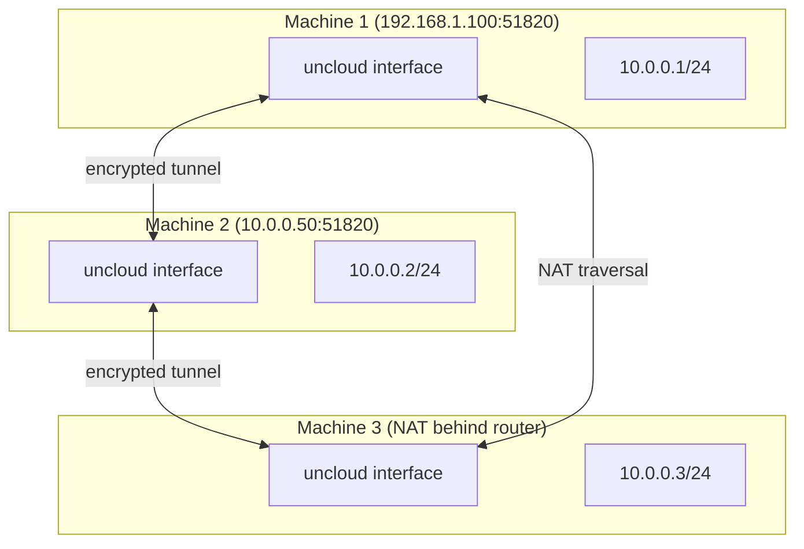
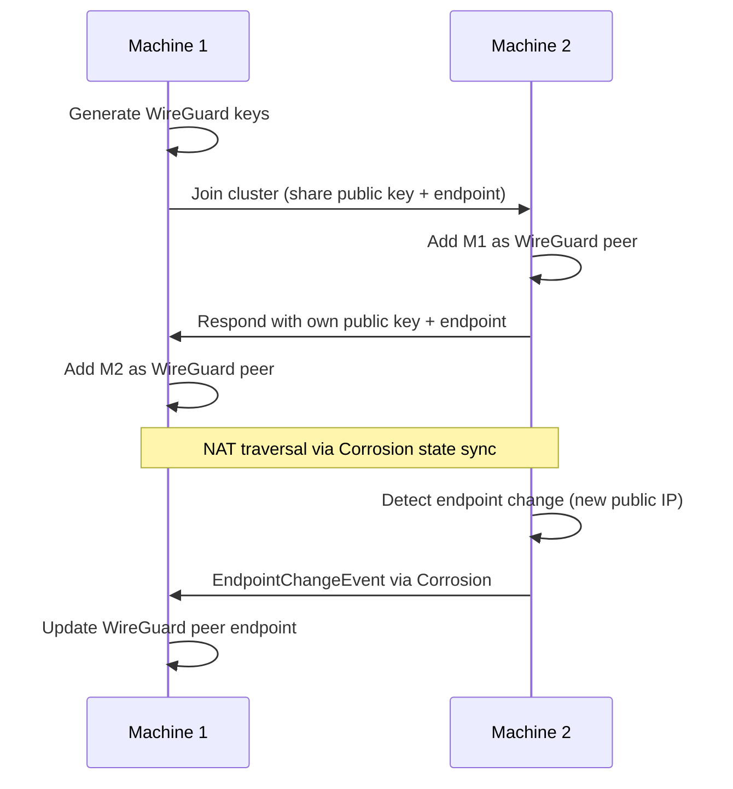

# WireGuard Mesh — Network Setup, Peer Discovery, NAT Traversal

**Uncloud creates a WireGuard mesh network between all Docker hosts — providing encrypted communication, automatic peer discovery, and NAT traversal without manual configuration.**

## WireGuard Network Architecture

Source: `internal/machine/network/` (1,105 LOC)



## WireGuard Network Setup

Source: `internal/machine/network/wireguard.go`

```go
const (
    WireGuardInterfaceName = "uncloud"
    DefaultWireGuardPort   = 51820
    WireGuardKeepaliveInterval = 25 * time.Second  // Works with most firewalls
)
```

### Key Generation

```go
func NewMachineKeys() (privKey, pubKey secret.Secret, err error) {
    wgPrivKey, err := wgtypes.GeneratePrivateKey()
    // privKey and pubKey are byte slices of the key material
}
```

Each machine generates its own WireGuard key pair on first join.

## Peer Discovery and NAT Traversal

Source: `internal/machine/network/peer.go`



### Endpoint Changes

```go
type EndpointChangeEvent struct {
    PublicKey secret.Secret
    Endpoint netip.AddrPort  // New endpoint address
}
```

The 25-second keepalive interval ensures NAT bindings stay alive, and endpoint changes are propagated through Corrosion state sync.

## IP Address Assignment

Source: `internal/machine/network/address.go`

Each machine gets a unique IP in the `10.0.0.0/24` subnet:

| Machine | WireGuard IP | Purpose |
|---------|-------------|---------|
| Machine 1 | 10.0.0.1 | First cluster member |
| Machine 2 | 10.0.0.2 | Second cluster member |
| Machine 3 | 10.0.0.3 | Third cluster member |

Containers on different machines communicate directly through the WireGuard mesh — no overlay network, no port mapping needed.

## Platform-Specific Implementation

**Aha:** The WireGuard keepalive interval of 25 seconds is specifically chosen because it works with the widest range of firewalls — too short and it wastes bandwidth, too long and stateful firewalls drop the connection. This is a battle-tested value from the WireGuard project.

| File | Platform | Purpose |
|------|----------|---------|
| `wireguard.go` | All | Core WireGuard logic |
| `wireguard_linux.go` | Linux | Linux-specific wgctrl setup |
| `wireguard_darwin.go` | macOS | macOS-specific wgctrl setup |

## What's Next

- [03 — Machine & Cluster](03-machine-cluster.md) — clusterController, state management
- [01 — Architecture](01-architecture.md) — Return to architecture
- [08 — Corrosion CRDT](08-corrosion-crdt.md) — Return to Corrosion
