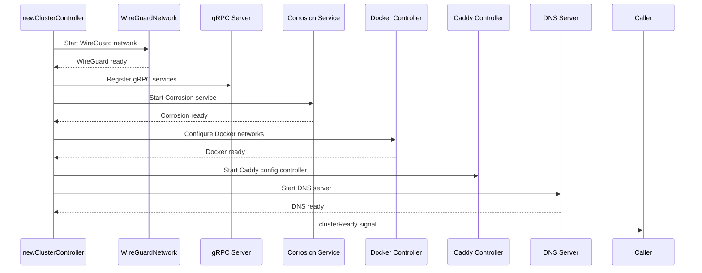

# Machine & Cluster — clusterController, State Management

**The clusterController is the main controller for each Uncloud machine — it manages the WireGuard network, Corrosion service, Docker integration, Caddy config, DNS, and the Unregistry.**

## clusterController

Source: `internal/machine/cluster.go` (666 lines)

```go
type clusterController struct {
    state *State
    store *store.Store
    wgnet *network.WireGuardNetwork
    server *grpc.Server
    corroService corroservice.Service
    dockerCtrl *docker.Controller
    caddyconfigCtrl *caddyconfig.Controller
    dnsServer *dns.Server
    dnsResolver *dns.ClusterResolver
    unregistry *unregistry.Registry
    metricsServer *metrics.Server
}
```

## Initialization Flow



## State Management

Source: `internal/machine/state.go` (123 LOC)

```go
type State struct {
    // Machine identity, WireGuard keys, cluster membership
}
```

### Store

Source: `internal/machine/store/` (618 LOC)

SQLite-backed persistent storage for:
- Container state
- Service definitions
- Volume information

Schema: `internal/machine/store/schema.sql`

## Cluster Membership

Source: `internal/machine/cluster/` (620 LOC)

Manages:
- Machine join/leave
- Peer discovery
- Cluster state synchronization

## Corrosion Migration

Source: `internal/machine/corromigrate/` (515 LOC)

Handles database schema migrations for Corrosion — ensuring all machines run compatible schema versions.

## Corrosion Service

Source: `internal/machine/corroservice/` (341 LOC)

Wraps the Corrosion process:
- Starts/stops the Corrosion service
- Manages corrosion user permissions
- Handles runtime directory setup

## What's Next

- [04 — Service Deployment](04-service-deployment.md) — ServiceSpec, scheduling
- [08 — Corrosion CRDT](08-corrosion-crdt.md) — P2P state synchronization
- [02 — WireGuard Mesh](02-wireguard-mesh.md) — Return to WireGuard
