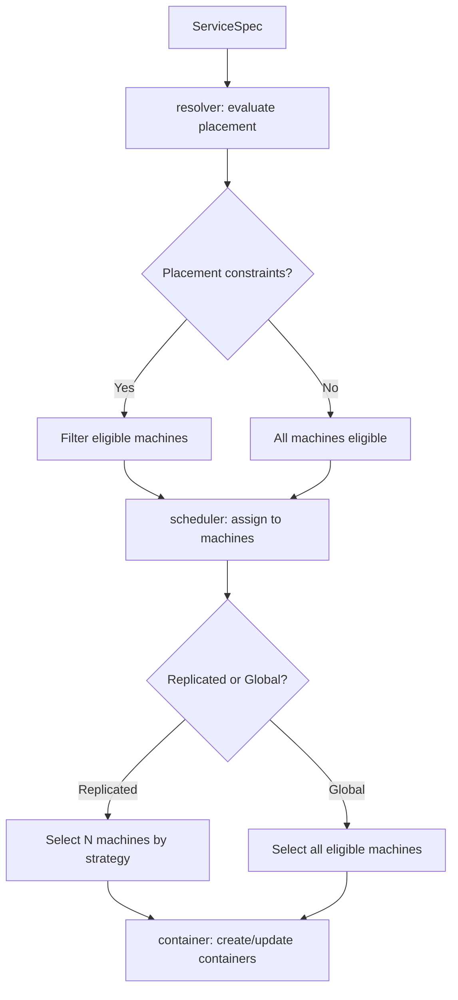
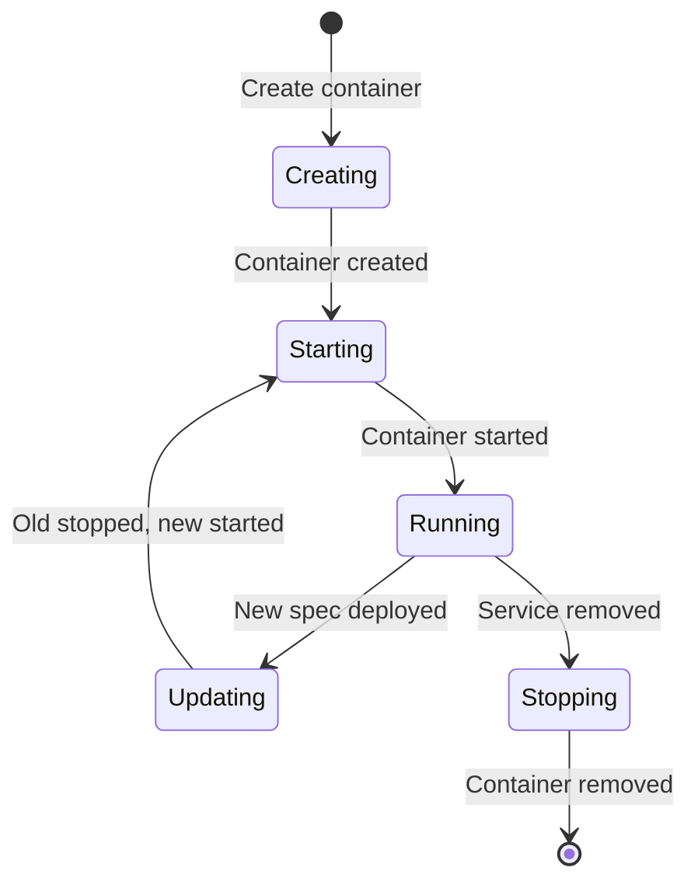

# Service Deployment — ServiceSpec, Scheduling, Container Lifecycle

**Uncloud uses Docker Compose-compatible service definitions to deploy containerised apps across the cluster — with scheduling, rolling updates, and persistent storage.**

## ServiceSpec

Source: `pkg/api/service.go` (638 lines)

```go
type ServiceSpec struct {
    Caddy      *CaddySpec      // Optional HTTPS reverse proxy
    Configs    []ConfigSpec    // Configuration mounts
    Container  ContainerSpec   // Desired container state
    Mode       string          // "replicated" or "global"
    Name       string
    Placement  Placement       // Placement constraints
    Ports      []PortSpec      // Published ports
    PreDeploy  *PreDeployHook  // Pre-deployment command
    Replicas   uint            // Number of containers (replicated mode)
    UpdateConfig UpdateConfig  // Rolling update configuration
    Volumes    []VolumeSpec    // Data volumes
}
```

### Service Modes

| Mode | Behavior |
|------|----------|
| `replicated` | Run N copies across the cluster (default) |
| `global` | Run one copy on every machine |

### Update Strategy

```go
const (
    UpdateOrderStartFirst = "start-first"  // New before old (min downtime)
    UpdateOrderStopFirst  = "stop-first"   // Old before new (safe for stateful)
    PullPolicyAlways      = "always"       // Always pull
    PullPolicyMissing     = "missing"      // Pull only if missing (default)
    PullPolicyNever       = "never"        // Never pull (local images only)
)
```

## Deployment Scheduler

Source: `pkg/client/deploy/scheduler/`



### Deployment Strategies

Source: `pkg/client/deploy/strategy.go`

| Strategy | Purpose |
|----------|---------|
| Rolling update | Update containers one at a time |
| start-first | Start new before stopping old (zero downtime) |
| stop-first | Stop old before starting new (safe for stateful) |

## Container Lifecycle

Source: `pkg/client/deploy/container.go`



## Port Publishing

Source: `pkg/api/port.go` (292 lines)

Services can publish ports in two ways:

| Method | Use Case |
|--------|----------|
| `Ports` | Direct port publishing to machine IP |
| `Caddy` | Automatic HTTPS via Caddy reverse proxy |

**Aha:** Caddy and Ports cannot be specified simultaneously — you either want raw port access or automatic HTTPS, not both. Caddy handles TLS provisioning via Let's Encrypt automatically.

## Pre-Deploy Hooks

```go
type PreDeployHook struct {
    Command []string  // Command to run before deployment
}
```

Runs a command in a temporary container before deploying the service — useful for database migrations, cache warmup, etc.

## What's Next

- [05 — Caddy & HTTPS](05-caddy-https.md) — Automatic HTTPS, load balancing
- [01 — Architecture](01-architecture.md) — Return to architecture
- [10 — Client Library](10-client-library.md) — Return to client library
