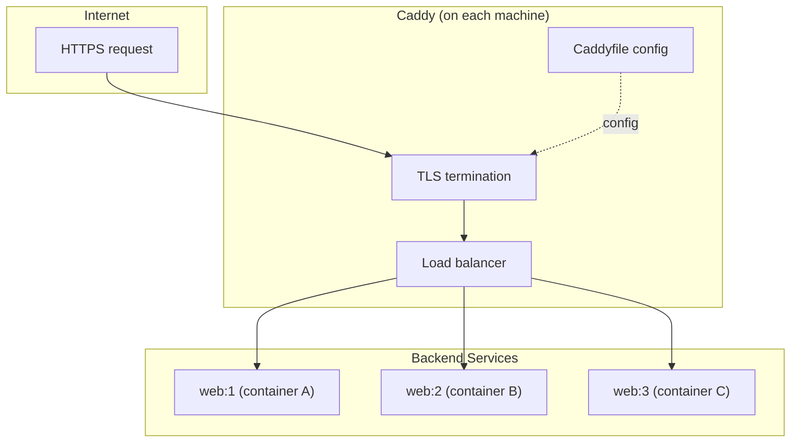
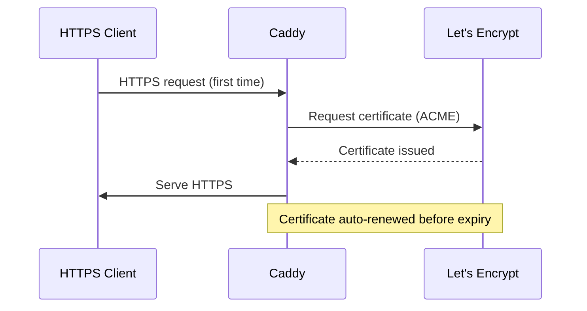

# Caddy & HTTPS — Automatic HTTPS, Load Balancing

**Uncloud integrates Caddy as the built-in reverse proxy — providing automatic HTTPS with Let's Encrypt, load balancing across service replicas, and zero-config TLS provisioning.**

## Caddy Architecture

Source: `internal/machine/caddyconfig/` (2,648 LOC)



## Caddy Configuration

Source: `internal/machine/caddyconfig/caddyfile.go`

The Caddy config controller generates Caddyfile from service specs:

| Service Spec | Caddy Directive |
|-------------|----------------|
| `CaddySpec.Domain` | `domain.example.com` site block |
| `CaddySpec.TLS` | `tls internal` or `tls email@` |
| `Service.Ports` | `reverse_proxy` upstream list |
| `Service.Replicas` | Multiple upstream entries |

## Caddy Service

Source: `internal/machine/caddyconfig/service.go`

The Caddy service runs as a system service managed by the cluster controller:

| Responsibility | Implementation |
|---------------|----------------|
| Config generation | `caddyfile.go` |
| Config validation | Admin socket API |
| Config reload | Graceful reload (zero downtime) |
| TLS provisioning | Let's Encrypt (automatic) |

## TLS Certificate Management



## Load Balancing

When a service has multiple replicas, Caddy distributes requests:

```
reverse_proxy web-abc123:8080 web-def456:8080 web-ghi789:8080
```

Each container's WireGuard IP is used as the upstream — direct encrypted communication, no overlay network needed.

**Aha:** Every machine runs its own Caddy instance. If a machine goes down, services on other machines continue serving traffic. There's no single Caddy bottleneck — the load is distributed across the cluster.

## What's Next

- [06 — CLI](06-cli.md) — Commands, config, connection types
- [04 — Service Deployment](04-service-deployment.md) — Return to deployment
- [09 — Docker Integration](09-docker-integration.md) — Return to Docker
