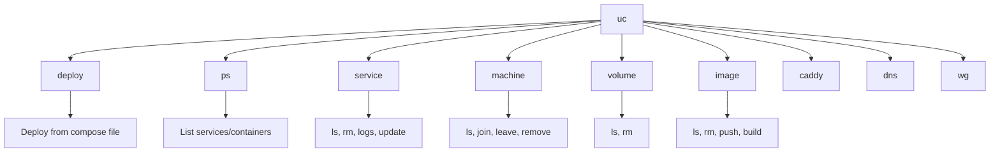
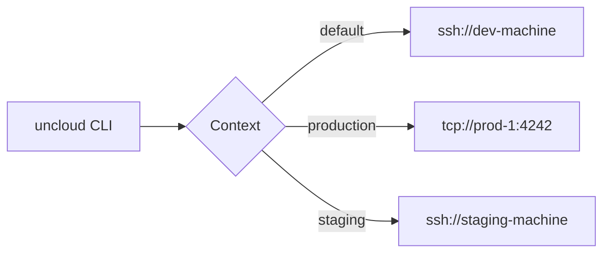

# CLI — Commands, Configuration, Connection Types

**The Uncloud CLI (`uc`) provides Docker-like commands for managing machines, services, volumes, and images across the cluster — accessible via TCP, SSH, or local Unix socket.**

## CLI Architecture

Source: `cmd/uncloud/` (6,165 LOC)

Built with [cobra](https://github.com/spf13/cobra) for command structure and [bubbletea](https://github.com/charmbracelet/bubbletea) for TUI elements.

## Command Structure



## Connection Types

Source: `cmd/uncloud/main.go`

```go
// Connection via TCP
uc --connect tcp://192.168.1.100:4242 service ls

// Connection via SSH
uc --connect ssh+go://user@192.168.1.100 service ls

// Local Unix socket
uc --connect unix:///run/uncloud/uncloud.sock service ls
```

| Connection | Use Case |
|------------|----------|
| `tcp://host:port` | Direct connection to machine's gRPC server |
| `ssh+go://user@host` | SSH tunnel (full remote management) |
| `unix://path` | Local on-machine access |

## Context Switching



## Configuration

Source: `internal/cli/config/`

Configuration stored in `~/.config/uncloud/config.toml`:

```toml
[contexts.default]
connect = "ssh+go://user@host"

[contexts.production]
connect = "tcp://10.0.0.1:4242"
```

## Key Commands

### deploy

```bash
uc deploy -f docker-compose.yml
```

Deploys services from a Docker Compose file. Supports:
- Rolling updates
- Pre-deploy hooks
- Volume management

### ps

```bash
uc ps           # List all services
uc ps -a        # Include stopped services
uc ps web       # Filter by service name
```

### service

```bash
uc service ls           # List services
uc service rm web       # Remove service
uc service logs web     # Stream logs
uc service update web   # Rolling update
```

### machine

```bash
uc machine ls           # List machines
uc machine join         # Join cluster
uc machine leave        # Leave cluster
uc machine remove       # Remove machine from cluster
```

**Aha:** The CLI can manage multiple clusters through contexts — similar to `kubectl config use-context`. Switch between dev, staging, and production with a single flag.

## What's Next

- [07 — API & gRPC](07-api-grpc.md) — Protobuf definitions, gRPC services
- [01 — Architecture](01-architecture.md) — Return to architecture
- [10 — Client Library](10-client-library.md) — Return to client library
