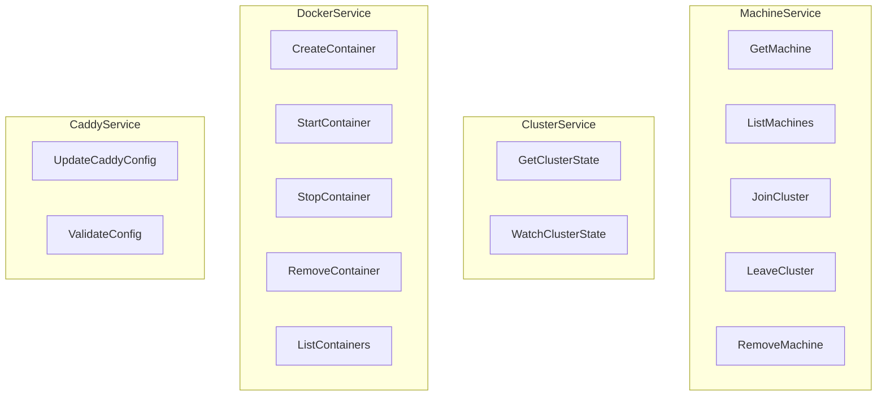
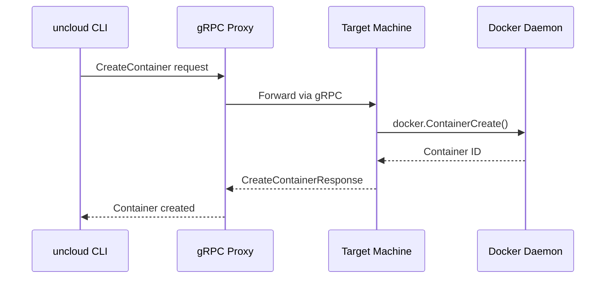

# API & gRPC — Protobuf Definitions, gRPC Services

**Uncloud uses gRPC with protobuf for all inter-machine communication — machine API, cluster API, Docker API proxy, and Caddy config API.**

## Protobuf Definitions

Source: `internal/machine/api/pb/` (9,696 LOC)

| Proto File | Generated Files | Purpose |
|------------|----------------|---------|
| `machine.proto` | `machine.pb.go`, `machine_grpc.pb.go` | Machine management |
| `cluster.proto` | `cluster.pb.go`, `cluster_grpc.pb.go` | Cluster operations |
| `docker.proto` | `docker.pb.go`, `docker_grpc.pb.go` | Docker operations |
| `caddy.proto` | `caddy.pb.go`, `caddy_grpc.pb.go` | Caddy config |
| `common.proto` | `common.pb.go` | Shared types |

## gRPC Services

## Request/Response Flow

## API Types

Source: `pkg/api/` (3,794 LOC)

| Type | LOC | Purpose |
|------|-----|---------|
| `service.go` | 638 | ServiceSpec, ContainerSpec, VolumeSpec |
| `container.go` | 342 | Container state, status |
| `port.go` | 292 | PortSpec, port validation |
| `volume.go` | 287 | VolumeSpec, volume configuration |
| `config.go` | 196 | ConfigSpec, configuration objects |
| `config_test.go` | 289 | Config validation tests |
| `container_test.go` | 300 | Container validation tests |
| `service_test.go` | 301 | Service validation tests |

## gRPC Proxy

Source: `internal/machine/api/proxy/`

The gRPC proxy enables the CLI to connect to any machine in the cluster and access any other machine's gRPC services transparently — essential for managing the entire cluster through a single SSH connection.

**Aha:** The protobuf definitions generate ~9,696 LOC of Go code — making this the largest single package in Uncloud. The type-safe API contracts ensure that machine-to-machine communication is well-defined and versioned.

## What's Next

- [08 — Corrosion CRDT](08-corrosion-crdt.md) — P2P state synchronization
- [03 — Machine & Cluster](03-machine-cluster.md) — Return to machine cluster
- [10 — Client Library](10-client-library.md) — Return to client library
