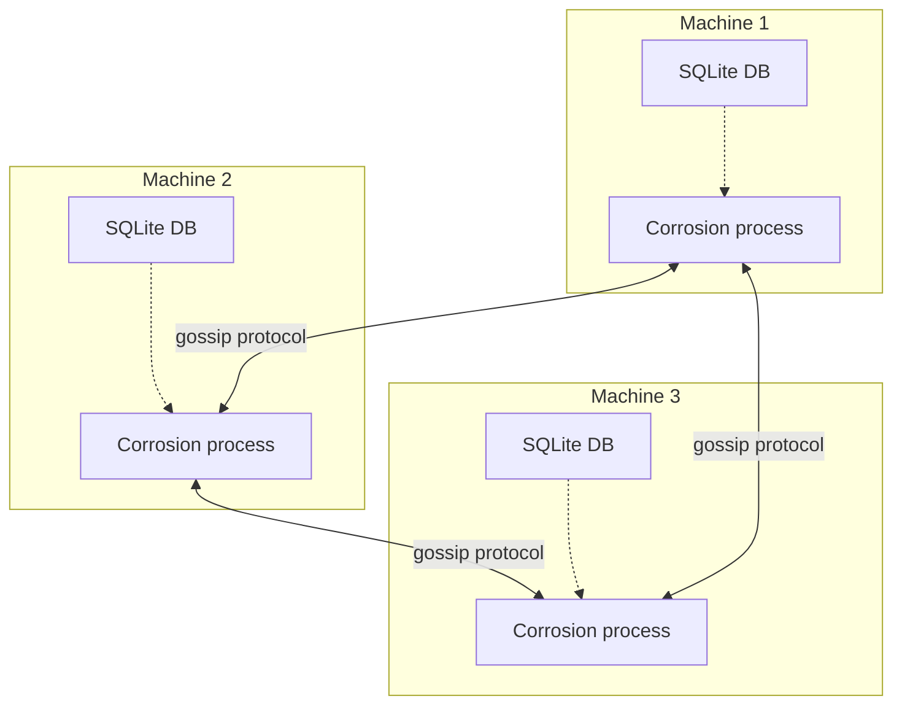
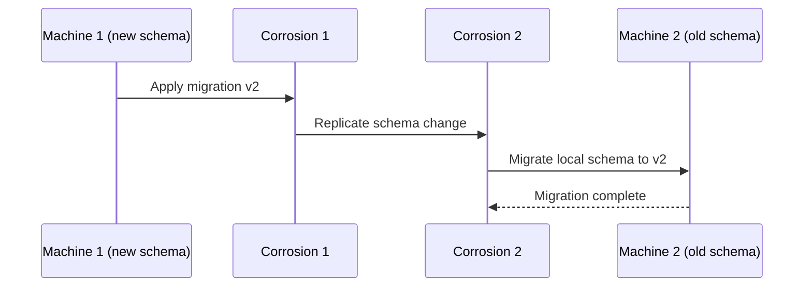

# Corrosion CRDT — P2P State Synchronization

**Corrosion is Uncloud's distributed state synchronization engine — a SQLite-based CRDT that keeps cluster state consistent across all machines without a central authority.**

## What is Corrosion?

Corrosion is an external service (not built into Uncloud) that provides:
- **SQLite storage** — each machine has its own local SQLite database
- **CRDT replication** — conflict-free merge of concurrent updates
- **Peer-to-peer sync** — no central server, machines sync directly

Source: `internal/corrosion/` (1,514 LOC)

## Architecture



## Corrosion Client

Source: `internal/corrosion/client.go`

```go
type Client struct {
    // Connection to Corrosion's HTTP API
}

// Query the local SQLite database
func (c *Client) Query(ctx context.Context, query string, args ...any) (*Rows, error)

// Subscribe to changes
func (c *Client) Subscribe(ctx context.Context, query string, args ...any) (*Subscription, error)
```

## Corrosion Admin

Source: `internal/corrosion/admin.go`

Administrative interface for:
- Managing peer connections
- Monitoring replication status
- Schema migrations

## Corrosion Service Wrapper

Source: `internal/machine/corroservice/` (341 LOC)

Wraps the Corrosion process:

| Function | Purpose |
|----------|---------|
| `Start()` | Launch Corrosion service |
| `Stop()` | Graceful shutdown |
| `WaitReady()` | Wait until service is ready |

## Corrosion Migration

Source: `internal/machine/corromigrate/` (515 LOC)

Handles schema migrations across the cluster:



**Aha:** The CRDT approach means no consensus protocol is needed. Unlike etcd (Raft) or Consul (Serf + Raft), Corrosion allows machines to go offline and rejoin later — their state automatically converges through the CRDT merge process. This is what enables Uncloud's "no control plane" design.

## What's Next

- [09 — Docker Integration](09-docker-integration.md) — Docker controller, Unregistry
- [01 — Architecture](01-architecture.md) — Return to architecture
- [03 — Machine & Cluster](03-machine-cluster.md) — Return to machine cluster
