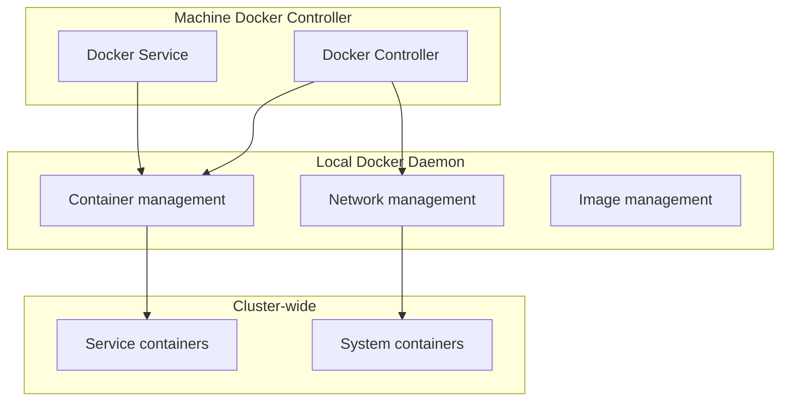
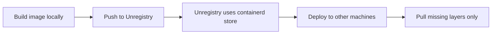

# Docker Integration — Docker Controller, Unregistry

**Uncloud manages Docker containers directly on each machine — with a custom Docker controller, built-in Unregistry for image storage, and Docker network integration.**

## Docker Controller

Source: `internal/machine/docker/` (2,998 LOC)

| Component | Purpose |
|-----------|---------|
| `controller.go` | Main Docker controller (platform-specific) |
| `controller_linux.go` | Linux-specific Docker setup |
| `controller_darwin.go` | macOS-specific Docker setup |
| `server.go` | gRPC Docker service implementation |
| `service.go` | Docker service management |
| `client.go` | Docker client wrapper |
| `client_exec.go` | Docker exec implementation |

## Docker Networks

Uncloud creates two Docker networks:

| Network | Purpose |
|---------|---------|
| `uncloud-system` | System containers (DNS, Caddy, Unregistry) |
| `uncloud-user` | User service containers |

Both networks are attached to the WireGuard interface, enabling cross-machine communication.

## Unregistry

Source: `internal/machine/machine.go:57`

Uncloud integrates [Unregistry](https://github.com/psviderski/unregistry) — a built-in container registry that uses the local Docker (containerd) image store as its backend:

**Aha:** Unlike traditional registries that require a separate image store, Unregistry uses Docker's own containerd image store. This means:
- Built images are immediately available to Unregistry
- Pushing only transfers missing layers to other machines
- No separate registry infrastructure needed

## What's Next

- [10 — Client Library](10-client-library.md) — pkg/client API
- [05 — Caddy & HTTPS](05-caddy-https.md) — Return to Caddy
- [04 — Service Deployment](04-service-deployment.md) — Return to deployment
