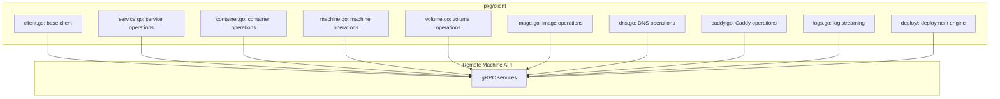
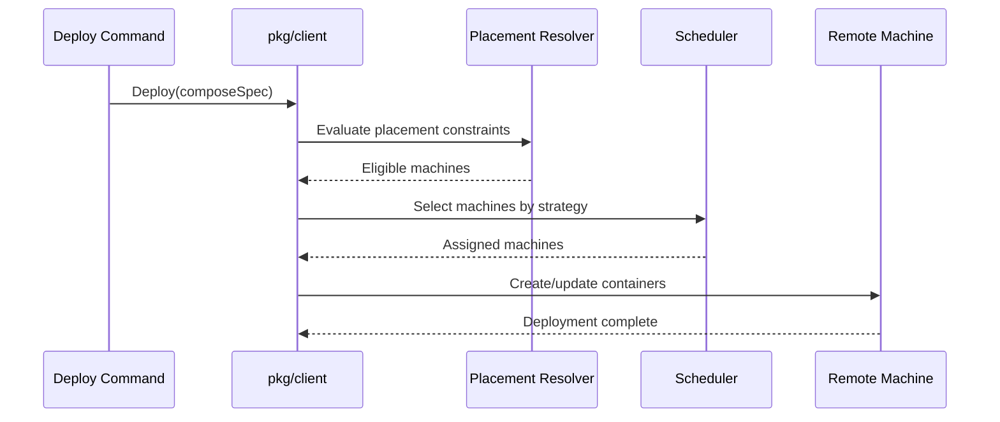

# Client Library — pkg/client API

**The client library (`pkg/client`) is the Go SDK for interacting with Uncloud — used by the CLI and available for programmatic access.**

## Architecture

Source: `pkg/client/` (15,442 LOC)

## Package Breakdown

| File | LOC | Purpose |
|------|-----|---------|
| `container.go` | 537 | Create, start, stop, remove containers |
| `image.go` | 672 | List, pull, push, remove images |
| `logmerger.go` | 317 | Merge logs from multiple containers |
| `logs.go` | 269 | Stream container logs |
| `service.go` | 386 | Deploy, update, remove services |
| `dns.go` | 228 | DNS record management |
| `volume.go` | 125 | Volume management |
| `machine.go` | 149 | Machine join/leave/list |
| `caddy.go` | 150 | Caddy config management |
| `client.go` | 98 | Base client with connection handling |
| `user.go` | 50 | User management |

## Deployment Engine

Source: `pkg/client/deploy/`

| File | Purpose |
|------|---------|
| `deploy.go` | Top-level deploy entry point |
| `container.go` | Container creation/update logic |
| `strategy.go` | Deployment strategies (rolling, start-first) |
| `resolver.go` | Placement constraint evaluation |
| `scheduler/` | Machine selection and scheduling |
| `operation/` | Deployment operation tracking |

## Log Merging

**Aha:** The client library is 15,442 LOC — larger than many complete applications. This reflects Uncloud's comprehensive API surface: every machine, service, container, volume, image, log, DNS, and Caddy operation is covered.

Source: `pkg/client/logmerger.go` (317 lines)

## Deployment Engine Flow

Merges logs from multiple containers into a single time-ordered stream — essential for multi-replica service debugging.

**Aha:** The client library is 15,442 LOC — larger than many complete applications. This reflects Uncloud's comprehensive API surface: every machine, service, container, volume, image, log, DNS, and Caddy operation is covered.

## What's Next

- [11 — Cross-Cutting](11-cross-cutting.md) — Testing, metrics, SSH exec
- [06 — CLI](06-cli.md) — Return to CLI
- [00 — Overview](00-overview.md) — Return to overview
