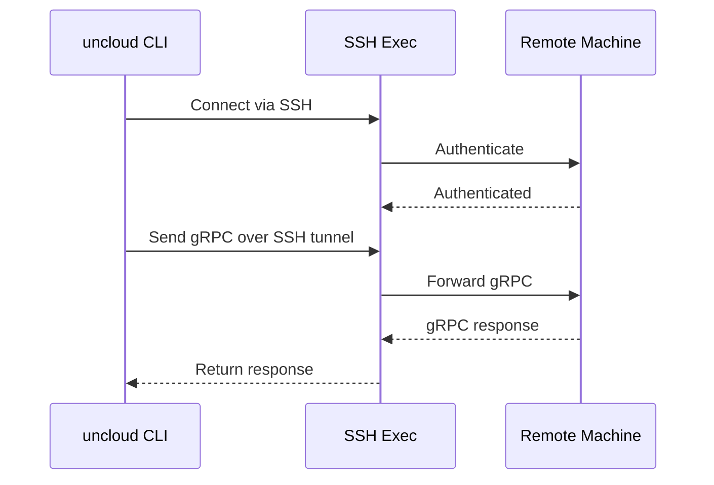
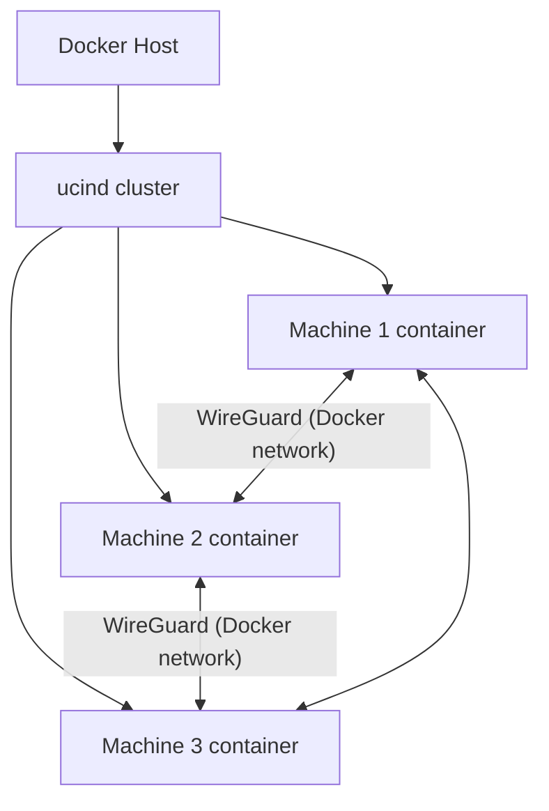

# Cross-Cutting — Testing, Metrics, SSH Exec, ucind

**This document covers testing strategy, metrics collection, SSH execution for remote management, and the Cluster-in-Docker testing framework.**

## End-to-End Testing

Source: `test/e2e/` (4,524 LOC)

| Test File | LOC | Purpose |
|-----------|-----|---------|
| `service_test.go` | 2,278 | Service deployment, updates, scaling |
| `machine_test.go` | 503 | Machine join/leave, cluster operations |
| `compose_deploy_test.go` | 660 | Docker Compose deployment flows |
| `assert.go` | 269 | Test assertions and helpers |

## Metrics

Source: `internal/machine/metrics/` (58 LOC)

Prometheus metrics server exposes:
- Machine health
- Service status
- Container counts
- Network statistics

## SSH Execution

Source: `internal/sshexec/` (429 LOC)

Enables remote management via SSH:

| File | Purpose |
|------|---------|
| `ssh.go` | Core SSH connection management |
| `executor.go` | Remote command execution |
| `remote.go` | Remote file operations |
| `sshcli.go` | CLI integration |

## ucind (Cluster-in-Docker)

Source: `internal/ucind/` (727 LOC)

Creates a full Uncloud cluster inside Docker containers for testing:

This enables full e2e testing without needing real VMs.

## Journal

Source: `internal/journal/` (310 LOC)

Structured logging with slog integration — all Uncloud components use consistent logging.

## Firewall

Source: `internal/machine/firewall/` (194 LOC)

Manages iptables rules for:
- WireGuard port access
- Service port publishing
- Docker network isolation

## DNS

Source: `internal/machine/dns/` (597 LOC)

Built-in DNS server that resolves:
- Service names → container IPs
- Machine names → WireGuard IPs
- External domains → upstream resolver

**Aha:** The ucind testing framework is what enables Uncloud to have comprehensive e2e tests (4,524 LOC of tests!) without requiring a real multi-machine setup. Every test runs inside Docker containers with full WireGuard mesh networking.

## What's Next

- [00 — Overview](00-overview.md) — Return to overview
- [01 — Architecture](01-architecture.md) — Return to architecture
- [08 — Corrosion CRDT](08-corrosion-crdt.md) — Return to Corrosion
