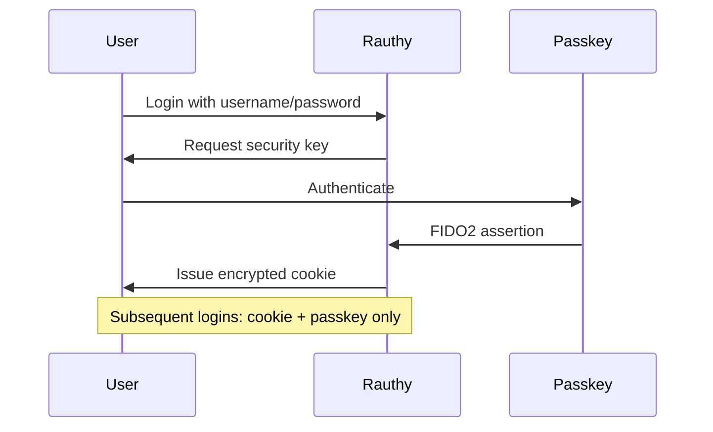
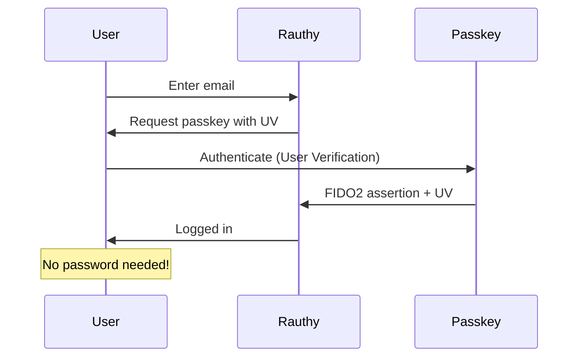
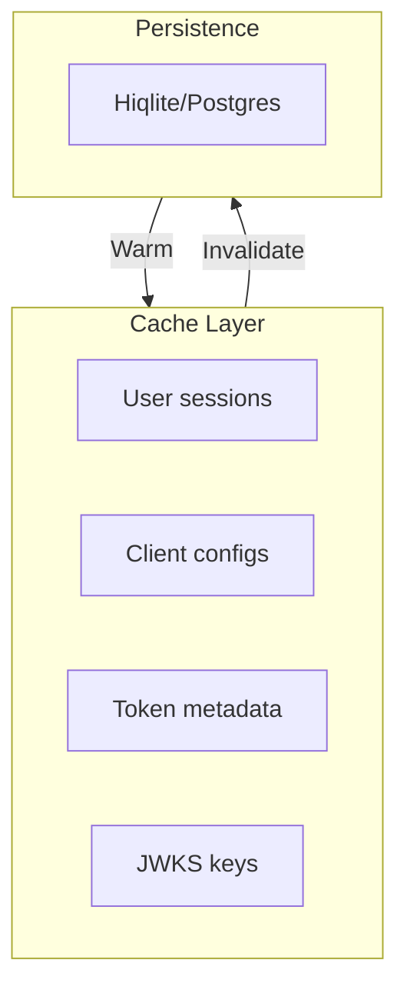

# rauthy Overview

Lightweight, secure Identity Provider with OIDC, OAuth 2, and PAM.

## Philosophy

**Secure by default, simple to operate.**

rauthy is designed to provide enterprise-grade authentication with minimal resource usage:

1. **Security first** — ed25519 token signing, S256 PKCE, FIDO2/WebAuthn
2. **Simplicity** — Embedded Hiqlite database, no external dependencies
3. **Efficiency** — Runs on Raspberry Pi (~35-65MB RAM)
4. **Compatibility** — OIDC/OAuth2 standards, works with any client
5. **Flexibility** — Configurable for older systems when needed

## Secure by Default

When you create a new OIDC client:

| Setting | Default | Why |
|---------|---------|-----|
| Token signing | ed25519 | Most secure algorithm |
| PKCE flow | S256 | Prevents authorization code interception |
| MFA | Required for passkey-only | Ensures 2FA minimum |

**Aha:** Defaults are maximum security. You can downgrade for compatibility, but must explicitly do so.

## Authentication Options

### Option 1: Password + Security Key

Flow:
1. First login: username + password + security key
2. Encrypted cookie stored
3. Subsequent logins: cookie + passkey (no password)

### Option 2: Passkey-Only Accounts

**Requirements:**
- Passkey must support User Verification (UV)
- Provides 2FA security (something you have + something you are)
- Account has no password at all

**Aha:** Passkey-only accounts don't use any storage on the authenticator device (YubiKey slots remain free).

## Resource Efficiency

### Memory Usage

| Deployment | Memory | Users |
|------------|--------|-------|
| Hiqlite single | ~57 MB | Up to millions |
| Hiqlite HA cluster | ~65 MB | Up to millions |
| Postgres-based | ~35 MB | Up to millions |

### Comparison with Keycloak

| Metric | rauthy | Keycloak |
|--------|--------|----------|
| Memory | ~35-65 MB | ~1-2 GB |
| Startup time | < 1s | ~10-30s |
| External DB | Optional (Hiqlite) | Required |
| HA mode | Built-in | Complex setup |

**Aha:** rauthy achieves efficiency through aggressive caching and Rust's memory safety.

## Caching Strategy

rauthy caches extensively for performance:

**Cache durations:**
- User sessions: Several hours
- Client configurations: Long-lived
- JWKS keys: Configurable TTL
- Token metadata: Until expiration

**Aha:** Special care for cache invalidation ensures consistency across HA nodes.

## Features Overview

### OIDC/OAuth2 Provider

- Authorization Code flow
- PKCE (Proof Key for Code Exchange)
- Client credentials
- Device authorization grant
- Refresh tokens
- ID tokens (JWT)
- Access tokens
- Token introspection
- UserInfo endpoint

### FIDO2/WebAuthn

- Passkey registration
- Passkey authentication
- User Verification (UV) support
- Resident key support
- Discoverable credentials (discouraged by default)

### Admin Features

- Web-based Admin UI
- User management
- Client management
- Group/role management
- Event log viewing
- Audit trail

### User Features

- Account dashboard
- Password management
- Passkey management
- MFA setup
- Session management
- Account deletion

### Client Branding

- Per-client color themes
- Custom logos
- Login page customization

## Next Steps

Continue to [Architecture →](01-architecture.html) for system design.
