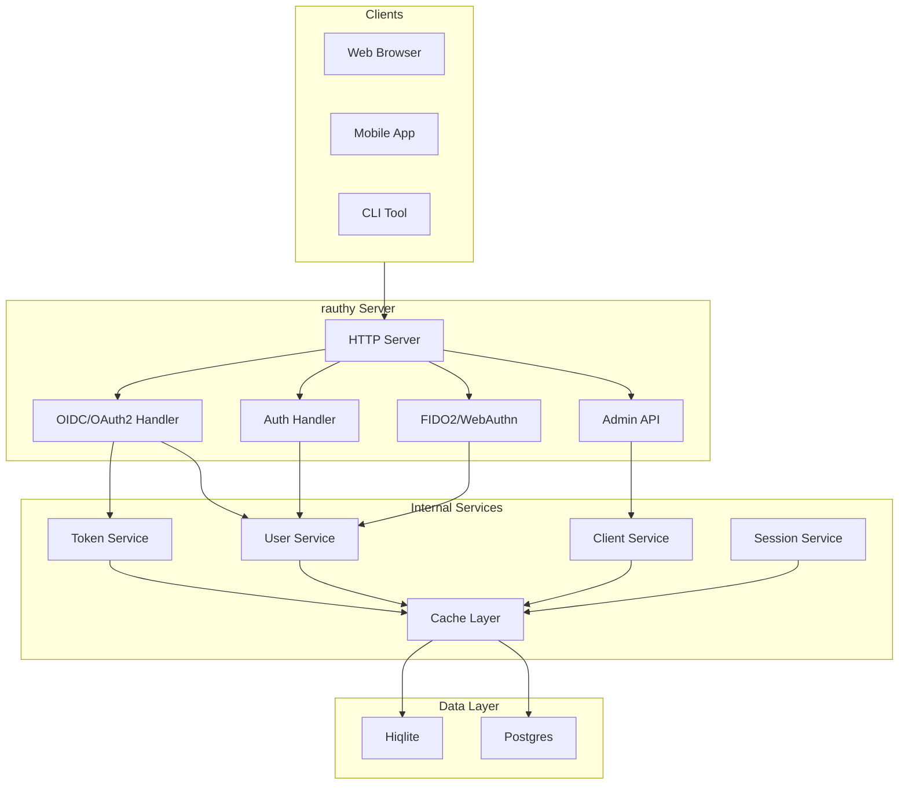
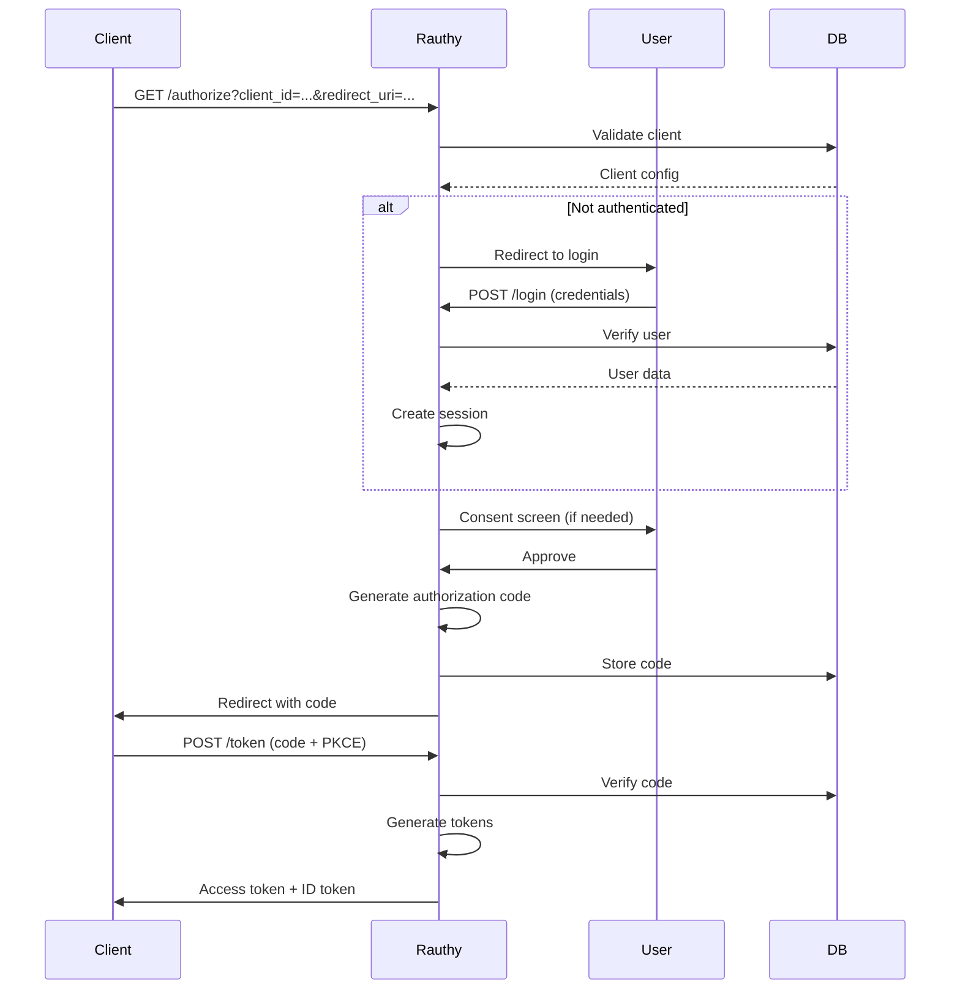
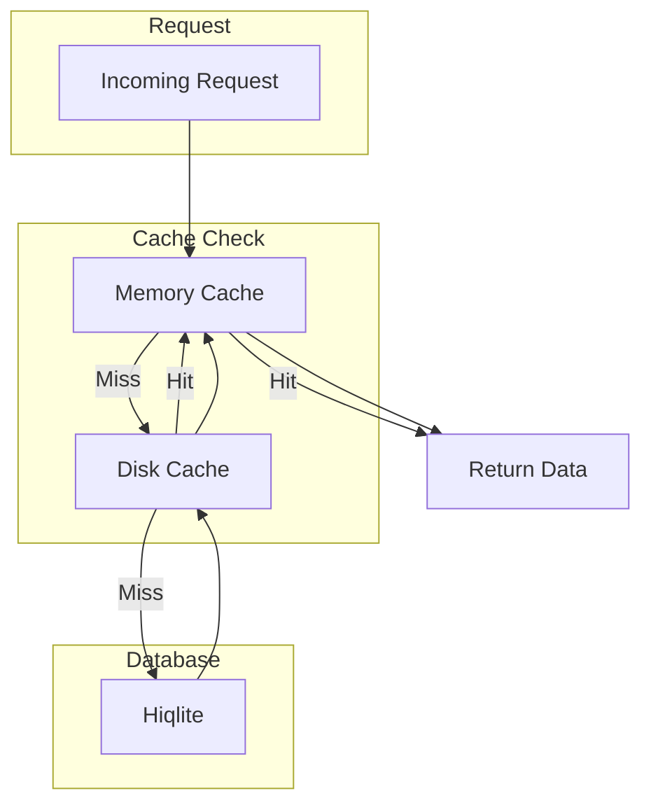
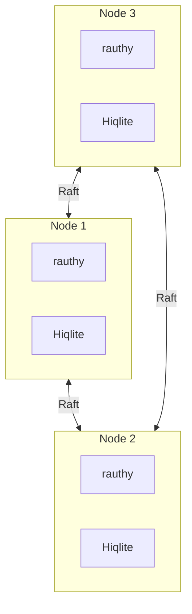
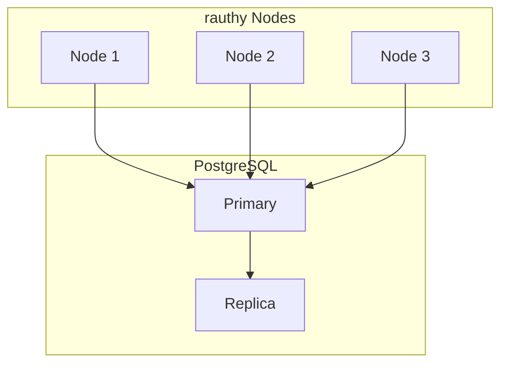

# rauthy Architecture

System architecture and component design.

## High-Level Architecture



## Source Structure

```
rauthy/src/
├── api/                # HTTP API handlers
├── api_types/          # API type definitions
├── bin/                # Binary entry points
├── common/             # Common utilities
├── data/               # Data models
├── error/              # Error handling
├── jwt/                # JWT handling
├── macros/             # Rust macros
├── middlewares/        # HTTP middlewares
├── notify/             # Notification system
├── schedulers/         # Background tasks
├── service/            # Business logic
└── wasm-modules/       # WebAssembly modules
```

## Component Breakdown

### API Layer

**Location:** `src/api/`

HTTP request handlers:

| Module | Purpose | Endpoints |
|--------|---------|-----------|
| `auth.rs` | Authentication | `/auth`, `/login` |
| `oidc.rs` | OIDC endpoints | `/authorize`, `/token` |
| `users.rs` | User API | `/users/*` |
| `clients.rs` | Client API | `/clients/*` |
| `sessions.rs` | Session API | `/sessions/*` |

### Service Layer

**Location:** `src/service/`

Business logic:

```rust
// src/service/token.rs
pub struct TokenService {
    cache: Arc<Cache>,
    db: Arc<DbPool>,
}

impl TokenService {
    pub async fn generate_token(
        &self,
        user: &User,
        client: &Client,
    ) -> Result<TokenPair, Error> {
        // Generate access token
        let access_token = self.create_access_token(user, client)?;
        
        // Generate refresh token
        let refresh_token = self.create_refresh_token(user, client)?;
        
        // Store in cache
        self.cache.set(&access_token).await?;
        
        Ok(TokenPair {
            access_token,
            refresh_token,
        })
    }
}
```

### Data Layer

**Location:** `src/data/`

Database models and queries:

```rust
// src/data/user.rs
#[derive(Debug, Clone, sqlx::FromRow)]
pub struct User {
    pub id: String,
    pub email: String,
    pub password_hash: Option<String>,
    pub mfa_enabled: bool,
    pub created_at: DateTime<Utc>,
}

impl User {
    pub async fn find_by_email(
        db: &DbPool,
        email: &str,
    ) -> Result<Option<User>, Error> {
        sqlx::query_as(
            "SELECT * FROM users WHERE email = $1",
        )
        .bind(email)
        .fetch_optional(db)
        .await
    }
}
```

### JWT Layer

**Location:** `src/jwt/`

JWT token handling:

```rust
// src/jwt/mod.rs
pub struct JwtHandler {
    signing_key: Ed25519KeyPair,
    validation: Validation,
}

impl JwtHandler {
    pub fn sign(&self, claims: &Claims) -> Result<String, Error> {
        let token = encode(
            &Header::new(Algorithm::EdDSA),
            claims,
            &self.signing_key,
        )?;
        Ok(token)
    }
    
    pub fn verify(&self, token: &str) -> Result<Claims, Error> {
        let validation = self.validation.clone();
        let token_data = decode(token, &self.decoding_key, &validation)?;
        Ok(token_data.claims)
    }
}
```

## Request Flow

### OIDC Authorization Flow



## Caching Architecture



**Cache levels:**
1. **Memory cache** — Fastest, per-request
2. **Distributed cache** — Hiqlite cache (HA mode)
3. **Database** — Persistent storage

## High Availability

### HA Mode with Hiqlite



**Aha:** Hiqlite uses Raft consensus for distributed state. Each node has full data.

### HA Mode with Postgres



## Next Steps

Continue to [Authentication →](02-authentication.html) for auth flows.
